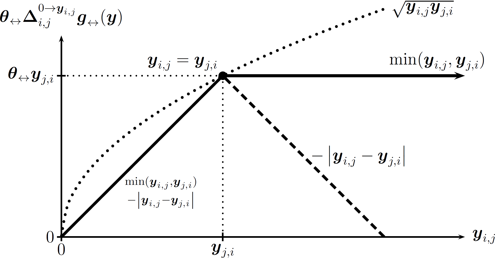

```{r setup, include = FALSE}
library(knitr)
opts_chunk$set(echo=TRUE,tidy=TRUE,cache=TRUE,autodep=TRUE,concordance=TRUE,error=FALSE,size='small',message=FALSE)
options(width=80, useFancyQuotes = FALSE, continue="  ")
```

_Last updated: `r Sys.Date()`_


\usepackage[Q=yes]{examplep}
\usepackage[round]{natbib}
\usepackage{hyperref,geometry}
\geometry{verbose,tmargin=3cm,bmargin=3cm,lmargin=3cm,rmargin=3cm}
\setlength{\parskip}{\smallskipamount}


\usepackage{color,csquotes}
\usepackage{verbatim}
\usepackage{amsmath,amssymb,amsfonts}
\usepackage{url}

\newcommand{\notes}[1]{\textbf{#1}}

<!-- % Frequently used symbols -->
\def\y{\boldsymbol{y}}
\def\Y{\boldsymbol{Y}}
\def\covariate{\boldsymbol{x}}
\def\weight{\boldsymbol{w}}
\def\covariates{\mathbb{X}}
\def\e{\boldsymbol{e}}
\def\actors{{N}}
\newcommand{\actorsnot}[1]{\actors\setsub\left\{#1\right\}}
\newcommand{\distuples}[1]{\actors^{#1\ne}}
\def\nactors{ n }
\def\cnmap{\boldsymbol{\eta}}
\def\linpred{\boldsymbol{\eta}}
\def\linpar{\boldsymbol{\beta}}
\def\sendeff{\boldsymbol{\delta}}
\def\recveff{\boldsymbol{\gamma}}
\def\Z{\boldsymbol{Z}}
\def\nnatpar{ p }
\def\latdim{ d }
\def\curvpar{\boldsymbol{\theta}}
\def\curvpars{\boldsymbol{\Theta}}
\def\natcurvpars{\boldsymbol{\Theta}_{\text{N}}}
\def\designpar{\boldsymbol{\psi}}
\def\ncurvpar{ q }
\def\meanpar{\boldsymbol{\mu}}
\def\genstatsymbol{g}
\def\genstats{\boldsymbol{\genstatsymbol}}
\newcommand{\genstat}[1]{\boldsymbol{\genstatsymbol}_{\text{#1}}}
\def\target{\boldsymbol{t}}
\def\Design{\boldsymbol{D}}
\def\design{\boldsymbol{d}}
\def\dyadvals{\mathbb{S}}
\def\maxdyadvals{ s }
\def\Borel{ \mathfrak{B} }

\def\changeijv{\boldsymbol{\Delta}\sij}
\newcommand{\promote}[2]{\Delta_{#1,#2}^\nearrow}
\def\setsub{\backslash}

\newcommand{\EN}[3]{\left#1 #3 \right#2}
\newcommand{\en}[3]{#1 #3 #2}


\newcommand{\E}{\text{E}}
\newcommand{\Var}{\text{Var}}
\newcommand{\logit}{\text{logit}}
\newcommand{\N}{\text{N}}
\newcommand{\Geometric}{\text{Geometric}}
\newcommand{\Multinomial}{\text{Multinomial}}
\newcommand{\Inv}{\text{Inv}}
\newcommand{\MVN}{\text{MVN}}
\newcommand{\Bernoulli}{\text{Bernoulli}}
\newcommand{\Exponential}{\text{Exponential}}
\newcommand{\ERGM}{\text{ERGM}}
\newcommand{\RandomChoose}{\text{RandomChoose}}
\newcommand{\0}{0}
\def\dysY{\mathbb{Y}}
\def\netsY{\mathcal{Y}}
\def\iid{{\stackrel{\mathrm{i.i.d.}}{\sim}}}
\def\ind{{\stackrel{\mathrm{ind.}}{\sim}}}
\newcommand{\LN}{\text{LN}}
\newcommand{\InvChiSq}{\text{Inv}\chi^2}
\newcommand{\Dirichlet}{\text{Dirichlet}}
\newcommand{\Poisson}{\text{Poisson}}
\newcommand{\Binomial}{\text{Binomial}}
\newcommand{\Uniform}{\text{Uniform}}
\newcommand{\Prob}{\text{Pr}}
\newcommand{\Lik}{\text{L}}
\newcommand{\lateff}{\text{d}}


\def\M{P}
\def\h{h}
\def\Mteg{\M_{\curvpar;\cnmap,\genstats}}
\def\Mref{\M_\h}
\def\Mtheg{\M_{\curvpar;\Mref,\cnmap,\genstats}}


\def\sigY{\mathsf{Y}}

\def\Pteg{\Prob_{\curvpar;\genstats}}
\def\Pheg{\Prob_{\h,\genstats}}
\def\Eteg{\E_{\curvpar;\genstats}}
\def\fteg{f_{\curvpar;\genstats}}
\DeclareMathOperator{\Odds}{Odds}
\def\offset{_\text{o}}
\def\normc{\kappa}
\def\ceg{\normc_{\genstats}}
\def\cegoff{\normc_{\genstats\offset,\cnmap,\genstats}}
\def\cheg{\normc_{\h,\genstats}}
\def\chegoff{\normc_{\h,\genstat\offset,\genstats}}
\DeclareMathOperator*{\argmax}{arg\,max}
\DeclareMathOperator*{\argmin}{arg\,min}
\newcommand{\ilogit}{\text{logit}^{-1}}
\def\reals{\mathbb{R}}
\def\naturals{\mathbb{N}}
\def\BB{\mathbb{B}}
\def\ij{{i,j}}
\def\ji{{j,i}}
\def\pij{{(i,j)}}
\def\pji{{(j,i)}}
\def\ipjp{{i',j'}}
\def\pipjp{{(i',j')}}
\def\tij{\oplus\pij}
\def\ijdysY{{\pij\in\dysY}}
\def\ynetsY{{\y\in\netsY}}
\def\ypnetsY{{\y'\in\netsY}}
\def\sij{_{i,j}}
\def\sijk{_{i,j,k}}
\def\sik{_{i,k}}
\def\l{l}
\def\sil{_{i,\l}}
\def\sji{_{j,i}}
\def\sli{_{\l,i}}
\def\slj{_{\l,j}}
\def\slk{_{\l,k}}
\def\sipjp{_{i',j'}}
\def\Yij{\Y\!\sij}
\def\yij{\y\sij}
\def\Yji{\Y\!\sji}
\def\yji{\y\sji}
\def\ytij{\y\tij}
\def\Yyij{\Yij=\yij}
\def\Yy{\Y=\y}
\def\sobs{_{\text{obs}}}
\def\smis{_{\text{mis}}}
\def\Yobs{\Y\sobs}
\def\yobs{\y\sobs}
\def\Ymis{\Y\smis}
\def\ymis{\y\smis}
\def\Yyobs{\Yobs=\yobs}
\def\Yymis{\Ymis=\ymis}
\def\half{\frac{1}{2}}
\def\jplus{j^+}
\makeatletter
\newcommand{\myrel}[3][.3]{\binrel@{#3}%
  \binrel@@{\mathop{\kern\z@#3}\limits^{\vbox to #1\ex@{\kern-\tw@\ex@
\hbox{\scriptsize #2}\vss}}}}
\makeatother
\newcommand{\pref}[1][]{\myrel{\ensuremath{\,\,#1}}{\succ}}
\newcommand{\npref}[1][]{\myrel[-0.2]{\ensuremath{#1}}{\nsucc}}
\newcommand{\indiff}[1][]{\myrel{\ensuremath{#1}}{\cong}}


\newcommand{\yat}[1]{\y^{t#1}}
\newcommand{\Yat}[1]{\Y^{t#1}}
\newcommand{\Yyat}[1]{\Yat{#1}=\yat{#1}}
\newcommand{\Yya}[1]{\Y^{#1}=y^{#1}}

<!-- %\newcommand{\natpar}[1][]{\cnmap#1(\curvpar)} -->
<!-- %\newcommand{\natparS}[1]{\cnmap(\curvpar^{#1})} -->
\newcommand{\natpar}[1][]{\curvpar#1}
\newcommand{\natparS}[1]{\curvpar^{#1}}

<!-- % exp with parentheses -->
\newcommand{\myexp}[1]{\exp\mathchoice{\left(#1\right)}{(#1)}{(#1)}{(#1)}}
\newcommand{\I}[1]{\mathbb{I}\left(#1\right)}
\newcommand{\egopref}[4]{#1_{#2:\,#3\succ #4}}
\newcommand{\ypref}[3]{\egopref{\y}{#1}{#2}{#3}}
\newcommand{\yvpref}[3]{\egopref{\yv}{#1}{#2}{#3}}
<!-- %\newcommand{\egopref}[4]{\I{#1_{#2,#3}\pref #1_{#2,#4}}} -->
\newcommand{\egoswapr}[4]{#1^{#2:\,#3\rightleftarrows#4}}

\def\ipromotej{\promote{i}{j}}
\newcommand{\promotev}[2]{\boldsymbol{\Delta}_{#1,#2}^\nearrow}
\def\ipromotejv{\promotev{i}{j}}


\newcommand{\pkg}[1]{\texttt{#1}}
\newcommand{\proglang}[1]{\textsf{#1}}

\def\indep{\perp\!\!\!\perp}
\newcommand{\condind}[3]{#1 \indep #2 \,|\, #3}
\newcommand{\code}[1]{\Q{#1}}

\providecommand{\abs}[1]{\left\lvert#1\right\rvert}

\def\t{^{\mathsf{T}}}
\def\c{^{\mathsf{c}}}
\newcommand{\fromthru}[2]{\left\{#1\,..\,#2\right\}}

\newcommand{\innerprod}[2]{{#1}^\top{#2}}

\newcommand{\centercol}[1]{\multicolumn{1}{c}{#1}}
\newcommand{\coef}[2]{$#1$ $(#2)$}
\newcommand{\scoef}[2]{$\mathbf{#1}$ $(#2)$}

\def\Mct{\mu}
\def\Mlbg{\lambda}
\def\drefdct{\frac{d\Mref}{d\Mct}}
\def\drefdlbg{\frac{d\Mref}{d\Mlbg}}
\def\dtegdref{\frac{d\Mteg}{d\Mref}}
\def\dtegdct{\frac{d\Mteg}{d\Mct}}


<script type="text/x-mathjax-config">
MathJax.Hub.Config({
  TeX: { equationNumbers: { autoNumber: "AMS" } }
});
</script>

<style>
.nobullet li {
  list-style-type: none;
}
</style>


```{r dev, child = '../statnetDevTeam.Rmd'}
```

   
The specific network modeling software demonstrated in this tutorial is authored by Pavel Krivitsky (`ergm.count`, `ergm.rank` and `latentnet`).

---

```{r project, child = '../statnetProject.Rmd'}
```

---

## 1. Getting the software

If you have not already done so, please make sure that you have a reasonably new version of R, preferably the latest (`r packageDescription("base")$Version`) (@R13r). Then, download and install the latest versions of the Statnet (@HaHu08s,@GoHa08s) packages, in particular `ergm` version `r packageDescription("ergm")$Version` (@HuHa08e,@HaHu13e), `ergm.count` version `r packageDescription("ergm.count")$Version` (@Kr13e), `ergm.rank` version `r packageDescription("ergm.rank")$Version`, `latentnet` version `r packageDescription("latentnet")$Version` (@KrHa13l), and their dependencies. You can accomplish this by typing:

```{r eval=FALSE}
install.packages("ergm.count")
install.packages("ergm.rank")
install.packages("latentnet")
update.packages()
```

and then

```{r}
library(ergm.count)
library(ergm.rank)
library(latentnet)
```

## 2. `network` and edge attributes

`network` (@Bu08n,@BuHa13n) objects have three types of attributes:

* **network attributes** -- attributes which pertain to the whole network and include such information as network size, directedness, and multiplicity; 
* **vertex attributes** -- attributes which pertain to the individual vertices in the network and include such information as vertex label, as well as group assignment or some other property of the individual being represented; 
* **edge attributes** -- attributes which pertain to edges in the network and include such information as edge value.


An edge attribute is only defined for edges that exist in the
network. Thus, in a matter of speaking, to set an edge value, one
first has to *create* an edge and then *set* its attribute.

As with network and vertex attributes, edge attributes that have
been set can be listed with `list.edge.attributes`. Every network
has at least one edge attribute: `"na"`, which, if set to
`TRUE`, marks an edge as missing.

### 2.1. Constructing valued networks

There are several ways to create valued networks for use with `ergm`.  Here, we will demonstrate two of the most straightforward approaches.

#### 2.1.1. Sampson's Monks, pooled

The first dataset that we'll be using is the (in)famous Sampson's
monks. Dataset `samplk` in package `ergm` contains three
(binary) networks: `samplk1`, `samplk2`, and `samplk3`,
containing the Monks' top-tree friendship nominations at each of the
three survey time points. We are going to construct a valued network
that pools these nominations.

**Method 1: From a sociomatrix** In many cases, a valued sociomatrix is available (or can easily be constructed).  In this case, we'll build one from the Sampson data.

```{r collapse=TRUE}
data(samplk)
ls()
as.matrix(samplk1)[1:5,1:5]
# Create a sociomatrix totaling the nominations.
samplk.tot.m<-as.matrix(samplk1)+as.matrix(samplk2)+as.matrix(samplk3)
samplk.tot.m[1:5,1:5]

# Create a network where the number of nominations becomes an attribute of an edge.
samplk.tot <- as.network(samplk.tot.m, directed=TRUE, matrix.type="a", 
                           ignore.eval=FALSE, names.eval="nominations" # Important!
                           )
# Add vertex attributes.  (Note that names were already imported!)
samplk.tot %v% "group" <- samplk1 %v% "group" # Groups identified by Sampson
samplk.tot %v% "group" 

# We can view the attribute as a sociomatrix.
as.matrix(samplk.tot,attrname="nominations")[1:5,1:5]

# Also, note that samplk.tot now has an edge if i nominated j *at least once*.
as.matrix(samplk.tot)[1:5,1:5]
```

**Method 2: Form an edgelist**  Sociomatrices are simple to work with, but not very convenient for large, sparse networks.  In the latter case, edgelists are often preferred.  For our present case, suppose that instead of a sociomatrix we have an edgelist with values:

```{r collapse=TRUE}
samplk.tot.el <- as.matrix(samplk.tot, attrname="nominations", 
                           matrix.type="edgelist")
samplk.tot.el[1:5,]
# and an initial empty network.
samplk.tot2 <- samplk1 # Copy samplk1
delete.edges(samplk.tot2, seq_along(samplk.tot2$mel)) # Empty it out
samplk.tot2  #We could also have used network.initialize(18)

samplk.tot2[samplk.tot.el[,1:2], names.eval="nominations", add.edges=TRUE] <- 
  samplk.tot.el[,3]
as.matrix(samplk.tot2,attrname="nominations")[1:5,1:5]
```

In general, the construction `net[i,j, names.eval="attrname", add.edges=TRUE] <- value` can be used to modify individual edge
values for attribute `"attrname"`. This way, we can also add more than one edge attribute to a network.  Note that network objects can support an almost unlimited number of vertex, edge, or network attributes, and that these attributes can contain any data type.  (Not all data types are compatible with all interface methods; see `?network` and related documentation for more information.)

#### 2.1.2. Zachary's Karate club


The other dataset we'll be using is almost as (in)famous Zachary's
Karate Club dataset.  We will be employing here a collapsed multiplex network that counts the number of social contexts in which each pair of individuals associated with the Karate Club in question interacted. A total of 8 contexts were considered, but as the contexts themselves were determined by the network process, this limit itself can be argued to be endogenous.

Over the course of the study, the club split into two factions, one led
by the instructor ("Mr. Hi") and the other led by the Club
President ("John A."). Zachary also recorded the faction
alignment of every regular attendee in the club. This dataset is
included in the `ergm.count` package, as `zach`.

### 2.2. Visualizing a valued network

The `network`'s `plot` method for `network`s can be used
to plot a sociogram of a network.  When plotting a valued network, we
it is often useful to color the ties depending on their value. Function
`gray` can be used to generate a gradient of colors, with
`gray(0)` generating black and `gray(1)` generating
white. This can then be passed to the `edge.col` argument of
`plot.network`.

**Sampson's Monks** For the monks, let's pass value data using a matrix.

```{r, collapse=TRUE}
par(mar=rep(0,4))
samplk.ecol <- 
  matrix(gray(1 - (as.matrix(samplk.tot, attrname="nominations")/3)),
         nrow=network.size(samplk.tot))
plot(samplk.tot, edge.col=samplk.ecol, usecurve=TRUE, edge.curve=0.0001, 
     displaylabels=TRUE, vertex.col=as.factor(samplk.tot%v%"group"))
```

Edge color can also be passed as a vector of colors corresponding to
edges. It's more efficient, but the ordering in the vector must
correspond to `network` object's internal ordering, so it should
be used with care.  Note that we can also vary line width and/or transparency in the same manner:

```{r, collapse=TRUE}
par(mar=rep(0,4))
valmat<-as.matrix(samplk.tot,attrname="nominations") #Pull the edge values
samplk.ecol <- 
  matrix(rgb(0,0,0,valmat/3),
         nrow=network.size(samplk.tot))
plot(samplk.tot, edge.col=samplk.ecol, usecurve=TRUE, edge.curve=0.0001, 
     displaylabels=TRUE, vertex.col=as.factor(samplk.tot%v%"group"),
     edge.lwd=valmat^2)
```

`plot.network` has may display options that can be used to customize one's data display; see `?plot.network` for more.

**Zachary's Karate Club**  In the following plot, we plot those strongly
aligned with Mr. Hi as red, those with John A. with purple, those
neutral as green, and those weakly aligned with colors in between.

```{r collapse = TRUE}
data(zach)
zach.ecol <- gray(1 - (zach %e% "contexts")/8)
zach.vcol <- rainbow(5)[zach %v% "faction.id"+3]
par(mar=rep(0,4))
plot(zach, edge.col=zach.ecol, vertex.col=zach.vcol, displaylabels=TRUE)
```

## 3. Valued ERGMs

### 3.1. Modeling dyad-dependent interaction counts using `ergm.count`

Many of the functions in package `ergm`, including `ergm`,
`simulate`, and `summary`, have been extended to handle
networks with valued relations. They switch into this "valued" mode when
passed the `response` argument, specifying the name of the edge
attribute to use as the response variable. For example, a new valued
term `sum` evaluates the sum of the values of all of the
relations: $\sum_{\ijdysY}\yij$. So,

```{r error=TRUE, results="hide"}
summary(samplk.tot~sum)
```

produces an error (because no such term has been implemented for
binary mode), while

```{r collapse=TRUE}
summary(samplk.tot~sum, response="nominations")
```

gives the summary statistics. We will introduce more statistics
shortly. First, we need to introduce the notion of valued ERGMs.

For a more in-depth discussion of the following, see (@Kr12e).

#### 3.1.1. Valued ERGMs

Valued ERGMs differ from standard ERGMs in two related ways.  First, the support of a valued ERGM (unlike its unvalued counterpart) is over a set of valued graphs; this is a substantial difference from the unvalued case, as valued graph support sets (even for fixed $N$) are often infinite (or even uncountable).  Secondly, in defining a valued ERGM one must specify the reference measure (or distribution) with respect to which the model is defined.  (In the unvalued case, there is a generic way to do this, which we employ tacitly -- that is no longer the case for general valued ERGMs.)  We discuss some of these issues further below.

Notationally, a valued ERGM (for discrete variables) looks like this:
$$\Pheg(\Yy;\curvpar)=\frac{\h(\y)\myexp{\innerprod{\natpar{}}{\genstats(\y)}}}{\cheg(\curvpar)},\ \ynetsY,$$
where $\netsY$ is the support.  The normalizing constant is defined by
$$\cheg(\curvpar)=\sum_\ynetsY \h(\y)\myexp{\innerprod{\natpar{}}{\genstats(\y)}}.$$
The similarity with ERGMs in the unvalued case is evident, notwithstanding the above caveats.

**New concept: a reference distribution**  With binary ERGMs, we only concern ourselves with presence and absence
of ties among actors --- who is connected with whom? If we want to
model values as well, we need to think about who is connected with
whom *and* how strong or intense these connections are. In
particular, we need to think about how the values for connections we
measure are distributed.  The reference distribution (a
*reference measure*, for the mathematically inclined) specifies
the model for the data *before* we add any ERGM terms, and is the
first step in modeling these values. The reference distribution is
specified using a one-sided formula as a `reference` argument to
an `ergm` or `simulate` call. Running

```{r eval=FALSE}
help("ergm-references")
```
will list the choices implemented in the various packages, and are given as a one-sided formula.

Conceptually, it has two ingredients: the sample space and the
baseline distribution ($\h(\y)$). An ERGM that "borrows" these from
a distribution $X$ for which we have a name is called an
*$X$-reference ERGM*.

**The sample space** For binary ERGMs, the sample space (or support) $\netsY$ --- the set of possible
networks that can occur --- is usually some subset of $2^\dysY$, the set of
all possible ways in which relationships among the actors may occur.

For the sample space of valued ERGMs, we need to define $\dyadvals$,
the set of possible values each relationship may take. For example,
for count data, that's $\dyadvals=\{0,1,\dotsc,\maxdyadvals\}$ if the
maximum count is $\maxdyadvals$ and $\{0,1,\dotsc\}$ if there is no
*a priori* upper bound. Having specified that, $\netsY$ is
defined as some subset of $\dyadvals^\dysY$: the set of possible ways
to assign to each relationship a value.

As with binary ERGMs, other constraints like degree distribution may
be imposed on $\netsY$.

$\h(\y)$**: The baseline distribution** What difference does it make?

Suppose that we have a sample space with $\dyadvals=\{0,1,2,3\}$
(e.g., number of monk--monk nominations) and let's have one ERGM term:
the sum of values of all relations: $\sum_{\ijdysY}\yij$:
$$\Pheg(\Yy;\curvpar)\propto \h(\y)\myexp{\natpar{} \sum_{\ijdysY}\yij}.$$
There are two values for $\h(\y)$ that might be familiar:

* $h(\y)=1$ (or any constant) $\implies$ $\Yij\iid\, \text{Uniform or truncated geometric}$
* $h(\y)=\binom{m}{\yij}=\frac{m!}{\yij!(m-\yij)!}$ $\implies$ $\Yij\iid\, \Binomial(m,\ilogit(\curvpar))$

What do they look like? Let's simulate!

```{r}
y <- network.initialize(2,directed=FALSE) # A network with one dyad!
## Discrete Uniform reference
# 0 coefficient: discrete uniform
sim.du3<-simulate(y~sum, coef=0, reference=~DiscUnif(0,3),
                  response="w",output="stats",nsim=1000)
# Negative coefficient: truncated geometric skewed to the right 
sim.trgeo.m1<-simulate(y~sum, coef=-1, reference=~DiscUnif(0,3),
                       response="w",output="stats",nsim=1000)
# Positive coefficient: truncated geometric skewed to the left 
sim.trgeo.p1<-simulate(y~sum, coef=+1, reference=~DiscUnif(0,3),
                      response="w",output="stats",nsim=1000)
# Plot them:
par(mfrow=c(1,3))
hist(sim.du3,breaks=diff(range(sim.du3))*4)
hist(sim.trgeo.m1,breaks=diff(range(sim.trgeo.m1))*4)
hist(sim.trgeo.p1,breaks=diff(range(sim.trgeo.p1))*4)
```

```{r}
## Binomial reference
# 0 coefficient: Binomial(3,1/2)
sim.binom3<-simulate(y~sum, coef=0, reference=~Binomial(3),
                     response="w",output="stats",nsim=1000)
# -1 coefficient: Binomial(3, exp(-1)/(1+exp(-1)))
sim.binom3.m1<-simulate(y~sum, coef=-1, reference=~Binomial(3),
                        response="w",output="stats",nsim=1000)
# +1 coefficient: Binomial(3, exp(1)/(1+exp(1)))
sim.binom3.p1<-simulate(y~sum, coef=+1, reference=~Binomial(3),
                        response="w",output="stats",nsim=1000)
# Plot them:
par(mfrow=c(1,3))
hist(sim.binom3,breaks=diff(range(sim.binom3))*4)
hist(sim.binom3.m1,breaks=diff(range(sim.binom3.m1))*4)
hist(sim.binom3.p1,breaks=diff(range(sim.binom3.p1))*4)
```

Now, suppose that we don't have an *a priori* upper bound on the
counts --- $\dyadvals=\{0,1,\dotsc\}$ --- then there are two familiar
reference distributions:

* $h(\y)=1$ (or any constant) $\implies$ $\Yij\iid\, \Geometric(p=1-\myexp{\curvpar})$
* $h(\y)=1/\prod_{\ijdysY}\yij!$ $\implies$ $\Yij\iid\, \Poisson(\mu=\myexp{\curvpar})$

```{r collapse=TRUE}
sim.geom<-simulate(y~sum, coef=log(2/3), reference=~Geometric,
                   response="w",output="stats",nsim=1000)
mean(sim.geom)
sim.pois<-simulate(y~sum, coef=log(2), reference=~Poisson,
                   response="w",output="stats",nsim=1000)
mean(sim.pois)
```

Similar means. But, what do they look like?
```{r}
par(mfrow=c(1,2))
hist(sim.geom,breaks=diff(range(sim.geom))*4)
hist(sim.pois,breaks=diff(range(sim.pois))*4)
```

Where did `log(2)` and `log(2/3)` come from? Later.

**Warning: Parameter space constrints**  What happens if we simulate from a geometric-reference ERGM with all coefficients set to 0?

```{r collapse=TRUE}
par(mfrow=c(1,1))
sim.geo0<-simulate(y~sum, coef=0, reference=~Geometric,
                    response="w",output="stats",nsim=100,
                    control=control.simulate(MCMC.burnin=0,MCMC.interval=1))
mean(sim.geo0)
plot(c(sim.geo0),xlab="MCMC iteration",ylab="Value of the tie")
```

Why does it do that? Because
$$ \Pheg(\Yy;\curvpar)=\frac{\myexp{\natpar \sum_{\ijdysY}\yij}}{\cheg(\curvpar)} $$
for $\natpar\ge 0$, is not a valid distribution, because
$\cheg(\curvpar)=\infty$. Using `reference=~Geometric` can be
dangerous for this reason. This issue only arises with ERGMs that have
an infinite sample space.

#### 3.1.2. Valued ERGM terms

**GLM-style terms** Many of the familiar ERGM effects can be modeled using the very same
terms in the valued case, but applied a little differently.

Any dyad-independent binary ERGM statistic can be expressed as
$\genstat{k}=\sum_{\ijdysY}\covariate_{k,i,j}\yij$ for some covariate
matrix $\covariate_k$. If $\yij$ is allowed to have values other than
$0$ and $1$, then simply using such a term in a Poisson-reference ERGM
creates the familiar log-linear effect. Similarly, in a
Binomial-reference ERGM, such terms produce an effect on log-odds of a
success. 

The good news is that almost every dyad-independent `ergm` term
has been reimplemented to allow this. It is invoked by specifying
"`form="sum"`" argument for one of the terms inherited
from binary ERGMs, though this not required, as it's the
default. Also, note that for valued ERGMs, the "intercept"
term is `sum`, not `edges`.

```{r eval=FALSE}
help("ergm-terms")
```

has the complete list across all the loaded packages. In particular, the one in package `ergm` has each term be tagged with whether it's binary or valued.

**Example: Sampson's Monks**  For example, we can fit the equivalent of logistic regression on the
probability of nomination, with every ordered pair of monks observed
3 times. We will look at differential homophily on group. That is, $\Yij\ind\, \Binomial(3,\boldsymbol{\pi}\sij)$ where
$$
\begin{align*}
  \logit(\boldsymbol{\pi}\sij) & = \linpar_1 + \linpar_2 \I{\text{$i$ and $j$ are both in the Loyal Opposition}} \\
  & + \linpar_3 \I{\text{$i$ and $j$ are both Outcasts}} +  \linpar_4 \I{\text{$i$ and $j$ are both Young Turks}} \\
  & + \linpar_5 \I{\text{$i$ and $j$ are both Waverers}}
\end{align*}
$$

```{r results="hide", fig.show="hide"}
samplk.tot.nm <- 
  ergm(samplk.tot~sum + nodematch("group",diff=TRUE,form="sum"), 
       response="nominations", reference=~Binomial(3)) 
mcmc.diagnostics(samplk.tot.nm)
```

Note that it looks like it's fitting the model twice. This is because
the first run is using an approximation technique called *constrastive
  divergence* to find a good starting value for the MLE fit.
```{r collapse=TRUE}
summary(samplk.tot.nm)
```

Based on this, we can say that the odds of a monk nominating another
monk not in the same group during a given time step are
$\myexp{\linpar_1}=\myexp{`r round(coef(samplk.tot.nm)[1],4)`}=`r round(exp(coef(samplk.tot.nm)[1]),4)`$,
that the odds of a Loyal Opposition monk nominating another Loyal
Opposition monk are
$\myexp{\linpar_2}=\myexp{`r round(coef(samplk.tot.nm)[2],4)`}=`r round(exp(coef(samplk.tot.nm)[2]),4)`$
times higher, etc..

**Example: Zachary's Karate Club** We will use a Poisson log-linear model for the number of contexts in
which each pair of individuals interacted, as a function of whether
this individual is a faction leader (Mr. Hi or John A.)  That is,
$\Yij\ind \Poisson(\meanpar\sij)$ where
$$ \log(\meanpar\sij)=\linpar_1 + \linpar_2 (\I{\text{$i$ is a faction leader}} + \I{\text{$j$ is a faction leader}}) $$

We will do this by constructing a dummy variable, a vertex attribute `"leader"`:
```{r collapse=TRUE}
unique(zach %v% "role")
# Vertex attr. "leader" is TRUE for Hi and John, FALSE for others.
zach %v% "leader" <- zach %v% "role" != "Member" 
```

```{r results="hide", fig.show="hide"}
zach.lead <- 
  ergm(zach~sum + nodefactor("leader"), 
       response="contexts", reference=~Poisson) 
mcmc.diagnostics(zach.lead)
```
**NB:** We could also write "`nodefactor(~role!="Member")`" to get the same result. This is new in `ergm` 3.10.
```{r collapse=TRUE}
summary(zach.lead)
```

Based on this, we can say that the expected number of contexts of
interaction between two non-leaders is
$\myexp{\linpar_1}=\myexp{`r round(coef(zach.lead)[1],4)`}=`r round(exp(coef(zach.lead)[1]),4)`$,
that the expected number of contexts of interaction between a leader
and a non-leader is
$\myexp{\linpar_2}=\myexp{`r round(coef(zach.lead)[2],4)`}=`r round(exp(coef(zach.lead)[2]),4)`$
times higher, and that the expected number of contexts of interaction
between the two leaders is
$\myexp{2\linpar_2}=\myexp{2\cdot`r round(coef(zach.lead)[2],4)`}=`r round(exp(2*coef(zach.lead)[2]),4)`$
times higher than that between two non-leaders. (Because the leaders
were hostile to each other, this may not be a very good prediction.)

**Sparsity and zero-modification** It is often the case that in networks of counts, the network is
sparse, yet if two actors do interact, their interaction count is
relatively high. This amounts to zero-inflation.

We can model this using the binary-ERGM-based terms with the term `nonzero` ($\genstat{k}=\sum_{\ijdysY}\I{\yij\ne 0}$) and GLM-style terms with argument
`form="nonzero"`:
$\genstat{k}=\sum_{\ijdysY}\covariate_{k,i,j}\I{\yij\ne 0}$. For
example,
```{r results="hide", fig.show="hide"}
samplk.tot.nm.nz <- 
  ergm(samplk.tot~sum + nonzero + nodematch("group",diff=TRUE,form="sum"), 
       response="nominations", reference=~Binomial(3))
mcmc.diagnostics(samplk.tot.nm.nz)
```

```{r collapse=TRUE}
summary(samplk.tot.nm.nz)
```

fits a zero-modified Binomial model, with a coefficient on the number
of non-zero relations $`r round(coef(samplk.tot.nm.nz)[2],4)`$ is negative
and highly significant, indicating that there is an excess of zeros in
the data relative to the binomial distribution, and given the rest of
the model.

**Other thresholds** The following terms compute the number of dyads $\pij$ whose values $\yij$ fulfil their respective conditions: `atleast(threshold=0)`, `atmost(threshold=0)`, `equalto(value=0, tolerance=0)`, `greaterthan(threshold=0)`, `ininterval(lower=-Inf, upper=+Inf, open=c(TRUE,TRUE))`, and `smallerthan(threshold=0)`.

**Dispersion** Similarly, even if we may use Poisson as a starting distribution, the
counts might be overdispersed or underdispersed relative to it. For
now, `ergm` offers two ways to do so:

**Conway--Maxwell--Poisson**

* Implemented by adding a `CMP` term to a Poisson- or geometric-reference ERGM.
* Effectively replaces the "$1/y!$" part of a Poisson density with "$1/(y!)^{\curvpar_\text{CMP}}$".
* (+) Produces a continuum between a geometric distribution and a Bernoulli distribution.
* (+) Can represent both over- and under-dispersion.
* (-) Has the parameter space problem; also, has some theoretical issues.

**Fractional moments**

* Implemented by adding a `sum(pow=1/2)` term to a Poisson-reference ERGM.
* Adds a statistic of the form $\sum_{\ijdysY} \yij^{1/2}$ to the model.
* (+) More stable.
* (+) For Poisson-like data, $\sqrt{\yij}$ is a variance-stabilizing transformation, so it could be interpreted as modeling (along with `sum` the first two moments of $\sqrt{\yij}$.
* (-) Not well-understood.
* (-) In extreme cases, creates a bimodal shape in the counts.

**Mutuality** `ergm` binary `mutuality` statistic has the form
$\boldsymbol{\genstatsymbol}_\leftrightarrow=\sum_{\ijdysY}\yij\yji$. It turns out that
directly plugging counts into that statistic is a bad idea. `mutuality(form)` is a valued ERGM term, permitting the following generalizations:

* `"geometric"`: $\sum_{\ijdysY}\sqrt{\yij\yji}$ --- can be viewed as uncentered covariance of variance-stabilized counts 
* `"min"`: $\sum_{\ijdysY}\min{\yij,\yji}$ --- easiest to interpret
* `"nabsdiff"`: $\sum_{\ijdysY}-\lvert\yij-\yji\rvert$

The figure below visualizes their effects.

<!-- ```{r, out.width="0.4\\linewidth", include=TRUE, fig.align="center", echo=FALSE}
knitr::include_graphics("./mutualities.pdf")
``` -->



**Individual heterogeneity** Different actors may have different overall propensities to
interact. This has been modeled using random effects (as in the $p_2$
model and using degeneracy-prone terms like $k$-star counts.

`ergm` implements a number of statistics to model it, but the one that seems to work best so far seems to be
$$\genstat{actor cov.}(\y)=\sum_{i\in N}\frac{1}{n-2}\sum_{j,k\in \dysY_{i}\land j<k}(\sqrt{\yij}-\overline{\sqrt{\y}})(\sqrt{\y_{i,k}}-\overline{\sqrt{\y}}),$$
essentially a measure of covariance between the $\sqrt{\yij}$s incident
on the same actor. The term `nodesqrtcovar` implements it.

**Triadic closure** Finally, to generalize the notion of triadic closure, `ergm` implements very flexible `transitiveweights(twopath, combine, affect)` and similar `cyclicalweights` statistics. The transitive weight statistic has the following general form:
$$\genstat{$\boldsymbol{v}$}(\y)=\sum_{\ijdysY}v_{\text{affect}}\left(\yij,v_{\text{combine}}\left(v_{\text{2-path}}(\y_{i,k},\y_{k,j})_{k\in N\setsub \{i,j\}}\right)\right),$$
and can be "customized" by varying the three functions

**$v_{\text{2-path}}$** Given $\y_{i,k}$ and $\y_{k,j}$, what is the strength of the two-path they form?

* `"min"` the minimum of their values --- conservative
* `"geomean"` their geometric mean --- more able to detect effects, but more likely to cause "degeneracy"

**$v_{\text{combine}}$** Given the strengths of the two-paths $\y_{i\to k\to j}$ for all $k\ne i,j$, what is the combined strength of these two-paths between $i$ and $j$?

* `"max"` the strength of the strongest path  --- conservative; analogous to `transitiveties`
* `"sum"` the sum of path strength --- more able to detect effects, but more likely to cause \enquote{degeneracy}; analogous to `triangles`

**$v_{\text{affect}}$** Given the combined strength of the two-paths between $i$ and $j$, how should they affect $\Yij$?

* `"min"` conservative
* `"geomean"` more able to detect effects, but more likely to cause "degeneracy"

These effects are analogous to mutuality.

#### 3.1.3. Examples
**Sampson's Monks** Suppose that we want to fit a model with a zero-modified Binomial baseline, mutuality, transitive (hierarchical) triads, and cyclical (antihierarchical) triads, to this dataset:
```{r results="hide", fig.show="hide"}
samplk.tot.ergm <- 
  ergm(samplk.tot ~ sum + nonzero + mutual("min") +
       transitiveweights("min","max","min") +
       cyclicalweights("min","max","min"),
       reference=~Binomial(3), response="nominations")
mcmc.diagnostics(samplk.tot.ergm)
```

```{r collapse=TRUE}
summary(samplk.tot.ergm)
```

What does it tell us? The negative coefficient on `nonzero`
suggests zero-inflation, there is strong evidence of mutuality, and
the positive coefficient on transitive weights and negative on the
cyclical weights suggests hierarchy, but they are not significant.

**Zachary's Karate Club** Now, let's try using Poisson to model the Zachary Karate Club data: a
zero-modified Poisson, with potentially different levels of activity
for the faction leaders, heterogeneity in actor activity level
overall, and an effect of difference in faction membership, a model
that looks like this:
```{r collapse=TRUE}
summary(zach~sum+nonzero+nodefactor("leader")+absdiffcat("faction.id")+
        nodesqrtcovar(TRUE), response="contexts")
```

A few other notes:

* By default, Poisson-reference ERGMs use a variant of the TNT proposal to make sampling from sparse (or 0-inflated) networks more efficient. There is a tuning parameter
  `MCMC.prop.args=list(p0=...)` that can be used to control how much "zero-inflation" there is. It has a sensible default.
* Informally, a Poisson random variable contains more "information" than a Bernoulli random variable, which means that large changes in likelihood are not necessarily symptomatic of a problem. Thus, it often helps to set `MCMLE.trustregion`, which is normally 20 to something higher.

Now, for the fit and the diagnostics:
```{r results="hide", fig.show="hide"}
zach.pois <- 
  ergm(zach~sum+nonzero+nodefactor("leader")+absdiffcat("faction.id")+
       nodesqrtcovar(TRUE),
       response="contexts", reference=~Poisson,
       control=control.ergm(MCMLE.trustregion=100, MCMLE.maxit=50), verbose=TRUE)
mcmc.diagnostics(zach.pois)
```

```{r collapse=TRUE}
summary(zach.pois)
```

What does it tell us? The negative coefficient on `nonzero`
suggests zero-inflation, the faction leaders clearly have more
activity than others, and the more ideologically separated two
individuals are, the less they interact. Over and above that, there is
some additional heterogeneity in how active individuals are: if $i$
has a lot of interaction with $j$, it is likely that $i$ has more with
$j'$. Could this mean a form of preferential attachment?

We can try seeing whether there is some friend of a friend effect
above and beyond that. This can be done by fitting a model with
transitivity and seeing whether the coefficient is significant, or we
can perform a simulation test. In the following

* `simulate` unpacks the `zach.pois` ERGM fit, extracting the formula, the coefficient, and the rest of the information.
* `nsim` says how many networks to generate.
* `output="stats"` says that we only want to see the simulated statistics, not the networks.
* `monitor=~transitiveweights("geomean","sum","geomean")` says that in addition to the statistics used in the fit, we want `simulate` to keep track of the transitive weights statistic.
  
We do not need to worry about degeneracy in this case, because we are not actually using that statistic in the model, only "monitoring" it.

```{r results="hide"}
# Simulate from model fit:
zach.sim <- 
  simulate(zach.pois, monitor=~transitiveweights("geomean","sum","geomean"),
           nsim = 1000, output="stats")
```

```{r collapse=TRUE}
# What have we simulated?
colnames(zach.sim)

# How high is the transitiveweights statistic in the observed network?
zach.obs <- summary(zach ~ transitiveweights("geomean","sum","geomean"), 
                    response="contexts")
zach.obs
```

Let's plot the density of the simulated values of transitive weights statistic:
```{r}
par(mar=c(5, 4, 4, 2) + 0.1)
# 9th col. = transitiveweights
plot(density(zach.sim[,9]))
abline(v=zach.obs)
```

```{r collapse=TRUE}
# Where does the observed value lie in the simulated?
# This is a p-value for the Monte-Carlo test:
min(mean(zach.sim[,9]>zach.obs), mean(zach.sim[,9]<zach.obs))*2
```

Looks like individual heterogeneity and faction alignment account for
appearance of triadic effects. (Notably, the factions themselves may
be endogenous, if social influence is a factor. Untangling selection
from influence is hard enough when dynamic network data are
available. We cannot do it here.)

### 3.2. Modeling ordinal relational data using `ergm.rank`

```{r}
library(ergm.rank)
```

Note that the implementations so far are *very* slow, so we will only do a short example.

#### 3.2.1. References
Suppose that we reprsent ranking (or ordinal rating) of $j$ by $i$ by the value of $\yij$. What reference can we use for ranks?

```{r eval=FALSE}
help("ergm-references", "ergm.rank")
```


#### 3.2.2. Terms
For details, see @KrBu12e. It's not meaningful to

* compare ranks across different egos.
* take rank difference within an ego.

The only thing we are allowed to do is to ask if $i$ has ranked $j$ over $k$.

Therefore, ordinal relational data call for their own sufficient statistics. These will depend on
$$
\begin{equation*}
\ypref{i}{j}{k}\equiv\begin{cases}
  1 & \text{if $j\stackrel{i}{\succ}k$ i.e.,  $i$ ranks $j$ above $k$;} \\
  0 & \text{otherwise.}
\end{cases}
\end{equation*}
$$
We may interpret them using the *promotion statistic*
$$\ipromotejv \genstats(\y)\equiv \genstats(\egoswapr{\y}{i}{j}{\jplus})-\genstats(\y).$$

Let $\distuples{k}$ be the set of possible $k$-tuples of actor indices where no actors are repeated. Then,

* **`rank.deference`: *Deference (aversion)*:** Measures the amount of "deference" in the network: configurations where an ego $i$ ranks an alter $j$ over another alter $k$, but $j$, in turn, ranks $k$ over $i$:
$$ \genstat{D}(\y) = \sum_{(i,j,\l)\in \distuples{3}} \ypref{\l}{j}{i}\ypref{i}{\l}{j} $$
$$ \ipromotej \genstat{D}(\y) = 2\en(){\ypref{\jplus}{i}{j}+\ypref{j}{\jplus}{i} - 1}. $$
  A lower-than-chance
  value of this statistic and/or a negative coefficient implies a form
  of mutuality in the network.
  
* **`rank.edgecov(x, attrname)`: *Dyadic covariates*:** Models the effect of a dyadic covariate on the propensity of an ego $i$ to rank alter $j$ highly:
$$ \genstat{A}(\y;\covariate) = \sum_{(i,j,k)\in \distuples{3}} \ypref{i}{j}{k}(\covariate_j-\covariate_k).$$
$$ \ipromotej \genstat{A}(\y;\covariate)= 2(\covariate_{j}-\covariate_{\jplus}),$$
  See the `?rank.edgecov` ERGM term documentation for arguments.
  
* **`rank.inconsistency(x, attrname, weights, wtname, wtcenter)`: *(Weighted) Inconsistency*:**
  Measures the amount of disagreement between rankings of the focus
  network and a fixed covariate network `x`, by couting the number of pairwise
  comparisons for which the two networks disagree. `x` can be a `network` with an edge
  attribute `attrname` containing the ranks or a matrix of
  appropriate dimension containing the ranks. If `x` is not
  given, it defaults to the LHS network, and if `attrname` is
  not given, it defaults to the `response` edge attribute.
  $$\genstat{I}(\y;\y') = \sum_{(i,j,k)\in\distuples{3}_s} \left[ \ypref{i}{j}{k}\en(){1-\egopref{\y'}{i}{j}{k}} + \left(1-\ypref{i}{j}{k}\right) \egopref{\y'}{i}{j}{k} \right],$$ 
with promotion statistic being simply 
$$ \ipromotej \genstat{I}(\y;\y') = 2(\egopref{\y'}{i}{\jplus}{j}-\egopref{\y'}{i}{j}{\jplus}).$$
  Optionally, the count can be weighted by the `weights`
  argument, which can be either a 3D $n\times n\times n$-array
  whose $(i,j,k)$th element gives the weight for the
  comparison by $i$ of $j$ and $k$ or a function taking
  three arguments,  $i$, $j$, and $k$, and returning
  the weight of this comparison. If `wtcenter=TRUE`, the
  calculated weights will be centered around their
  mean. `wtname` can be used to label this term.
  
* **`rank.nodeicov(attrname, transform, transformname)`: *Attractiveness/Popularity covariates*:**  Models the effect of a nodal covariate on the propensity of an
  actor to be ranked highly by the others.
$$ \genstat{A}(\y;\covariate) = \sum_{(i,j,k)\in \distuples{3}} \ypref{i}{j}{k}(\covariate_j-\covariate_k).$$
$$ \ipromotej \genstat{A}(\y;\covariate)= 2(\covariate_{j}-\covariate_{\jplus}), $$
  See the `?nodeicov` ERGM term documentation for arguments.

* **`rank.nonconformity(to, par)`: *Nonconformity*:**
  Measures the amount of ``nonconformity'' in the network: configurations where an ego
  $i$ ranks an alter $j$ over another alter $k$, but
  ego $l$ ranks $k$ over $j$.
  
    This statistic has an argument `to`, which controls
    to whom an ego may conform:

    + **`"all"` (the default)** Nonconformity to all
    egos is counted:
    $$ \genstat{GNC}(\y) = \sum_{(i,j,k,\l)\in \distuples{4}}\ypref{\l}{j}{k}\left(1-\ypref{i}{j}{k}\right) $$
    $$ \ipromotej \genstat{GNC}(\y) = 2\sum_{\l \in \actorsnot{i,j,\jplus}}\en(){\ypref{\l}{\jplus}{j}-\ypref{\l}{j}{\jplus}}. $$
    A lower-than-chance
    value of this statistic and/or a negative coefficient implies a
    degree of consensus in the network.
    
    + **`"localAND"` (*Local nonconformity*)**
    Nonconformity of $i$ to ego $l$ regarding the relative ranking
    of $j$ and $k$ is only counted if $i$ ranks $l$
    over both $j$ and $k$:
    $$\genstat{LNC}(\y) = \sum_{(i,j,k,\l)\in \distuples{4}} \ypref{i}{\l}{j} \ypref{i}{\l}{k} \ypref{\l}{j}{k} (1-\ypref{i}{j}{k})$$
$$
\begin{align*}
  \ipromotej \genstat{LNC}(\y)=\sum_{k\in \actorsnot{i,j,\jplus}}(&  \ypref{i}{k}{\jplus}\ypref{k}{\jplus}{j}-\ypref{i}{k}{\jplus}\ypref{k}{j}{\jplus}\\
  \vphantom{\sum_{k\in \actorsnot{i,j,\jplus}}}&+\ypref{k}{i}{\jplus}\ypref{k}{\jplus}{j}-\ypref{k}{i}{j}\ypref{k}{j}{\jplus}\\
  \vphantom{\sum_{k\in \actorsnot{i,j,\jplus}}}&+\ypref{j}{k}{\jplus}\ypref{i}{\jplus}{k}-\ypref{\jplus}{k}{j}\ypref{i}{j}{k}). 
\end{align*}
$$
    A lower-than-chance
    value of this statistic and/or a negative coefficient implies a
    form of hierarchical transitivity in the network.


Consider the Newcomb's fraternity data:
```{r collapse=TRUE}
data(newcomb)
as.matrix(newcomb[[1]], attrname="rank")
as.matrix(newcomb[[1]], attrname="descrank")
```

Let's fit a model for the two types of nonconformity and deference at the first time point:

```{r results="hide"}
newc.fit1<- ergm(newcomb[[1]]~rank.nonconformity+rank.nonconformity("localAND")+rank.deference,response="descrank",reference=~CompleteOrder,control=control.ergm(MCMLE.trustregion=1000, MCMC.burnin=4096, MCMC.interval=32, CD.conv.min.pval=0.05),eval.loglik=FALSE)
```

```{r collapse=TRUE}
summary(newc.fit1)
```

Check diagnostics:

```{r results="hide", fig.show="hide"}
mcmc.diagnostics(newc.fit1)
```

```{r results="hide"}
newc.fit15 <- ergm(newcomb[[15]]~rank.nonconformity+rank.nonconformity("localAND")+rank.deference,response="descrank",reference=~CompleteOrder,control=control.ergm(MCMLE.trustregion=1000, MCMC.burnin=4096, MCMC.interval=32, CD.conv.min.pval=0.05),eval.loglik=FALSE)
```

```{r collapse=TRUE}
summary(newc.fit15)
```

Check diagnostics:
```{r results="hide", fig.show="hide"}
mcmc.diagnostics(newc.fit15)
```

### 3.3. Other notes

* Missing (`NA`) edges are handled automatically for valued
  ERGMs (as they are for regular ERGMs).
* `ergm` has an argument `eval.loglik`, which is
  `TRUE` by default. For valued ERGMs, it's quite a bit less
  efficient than for binary, at least for now. So, unless you need the
  AICs or BICs to compare models, and especially if your networks are
  not small, pass `eval.loglik=FALSE`.
* Writing user terms is possible, but the API is a little
  different from that of binary change statistics API.


### 3.4. Medium-term Roadmap

* More efficient sampling for valued ERGMs.
* Goodness of fit diagnostics.
* Other reference distributions, including tied ranks and continuous
  data. (Continuous uniform and normal is already implemented, but not well-understood.)

## 4. Latent space models with non-binary response with `latentnet`

`latentnet`, as the name suggests, is designed to fit latent
space models, but it can fit other dyad-independent network models as
well. Let

**$\Y$** be the random network being modeled;

**$\y$** be the observed network;

**$\covariate$** is a $\nnatpar\times\nactors\times\nactors$ array of dyadic covariates, with

**$\covariate_{\cdot,i,j}$** being a $\nnatpar$-vector of covariates for dyad $\pij$;

**$\linpar$** be the $\nnatpar$-vector of covariate coefficients;

**$\Z$** be the $\nactors\times\latdim$ array of latent positions, with

**$\Z_i$** being the $\latdim$-vector position of actor $i$;

**$\sendeff$** be the $\nactors$-vector of sender effects, with

**$\sendeff_i$** being the sender effect of $\sendeff$; and

**$\recveff$** being a $\nactors$-vector of receiver effects, with

**$\recveff_i$** being the receiver effect of $\recveff$.


For brevity, let $\curvpar=(\linpar,\Z,\sendeff,\recveff)$ and let $\curvpar\sij=(\linpar,\Z_i,\Z_j,\sendeff_i,\recveff_j)$. Generally, a latent space model that can be fit by `latentnet` has the following form:
$$
\begin{align}
  \Pr(\Yy|\curvpar,\covariate) & = \prod_{\ijdysY}\Pr(\Yyij|\curvpar\sij,\covariate_{\cdot,i,j})\label{eq:cond-ind}, \\
  \Pr(\Yyij|\curvpar\sij,\covariate_{\cdot,i,j}) & = f(\yij|\meanpar\sij)\label{eq:cond-on-dist}, \\
  \meanpar\sij & = g^{-1}(\linpred\sij)\label{eq:glm-link}, \\
  \linpred\sij & = \covariate_{\cdot,i,j}^\top \linpar + \lateff(\Z_i,\Z_j)+\sendeff_i+\recveff_j\label{eq:linear-predictor},
\end{align}
$$
for some latent position effect $\lateff(\cdot,\cdot)$. Effects
supported by `latentnet` are Euclidean, having
$\lateff(\Z_i,\Z_j)=-\lvert \Z_i -\Z_j\rvert$ and bilinear, having
$\lateff(\Z_i,\Z_j)= \Z_i^\top\Z_j$. Latent space positions $\Z$ can
further be modeled as a Gaussian mixture, and $\sendeff$ and
$\recveff$ are likewise modeled as random effects.

In words, the values of individual relations are assumed to be
independent $\eqref{eq:cond-ind}$, and each potential relation has a
value modeled by a GLM, having some distribution with density $f$,
parametrized by its expected value $\eqref{eq:cond-on-dist}$, which is,
in turn, a function, via a GLM link function $g$, of the linear
predictor $\linpred\sij$ $\eqref{eq:glm-link}$, which is a linear
function combining all the parameters $\eqref{eq:linear-predictor}$.

A latent space model for a binary network has
$$
\begin{align*}
  f(\yij|\meanpar\sij)&=(\meanpar\sij)^{\yij}(1-\meanpar\sij)^{1-\yij}\\
  g(\meanpar\sij)&=\logit(\meanpar\sij),
\end{align*}
$$
a Bernoulli model with a logit link: a logistic regression model.

This is easily extended to any GLM. In particular,

**Poisson log-linear model:**
$$
\begin{align*}
  f(\yij|\meanpar\sij)&=\myexp{-\meanpar\sij} \meanpar\sij^{\yij}/\yij!\\
  g(\meanpar\sij)&=\log(\meanpar\sij)
\end{align*}
$$

**Binomial logit with $m$ trials:**
$$
\begin{align*}
  f(\yij|\meanpar\sij)&=\binom{m}{\yij}(\meanpar\sij/m)^{\yij}(1-\meanpar\sij/m)^{m-\yij}\\
  g(\meanpar\sij)&=\logit(\meanpar\sij)
\end{align*}
$$

**Normal linear with variance $\sigma^2$:**
$$
\begin{align*} f(\yij|\meanpar\sij)&=\frac{1}{\sqrt{2\pi\sigma^2}}\myexp{-\frac{(\yij-\meanpar\sij)^2}{2\sigma^2}}\\
  g(\meanpar\sij)&=\meanpar\sij\\
  \sigma^2&\sim \sigma^2_0 \InvChiSq(\nu)  
\end{align*}
$$
for prior dispersion parameters $\sigma^2_0$ (magnitude of the variance) and $\nu$ (certainty of the prior (higher = more certain)).

These are currently supported by `latentnet`.

### 4.1. A very quick overview of `latentnet`

The workhorse function `ergmm` (for Exponential Random Graph
*Mixed* Model) has a syntax very similar to `ergm`: the
model is specified as `network ~ term1 + term2 + ...` and `latentnet` automatically imports all of
the *dyad-independent* terms implemented in `ergm` (and those in any loaded addon packages). (`latentnet` does have some special-purpose terms, mainly because it can fit networks with self-loops, while `ergm` cannot.) For a full
list of `latentnet`-specific terms implemented, see `? terms.ergmm`. Note that
`ergmm`, like `glm` and unlike `ergm`, sets the first
covariate $\covariate_{1,i,j}\equiv 1$ for an intercept term, the
(binary) ERGM equivalent of an edge count term.

For example,
```{r results="hide"}
samplk.nm.l <- ergmm(samplk.tot~nodematch("group",diff=TRUE),tofit="mle", verbose=TRUE)
```

sets $\covariate_{1,i,j}\equiv 1$, $\covariate_{2,i,j}\equiv \I{i\in\text{Loyal} \land j\in\text{Loyal}}$, $\covariate_{3,i,j}\equiv \I{i\in\text{Outcasts} \land j\in\text{Outcasts}}$, etc., to produce a model of the form
$$\logit(\Pr(\Yij=1))=\linpar_1 + \linpar_2 \I{\text{$i$ and $j$ are both Loyal Opposition}} + \linpar_3 \I{\text{$i$ and $j$ are both Outcasts}}+\dotsb,$$
equivalent to a `ergm` specification of
```{r results="hide"}
samplk.nm.e <- ergm(samplk.tot~edges+nodematch("group",diff=TRUE))
```

In fact, the produce the same coefficients and standard errors:
```{r collapse=TRUE}
summary(samplk.nm.l, point.est="mle", se=TRUE)
summary(samplk.nm.e)
```

`latentnet` fits latent space models using terms `euclidean`
and `bilinear`, which take two main arguments: `d` for
dimension and `G` for number of clusters to use. So, for a classic example of the Sampson's monks fit, i.e.,
$$\logit(\Pr(\Yij=1))=\linpar_1 + \lvert \Z_i -\Z_j \rvert,$$
with $\Z_i$ modeled as 3 spherical Gaussian clusters with 2 dimensions,
```{r results="hide"}
samplk.d2G3<-ergmm(samplk.tot~euclidean(d=2,G=3), verbose=TRUE)
```

Random actor-specific effects can also be used, with terms
`rsender`, `receiver`, and `rsociality`, respectively:
a receiver effects model of the form
$$\logit(\Pr(\Yij=1))=\linpar_1 + \lvert \Z_i -\Z_j \rvert + \recveff_j,$$
can be fit with
```{r results="hide", fig.show="hide"}
samplk.d2G3r<-ergmm(samplk.tot~euclidean(d=2,G=3)+rreceiver, verbose=TRUE)
mcmc.diagnostics(samplk.d2G3r)
```

The results can be visualized using
```{r}
par(mfrow=c(1,2))
# Extract a clustering
Z.K.ref <- summary(samplk.d2G3,point.est="pmean")$pmean$Z.K 
# Plot one model, saving positions, using Z.K.ref to set reference clustering.
Z.ref <- plot(samplk.d2G3, pie=TRUE, Z.K.ref=Z.K.ref)
# Plot the other model, using Z.ref and Z.K.ref to ensure similar
# orientation and coloring.
plot(samplk.d2G3r, rand.eff="receiver", pie=TRUE, Z.ref=Z.ref, Z.K.ref=Z.K.ref)
```

All `ergmm` terms also take additional arguments, specifying
prior distributions. Their defaults are generally sensible, so we
will not discuss them here.

### 4.2. Specifying non-binary models in `ergmm`

Fitting non-binary models using `ergmm` requires three additional arguments:

**`response`** An edge attribute in the network whose values
  are to be used as the response.
  
**`family`** A string specifying the family and the link to be
  used.
  
**`fam.par`** A named list of parameters required by some
  families.

The families listed above are specified using parameter values listed in the following table.

Also, see 
```{r eval=FALSE}
? families.ergmm
```
for more information.


Family    | Link   | `family=`     | `fam.par=list(...)`
----------|--------|---------------|--------------------------------------------------
Bernoulli | logit  | `"Bernoulli"` |
binomial  | logit  | `"binomial"`  | `trials` = $m$
Poisson   | log    | `"Poisson"`   |
Normal    | linear | `"normal"`    | `prior.var`$=\sigma^2_0$, `prior.var.df`$=\nu$

We have our network of nomination counts, with a maximum of three
"successes", so we might model it using a Binomial distribution, i.e.,
$$\Pr(\Yyij|\linpred\sij)=\binom{3}{\yij}(\ilogit(\linpred\sij))^{\yij}(\ilogit(\linpred\sij))^{3-\yij},$$
with $\linpred\sij$ being the same as in the binary case.

```{r results="hide"}
# Bernoulli logit fit (recall)
# samplk.d2G3 <- ergmm(samplk.tot~euclidean(d=2,G=3))
# Binomial(trials=3) logit fit
samplk.ct.d2G3 <- 
  ergmm(samplk.tot~euclidean(d=2,G=3),response="nominations",
        family="binomial",fam.par=list(trials=3), verbose=TRUE)
```

We can plot the fit
```{r}
# Plot them side-by-side, using edge.col argument:
par(mfrow=c(1,2))
plot(samplk.d2G3,pie=TRUE, Z.ref=Z.ref, Z.K.ref=Z.K.ref)
plot(samplk.ct.d2G3,pie=TRUE, Z.ref=Z.ref, Z.K.ref=Z.K.ref, edge.col=samplk.ecol)
```

Now, consider a latent cluster random effects model for the number of contexts of interactions, which takes into account that faction leaders are likely to have greater propensity to interact than non-leaders:
$\Yij\ind \Poisson(\meanpar\sij)$
with
$$\log\meanpar\sij=\linpred\sij=\linpar_1 + \linpar_2 (\I{\text{$i$ is a faction leader}} + \I{\text{$j$ is a faction leader}} ) + \lvert \Z_i-\Z_j \rvert + \sendeff_i + \sendeff_j.$$

Now, let's fit the model:
```{r results="hide", fig.show="hide", warning=FALSE}
zach.d2G2S <- ergmm(zach~nodefactor("leader")+euclidean(d=2,G=2)+rsociality,
                    response="contexts",family="Poisson",
                    verbose=TRUE)
mcmc.diagnostics(zach.d2G2S)
```

```{r collapse=TRUE}
summary(zach.d2G2S)
par(mar=c(5, 4, 4, 2) + 0.1)
plot(zach.d2G2S, rand.eff="sociality", edge.col=zach.ecol, labels=TRUE)
```

It is worth noting here that even though we are fitting a valued
network model, the term names and parameters that we need to use are
still those for the binary ERGM variants of these terms.

Another useful application of `nodecov` and others is when
an undirected network of counts is a product of collapsing an
affiliation network of actors to events to produce a network of actors
only, counting the number of shared events for each pair of actors. If
there is no particular pattern to the interaction, then the expected
number of shared events between $i$ and $j$ would be proportional to
the total number of events of $i$ and to the number of events of
$j$. If $a_i$ is the total number of events associated with actor $i$,
then using a vertex attribute equaling to $\log(a_i)$ in a
`socialitycov` can be a good baseline model:
$$\log \meanpar\sij=\linpar_1 + \linpar_2 (\log(a_i)+\log(a_j)) \Leftrightarrow \meanpar\sij=\myexp{\linpar_1}a_i^{\linpar_2}a_j^{\linpar_2},$$
which produces proportionality when $\linpar_2\approx 1$. For an application of this, see @KrHa09r.


### 4.3. Medium-term Roadmap

* Enable `latentnet` to fit heterogeneous trial counts.

## 5. References


