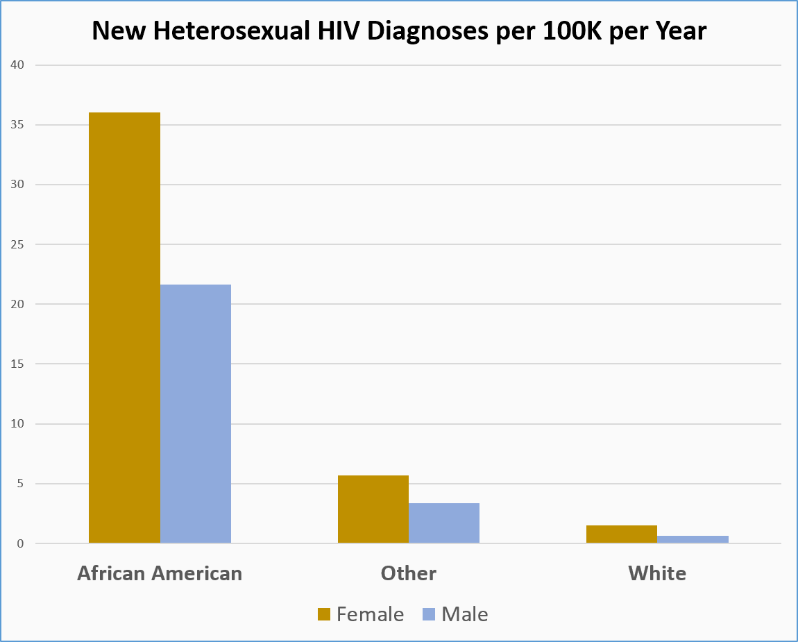
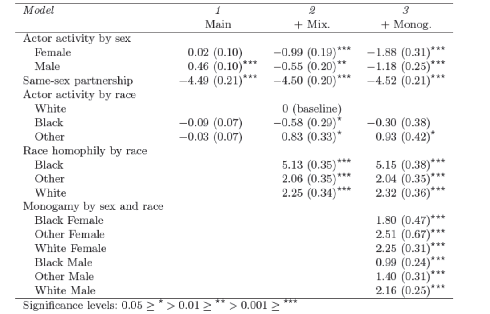
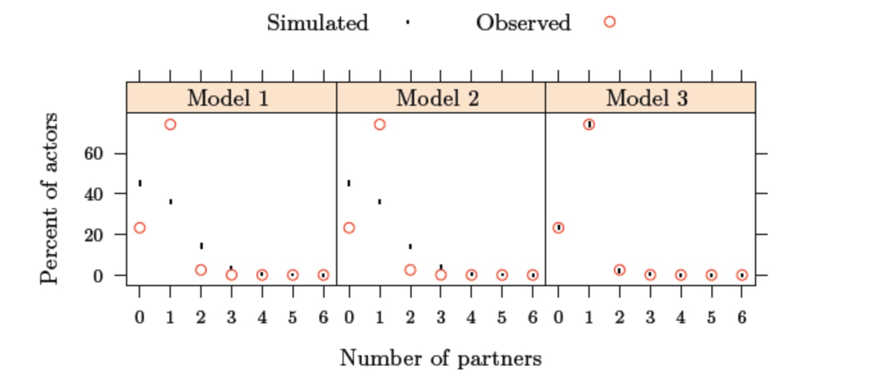
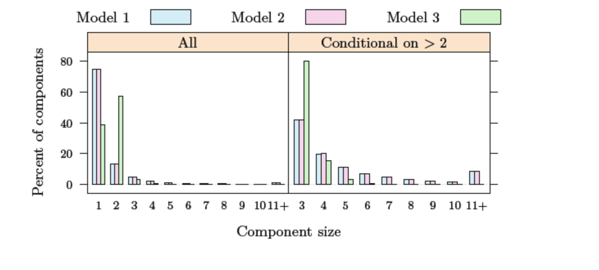
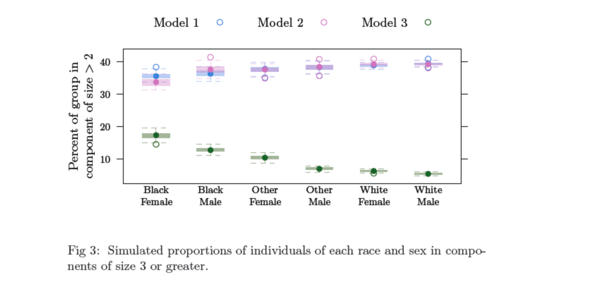
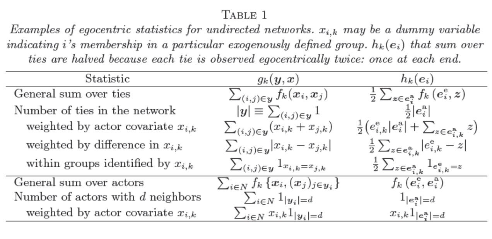

```{r setup, cache=FALSE, include=FALSE}
library(knitr)
knitr::opts_chunk$set(cache=T, comment=NA, fig.align='center')
options(width=100)
```
```{r include=FALSE}
SHOW_MSG = FALSE
```

_Last updated: `r Sys.Date()`_

*This tutorial is a joint product of the Statnet Development Team:* 

Martina Morris (University of Washington)  
Pavel N. Krivitsky (University of Wollongong)  
Mark S. Handcock (University of California, Los Angeles)    
Carter T. Butts (University of California, Irvine)    
David R. Hunter (Penn State University)    
Steven M. Goodreau (University of Washington)    
Skye Bender de-Moll (Oakland)  


For general questions and comments, please refer to the
[`statnet` wiki](statnet.org/wiki)
and the `statnet` users group and mailing list   
http://statnet.org/statnet_users_group.shtml

## Introduction to this workshop/tutorial.

This workshop and tutorial provide an introduction to 
key features of the packages that the
`statnet` suite provides for statistical modeling of
network data with *Exponential family Random Graph Models* (ERGMs).
The packages we will be using are:

* `network` -- storage and manipulation of network data
* `sna` -- descriptive statistics and graphics for exploratory network analysis`
* `ergm` -- statistical tools for estimating ERGMs, model assessment, and network simulation.

All `statnet` packages are open-source, written for the **R** computing
environment, and published on CRAN.  The source repositories are hosted
on [GitHub](statnet.github.io).  

### Prerequisites

This workshop assumes basic familiarity with **R**, experience with
network concepts, terminology and data, and familiarity with the
general framework for statistical modeling and inference.  

The workshops are conducted using `Rstudio`.


## 1. Software Installation and Preliminaries

Open an R session, and set your working directory to the location
where you would like to save this work.


To install the package the `ergm.ego`,

```{r,eval=FALSE}
install.packages('ergm.ego')
```

This will install all of the "dependencies" -- the other R packages that `ergm.ego` needs.

We will also need two other packages (from the "tidyverse") for this workshop:
```{r, eval=FALSE}
install.packages("dplyr")
install.packages("tibble")
```

Load these packages
```{r cache=FALSE, message=FALSE}
library(ergm.ego)
library(dplyr)
library(tibble)
```

Add define some functions we'll use later
```{r}
# Rounding of numeric columns only in dataframes 
round_df <- function(df, digits) {
  nums <- vapply(df, is.numeric, FUN.VALUE = logical(1))
  
  df[,nums] <- round(df[,nums], digits = digits)
  
  (df)
}

# extract se's for estimates from fit object
modse <- function(fit) sqrt(diag(vcov(fit, sources="model"))) 

```

Check package versions

```{r cache=FALSE}
sessionInfo()
```


## 2. Overview of ergm.ego

The `ergm.ego` package is designed to provide principled estimation of 
and statistical inference for Exponential-family Random Graph Models ("ERGMs") 
from egocentrically sampled network data.

This dramatically lowers the bar for empirical research on networks.  In many (most?) empirical contexts, it is not possible to collect a network
census or even an adaptive (link-traced) sample. Even when one of
these may be possible in practice, egocentrically sampled data are
typically cheaper and easier to collect. 

Long regarded as the poor country cousin in the network data family,
egocentric data contain a remarkable amount of information. With the
right statistical methods, such data can be used to explore the properties
of the complete networks in which they are embedded. The basic idea
here will be familiar to anyone who has worked with survey data:
you combine what is observed (the data) with assumptions 
(the model terms and their sampling distributions), to define a class of models (the range of coefficient values).  
Once estimated, the fitted model represents 
a distribution of networks that is
centered on the observed properties of the 
(appropriately scaled) sampled network.
The stochastic variation in the network distribution
quantifies some of the uncertainty introduced by the assumptions.


The `ergm.ego` package comprises:

* a set of utilities to manage the data,
* a set of "ergm terms" that can be used in models, 
* and a set of functions for estimation and inference that rely largely on the existing `ergm` package, but include the specific modifications needed in the egocentric data context.

`ergm.ego` is designed to work with the other `statnet` packages.  So, for example, once you have fit a model, you can use the summary and diagnostic functions from `ergm` to evaluate the model fit, the `ergm` simulate function to simulate complete network realizations from the model, the network descriptives from `sna` to explore the properities of networks simulated from the model, and you can use other **R** functions and packages as well after converting the network data structure into a data frame.

Putting this all together, you can start with egocentric data, estimate a model, test the coefficients for statistical significance, assess the model goodness of fit, and simulate complete networks of any size from the model.  The statistics in your 
simulated networks will be consistent with the appropriately scaled 
statistics from your sample for all of the terms that are 
represented in the model.

[//]: (switch here to showing examples:  1. ergmEgo paper, 2. AJPH paper)

### 2a. Motivating example:  Analyzing racial disparities in HIV in the US

The work on `ergm.ego` was originally motivated by a specific question 
in the field of HIV epidemiology---Does network structure help
explain the persistent racial disparities in HIV prevalence in the 
United States?  

An African American today is 10 times more likely than
a white American to be living with HIV/AIDS.
The disparity begins early in life, persists through to old age,
and is evident among all risk groups:  heterosexuals, men who have sex with
men (MSM), and injection drug users.  The disproportionate risks faced
by heterosexual African-American women are especially steep.  In 2010, an African-American woman was over 40 times more likely to be diagnosed with HIV than a heterosexual white man (Figure 1).

<div style="width:50%; height=50%">

</div>


Empirical studies repeatedly find that these disparities cannot be explained by individual behavior, or biological differences.  

A growing body of work is therefore focused on the role
of the underlying transmission network.  This network can channel the
spread of infection in the same way that
a transportation network channels the flow of traffic, with
emergent patterns that reflect the connectivity of the
system, rather than the behavior of any particular element.

Descriptive analyses and simulation studies 
have focused attention on two structural features: homophily and concurrency.
Homophily is the strong
propensity for within-group partner selection.
Concurrency is non-monogamy---having partners that overlap in time--which increases
network connectivity by allowing for the emergence of stable network
connected components larger than dyads (pairs of individuals).

The hypothesis is that these two network properties together can
produce the sustained HIV/STI prevalence differentials we observe: 
differences in concurrency between groups 
are the mechanism that generates the prevalence disparity, 
while homophily is the mechanism that sustains it. 

We will never observe the complete dynamic sexual network that transmits HIV.
But `ergm.ego` allows us to test the network hypothesis with egocentrically sampled data--and we will demonstrate that here using data collected by the *National Health and Social Life Survey* from 1994.  The analysis comes from a recent paper (Krivitsky and Morris, 2017).

First, `ergm.ego` allows us to assess whether empirical patterns of homophily and concurrency are in the predicted directions and statistically significant.  We do this in the usual way -- comparing sequential model fits with terms that represent the hypotheses of interests, and t-tests for their coefficients.  We will discuss these terms in more detail in later sections, but here we test the concurrency effects with "monogamy bias" terms.

<div style="width:80%; height=80%">

</div>
*Result:*  Yes, the homophily and concurrency effects are in the predicted directions and statistically significant.

Next, we can assess the goodness of fit of each model in the way we usually do in ERGMs, by checking whether the models reproduce observed nework properties that are *not* in the model.  We do this here by simulating from each model and comparing the fits to the full observed degree distribution:



*Result:*  Only Model 3 (with both hypothesized nework effects) is able to reproduce the observed degree distribution.

The ability to simulate complete networks from the model, however, allows
us to do much more--we can now examine the connectivity in the overall network that each of these models would generate.
For example, we can examine the component size distributions under each model:



*Result:* Model 3, with its "monogamy bias" dramatically reduces the right skew of the component size distribution, and places most people in components of size 2, or 3 if they are in a larger component.

Finally, we can define a measure of "network exposure" that represents the signature feature of a network effect: indirect exposure to HIV via a partner's behavior, rather than direct exposure via one's own behavior.
One metric for network exposure is the probability of being in a component of size 3 or more.  Because this is a node-level metric, we can break it down by race and sex for each of the three models:



*Result:*  Only model 3 produces a pattern of network exposure that is consistent with the observed disparities in HIV incidence.

`ergm.ego` provides a powerful analytic framework that uses extremely limited network data and testable models to investigate the unobservable patterns of complete network connectivity that are consistent with the sampled data.

The principles of egocentric inference can be extended to temporal ERGMs (TERGMs).  While we will not cover that in this workshop, an example can
be found in another paper that sought to evaluate the network hypothsis for racial disparities in HIV in the US (Morris et al. 2009).  In that paper, egocentric data from the National Longitudinal Survey of Adolescent Health (AddHealth) was analyzed, and an example of the resulting dynamic complete network simulation (on 10,000 nodes) can be found in this ["network movie"](http://statnet.org/movies). 

The movie below is another simpler example of what you can do with egocentrically sampled data and the `statnet` software.  It shows an epidemic spreading on a small dynamic contact network that is simulated with a STERGM estimated from egocentrically sampled network data.  The movie was produced by the R packages `EpiModel` and `ndtv`, which are part of the `statnet` package suite (and are also available on CRAN).
<div style="width:50%; height=50%">

</div>


## 3. Background

The full technical details on ERGM estimation and inference from egocentrically
sampled data have been published in
[Krivitsky and Morris (2017)](http://projecteuclid.org/euclid.aoas/1491616887)
This section of the tutorial provides a brief introduction to the key concepts.

### 3a. Exponential-family random graph models

ERGMs represent a general class of models based in exponential-family theory for 
specifying the probability distribution 
for a set of random graphs or networks. Within this framework, one can---among other tasks---obtain maximum-likehood estimates for the parameters of a specified model 
for a given data set; test individual models for goodness-of-fit, perform various types of model comparison; and simulate additional networks with the underlying probability 
distribution implied by that model.

The general form for an ERGM can be written as:
$$
P(Y=y;\theta,x)=\frac{\exp(\theta^{\top}g(y,x))}{\kappa(\theta,x)}\qquad (1)
$$
where:

* $Y$ is the random variable for the state of the network (with realization $y$), 

* $g(y,x)$ is a vector of model statistics for network y, 

* $\theta$ is the vector of coefficients for those statistics, and 

* $\kappa(\theta)$ represents the quantity in the numerator summed over all possible networks (typically constrained to be all networks with the same node set as $y$).

If you're not familiar with the compact notation here, note that the numerator represents a formula that is linear in the log form:

$$
log({\exp(\theta'g(y))}) = \theta_1g_1(y) + \theta_2g_2(y)+ ... + \theta_pg_p(y)
$$
where $p$ is the number of terms in the model.  From this one can more easily observe the analogy to a traditional statistical model:  the coefficients $\theta$ represent the size and direction of the effects of the covariates $g(y)$ on the overall probability of the network.

The ERGM expression for the probability of the entire graph shown above can be re-expressed in terms of the conditional log-odds of a single tie between two actors:

$$
\operatorname{logit}{(Y_{ij}=1|y^{c}_{ij})=\theta'\delta(y_{ij})}
$$

where 

* $Y_{ij}$ is the random variable for the state of the actor pair $i,j$ (with realization $y_{ij}$), and 

* $y^{c}_{ij}$ signifies the complement of $y_{ij}$, i.e. all dyads in the network other than $y_{ij}$. 

* $\delta(y_{ij})$ is a vector of the "change statistics" for each model term.  The change statistic records how the $g(y)$ term changes if the $y_{ij}$ tie is toggled on or off.  So:

$$
\delta(y_{ij}) = g(y^{+}_{ij})-g(y^{-}_{ij})
$$

where 

* $y^{+}_{ij}$ is defined as $y^{c}_{ij}$ along with $y_{ij}$ set to 1, and 
* $y^{-}_{ij}$ is defined as $y^{c}_{ij}$ along with $y_{ij}$ set to 0.  

So $\delta(y_{ij})$ equals the value of $g(y)$ when $y_{ij}=1$ minus the value of $g(y)$ when $y_{ij}=0$, but all other dyads are as in $g(y)$.  

This expression shows that the coefficient $\theta$ can be interpreted as that term's contribution to the log-odds of an individual tie, conditional on all other dyads remaining the same.  The coefficient for each term in the model is multiplied by the number of configurations that tie will create (or remove) for that specific term.

The model terms $g(y,x)$ are functions of network statistics that we hypothesize may be more or less common than what would be expected in a simple random graph (where all ties have the same probability).  When working with egocentrically sampled network data, the statistics one can include in the model are limited by the requirement that they can be observed in the sample data
[more details below](ergm.ego_tutorial.html#Egocentric-statistics)

A key distinction in model terms is _dyad independence_ or _dyad dependence_.  Dyad independent terms (like nodal homophily terms) imply no dependence between dyads---the presence or absence of a tie may depend on nodal attributes, but not on the state of other ties.  Dyad dependent terms (like degree terms, or triad terms), by contrast, imply dependence between dyads.  The design of an egocentric sample means that most observable statistics are dyad independent, but there are a few, 
like degree, that are dyad dependent. 

### 3b. Network Sampling

Network data are distinguished by having
two units of analysis: the actors and the links between the actors.  This gives 
rise to a range of
sampling designs that can be classified into two groups: link tracing designs (e.g., 
snowball and respondent driven sampling) and egocentric designs.


#### 3b1. Link-Trace Designs

Link-trace designs have traditionally been used to sample hard-to-reach populations.  Sampling begins with a set of seed nodes.  The seeds are asked to nominate alters, the alters are then recruited into the sample, asked to nominate their alters, and so on.  Each new set of alters is called a *wave* or a *generation*, and the number of waves of sampling is a study design variable.  At each wave, a census or a sample of the alters may be elicited, and/or recruited, 
this too is a study design variable,
and alter recruitment may be investigator-driven, or respondent-driven.  This gives rise to a wide range of possible link-trace designs.  When the decision to elicit a new wave of alters depends on an attribute of the current node (e.g., is this node an injection drug user) the design is called an adaptive sample.

#### 3b2. Egocentric Designs

Egocentric network sampling comprises a range of designs developed specifically 
for the collection of network data in social
science survey research. The design is (ideally) based on a probability
sample of respondents ("egos") who, via interview, are asked to nominate a
list of persons ("alters") with whom they have a specific type of relationship ("tie"),
and then asked to provide information on 
the characteristics of the alters and/or the ties.  The alters 
are not recruited or directly observed.
Depending on the study design, alters may or may not be uniquely identifiable, and
respondents may or may not be asked to provide information 
on one or more ties among alters (the "alter" matrices). 
Alters could, in theory, also be present in the data as an ego 
or as an alter of a different ego; the likelihood of this 
depends on the sampling fraction. 

Egocentric designs sample egos using
standard sampling methods, and the sampling of links is implemented through
the survey instrument. As a result, these methods are easily 
integrated into population-based 
surveys, and, as we show below, inherit many of the inferential benefits.

For the moment `ergm.ego` uses the minimal egocentric network study design,
in which alters cannot be uniquely identified and alter matrices are not collected 
<!-- (see Smith (2012) and Gjoka, Smith, and Butts (2014a) for  -->
<!-- considerations of when they are). -->
The minimal design is more common, and the data are more widely available,
largely because it is less invasive and less time-consuming than designs which include identifiable alter matrices. However, deveopment of estimation where alter--alter matrices are available is being planned.


### 3c. Existing methods for sampled network data

#### Model-based
**Handcock and Gile (2010):** Likelihood inference for partially observed networks, has egocentric data as a special case.

**Kosikinen and Robins (2010):** Bayesian inference for partially observed networks, has egocentric data as a special case.

Pros:
: * Can fit any ERGM that can be identified.
: * Can handle link-tracing designs.

Cons:
: * Requires alters to be identifiable.
: * Cannot take into account sampling weights (unless all attributes that affect sampling weights are part of the model).
: * Might not scale.
: * Requires knowledge of the *population* distribution of actor attributes used in the model.

#### Design-based
**Krivitsky and Morris (2017)** Use design-based estimators for sufficient statistics of the ERGM of interest and then transfers their properties to the ERGM estimate.

Pros:
: * Does not require alters to be identifiable.
: * Borrows directly from design-based inference methods. (Can easily incorporate sampling weights, stratification, etc.)
: * Can fit any ERGM that can be identified (though see below).
: * Can be made invariant to network size for some models.

Cons:
: * Requires "reimplementation" of the model statistics as "`EgoStats`": currenly does not support alter--alter statistics or directed or bipartite networks.
: * Relies on independent sampling form population of interest in some form.
: * Cannot be fit to more complex (e.g., RDS) designs.
: * Requires knowledge of the *population* distribution of actor attributes used in the model.

## 4. Theoretical Framework and Definitions

We'll need some notation for this (sorry, and a warning that it will get hairier).

#### Population network

Parameter   | Meaning
----------- | -----------------------------------------------------------------
$N$         | the population being studied: a very large, but finite, set of actors whose relations are of interest
$x _ i$     | attribute (e.g., age, sex, race) vector of actor $i \in N$
$x_N$       | (or just $x$, when there is no ambiguity) the attributes of actors in $N$
$\mathbb{Y}(N)$ | the set of **dyads** (potential ties) in an undirected network of actors in $N$
$y\subseteq \mathbb{Y}(N)$ | the **population network**: a fixed but unknown network (a set of relationships) of relationships of interest.  In particular,
$y_{ij}$ | an indicator function of whether a tie between $i$ and $j$ is present in $y$
$y _ i=\{j\in N: y _ {ij}=1\}$ | the set of $i$'s network neighbors.

#### Egocentric sample

Parameter   | Meaning
----------- | -----------------------------------------------------------------
$e_{N}$ | the **egocentric census**, the information retained by the minimal egocentric sampling design when all nodes are sampled
$S\subseteq N$ | the set of egos in a sample
$e_{S}$ | the data contained in an egocentric sample
$e_i$ | the "egocentric" view of network $y$ from the point of view of actor $i$ ("ego"), with the following parts:
$e^e_i \equiv x_i$ | $i$'s own attributes
$e^a_i \equiv (x_{j})_{j\in y_i}$ | an unordered list of attribute vectors of $i$'s immediate neighbors ("alters"), but **not** their identities (indices in $N$)
$e^e_{i,k}\equiv x_{i,k}$ | The $k$th attribute/covariate observed on ego $i$
$e^a_{i,k}\equiv( x_{j,k})_{j\in y_i}$ | and its alters.


<!-- Note that the statistical inference here is more straightforward than -->
<!-- inference from data on complete networks.  For complete networks  -->
<!-- you have the network census, so, in one sense, there is no inference to -->
<!-- be made from the "sample" to the "population", and no uncertainty to -->
<!-- quantify.  Statistical inference for complete networks is instead motivated -->
<!-- in terms of an unobserved "super-population" from which the observed network -->
<!-- was drawn. -->

<!-- With sampled networks, by contrast, the traditional framework of sampling -->
<!-- distributions (of the estimates) arising from repeated samples from a  -->
<!-- fixed population apply. -->

### 4a. Specifying Egocentric ERGMs

Egocentric ERGMs are specified the same way as plain `ergm`: via terms (e.g. `nodematch`)
used to represent predictors on the right-hand size of equations used
in:

* calls to `summary` (to obtain measurements of network statistics on a dataset)
* calls to `ergm.ego` (to estimate an ERGM)
* calls to `simulate` (to simulate networks from an ERGM fit)

The terms that can be used in an ERGM depend on the type of network being
analyzed (directed or undirected, one-mode or two-mode ("bipartite"), binary or
valued edges) and on the statistics that can be observed in the sample.

Even if the whole population is
egocentrically observed (i.e., $S=N$, a census), the alters are still not
uniquely identifiable.  This limits the kinds of network statistics that
can be observed, and the ERGM terms that can be fit to such data. 
We turn to the notion of sufficiency to identify the terms amenable to egocentric inference. 

#### Egocentric Statistics 

We call a network statistic $g_{k}(\cdot,\cdot)$ **egocentric** if
it can be expressed as 
$$
g_{k}(y,x)\equiv \textstyle\sum_{i\in N} h_{k}(e_i)   
$$
for some function $h_{k}(\cdot)$ of egocentric information
associated with a single actor.  In plain language, the statistic is egocentric if you can take the individual
level measure of that statistic (say, the number of ties), sum this (or a simple function of this) across all individuals 
in the population (i.e., an egocentric census) and recover the network level statistic (here, the total number of ties in the network).  


The space of egocentric statistics includes **dyadic-independent** 
statistics that can be expressed in the general form of
$$
g_{k}(y,x)=\sum_{ij\in y} f_k(x_i,x_j)          
$$
for some symmetric function $f_k(\cdot,\cdot)$ of two actors' attributes; 
and some **dyadic-dependent** statistics that can be expressed as
$$
g_{k}(y,x)=\sum_{i\in N} f_k ({x_{i},(x_j)_{j\in y_i}})
$$ 
for some function $f_k(\cdot,\dotsb)$ of the attributes of an actor and 
their network neighbors.  

*The statistics that are identifiable in an egocentric sample depend on the specific egocentric study design.*

Basic (minimal) egocentric design (alter attributes only)
: * Nodal Covariate/Factor effects
: * Homophily
: * Degree distribution

With ego reports of alter degree (the number of alter's ties)
: * Degree assortativity

With alter-alter ties
: * Triadic closure (transitive/cyclical ties, triangles)
: * 4-cycles (possibly)

Not Egocentric for other reasons, but estimable
: * Mean degree ($g_{k}(y,x)=2|y|/|N|$): $e _ i$ doesn't know how big the network is [^1]

The table below (from Krivitsky & Morris 2017)
shows some examples of egocentric statistics,
and gives their representations in terms of of 
$h_{k}(\cdot)$.
  

[^1]:
This does not mean that the mean degree  itself cannot be estimated from egocentric data, only that our inferential results might not apply.

 
### 4b. Theoretical basis for inference

The framework for inference relies on two basic properties of  exponential family models:

* For MLEs, the expected value of a sufficient statistic ($g(y,x)$) in the model is equal to its observed value.

* The MLE is a smooth function of the sufficient statistic, and is defined for "in between" values of the statistics as well (e.g., fractional edges).

MLE's uniquely maximize the probability of the observed statistics under the model, and any network with the same observed statistics will have the same probability.

#### 4.b1.  Preliminaries:  The scaling assumption for design based inference of the sufficient statistics

With an egocentric sample, we don't observe these sufficient statistics, we observe a sampled version of these statistics.
So the first question is how the sample statistics scale up to the population level.  If we know this, then we can
estimate the population level sufficient statistics.
A natural scaling assumption for dyadic independent statistics is
that they scale on a *per capita* basis, i.e., that the mean degree stays constant.
$$
\text{Mean Degree} = \frac{2\times\text{ties}}{\text{nodes}} = \frac{2T}{n}
$$
For example, if 5 people have 10 ties, the mean degree (degree *per capita*) is $\frac{2*ties}{nodes} = \frac{20}{5} = 4$,
so we would expect 20 people to have 80 ties.  As with everything network, things are more complicated for
dyad-dependent statistics.  We will not cover the scaling for dyad-dependent statistics in this workshop, but if you are
interested see [Krivtsky and Kolaczyk (2015)](https://projecteuclid.org/euclid.ss/1433341477).

This type of estimate can easily be adapted to handle sample weights.  This statistical name for this 
approach is "design-based" estimation.

#### 4.b2  Design-based estimation of ERGMs 

This is done in three steps:

1. Estimate the ERGM's sufficient statistics using the *per capita* scaling assumption
$$g(y,x)\approx \tilde{g}(e _ S)=\frac{|N|}{|S|} \textstyle\sum_{i\in S} h _ {k}(e _ i).$$
    * This is an estimate for a population total, so it is consistent, asymptotically normal (by the CLT).
	* We can estimate its variance as we would a variance of a mean.
2. Fit the ERGM by finding $\hat{\theta}$ that corresponds to (that is, produces) $\tilde{g}(e _ S)$.
    * It exists because of ERGM's properties.
3. Use Delta Method to transfer properties of $\tilde{g}(e _ S)$ to $\hat{\theta}$.
    * We can do this, because MLE is a smooth function of $g(y,x)$.

Together, these allow us to use
any statistics that can be observed in an egocentric sample as a term in an
ERG model, to estimate the model from a complete pseudo-network that has 
the same (or appropriately scaled) sufficient statistics,
and the networks simulated from the fitted model will be centered on the (scaled)
observed statistics.


#### 4b3. Practical issues

In practice, egocentric sample statistics generally need to be 
adjusted for network size and some types of observable discrepancies. 

##### Network Size

The treatment of network size is perhaps the most
obvious way that egocentric estimation differs
from a standard ERGM estimation on a completely observed
network.  With a network census, the network size is known;
by contrast, with a network sample, we don't typically know the size of the network from
which it is drawn.  However, if the
statistics we observe in the sample scale in a known way with network size, then
we can adjust for this in the estimation, and the resulting parameter estimates
(with the exception of the edges term) will be "size invariant".

Here we will follow Krivitsky, Handcock, and Morris (2011), who showed that one can
obtain a "per capita" size invariant parameterization for dyad-independent
statistics by using an offset, approximately equal to $-\log(n)$, where $n$ is
the number of nodes in the network.  The intuition
is that this transforms the density-based parameterization (ties per dyad) 
that is the default scale for ERGMs into a mean degree-based parameterization
(ties per node):

$$
\text{Density} = \frac{\text{ties}}{\text{dyads}} = \frac{T}{\frac{n(n-1)}{2}} = \frac{\text{Mean Degree}}{(n-1)}
$$

Once the number of edges is adjusted to preserve the mean degree, Krivitsky et al. show that all of the dyad
independent terms are properly scaled.  For degree-based terms, we would want, by
analogy, for per capita invariance to preserve the degree probability distribution.
Experimental results suggest that the mean-degree preserving offset has this
property, but a mathematical proof is elusive.

##### Observable discrepancies

In the population level network, the number of ties between groups must balance:  the number
of ties between group 1 and group 2 is the same as between group 2 and group 1, 
because we observe the group attribute of each node for every tie.  In an egocentrically
sampled network, this equality may no longer hold.

This can lead to discrepancies: tie subtotals that are 
required to balance in theory,
but are observed not to balance in the sample.  For an egocentrically sampled
network, and even for an egocentric census, this kind of discrepancy can arise, either
from sampling variability, or from measurement error.

This is another unique feature of egocentrically sampled network data.    

In `ergm.ego`, *we assume that any discrepancy is due to sampling variation*, 
and effectively take the average of the discrepant reports to estimate
the number of ties for that ego-alter tie configuration.  If you know the 
source of the discrepancy, or want to make a different assumption
you may want to address this before fitting the data in `ergm.ego`.

##### Constructing the egocentric **target statistics**

Now that we have a simple way to construct a consistent set of egocentric statistics
and implement a size-invariant parameterization, we can set up the *target statistics*
for the ERGM estimation.  However, in many applications, our population size is in the millions.  Therefore, we use *per capita* scaling to
limit the size of the network we use for estimation, and increase the speed and
efficiency of the process.

We first scale the sample statistics to a *pseudo-population* size $|N'|$.
The resulting values are the target statistics that we pass to `ergm`.
We can then fit whe model with an offset of $-\log(|N'|)$, which will return
the per capita estimates that can
be easily rescaled to any value for simulation purposes.

Note that if we want to obtain population estimates from `ergm.ego` for a population
with a known size $|N|$, we can fit the model with an
offset of $\log(|N|/{|N'|})=\log(|N|) - \log(|N'|)$.  This is what the parameters *would have been* had we fit the ERGM to the population of size $|N|$.


#### 4b4. Inference:  Estimating the standard errors of the ERGM coefficients

The standard errors for coefficients in an `ergm.ego` fit are designed to represent the
uncertainty in our estimate.  For ERGMs, this uncertainty can be thought of as
coming from three possible sources:

1. A superpopulation of networks, from which this one network is a single realization: What other networks _could_ have been produced by the social process of interest?
2. The sampling process of egos: What other samples _could_ have been drawn? 
3. The stochastic MCMC algorithm used to estimate the coefficient: What other MCMC samples _could_ we have gotten?

Most treatments of ERGM estimation treat the coefficient
$\theta$ as a parameter of a superpopulation process 
of which $y$ is a single realization. 
The variance of the MLE of $\theta$ is then conceived as coming from (1) and (3) above.

In contrast, in `ergm.ego` we treat the network as a fixed, unknown, finite population, 
so it is not a source of uncertainty. Rather, uncertainty comes from sampling
from this network, and from the MCMC algorithm, (2) and (3) above.

This makes `ergm.ego` inference much more like traditional (frequentist)
statistical inference:  we imagine repeatedly drawing an egocentric sample, and estimating
the ERGM on each replicate.  The sampling distribution of the estimate reflects
how our estimate will vary from sample to sample.


## 5. The package `ergm.ego`

Since `ergm.ego` is essentially a wrapper around `ergm`, there are relatively few
functions in the `ergm.ego` package itself.  The functions that are there deal with
the specific requirements associated with data management, estimation and inference
for egocentrically sampled data.

To get a list of documented functions, type:

```{r eval=FALSE}
help(package="ergm.ego")
```

The main `R` objects unique to `ergm.ego` are:


* `egodata` objects for storing the original data (the analog to `network` objects in `ergm`), 
* `ergm.ego` objects, which store the model fit results (the analog to `ergm` objects in `ergm`).  

Once you simulate from the fit, the resulting objects are just `network` objects.

The set of functions can be divided into groups as follows:


### 5a. Data construction and manipulation:   `egodata` objects and their related functions


The primary data construction function is `as.egodata`.  This function will transform data stored in other formats into an `egodata` object that can be used for analysis.  The two format conversions currently supported include:

**R** data frames
: This is the method used to read in data from an egocentric sample.
: * a data frame containing information on egos, which must include a column for unique ego IDs (defaulting to `egoID`)
: * a data frame containing information on alters, which also must have the ego ID column for the ego who nominated them
: * optionally, a vector of length equal to the number of egos, containing their sampling weights

`network` objects
: The function will create an egocentric census from an existing network. Mostly used for testing and pedagogical purposes.


The `as.network` method for `egodata` will transform an egodata 
object into a network object
with a target number of nodes and no edges.  The nodes will have the 
attributes of the egos in the dataset, replicating the egos as needed, 
and taking into account their sampling weights.

Functions for querying 'egodata' objects include:

* `dim` -- the number of egos, and the number of columns in the 'egos' table
and the 'alters' table.
* `nrow` -- the number of egos
* `dimnames` -- the `egoIDs`, and the column names in the 'egos' table and the 'alters' table.

Functions for extracting subsets from 'egodata' objects include:

* `head` --- first few rows of each component of `egodata` 
* `sample` -- a `sample` method for `egodata` object with the target number of egos
* `subset` -- allows you to define a condition for the subset of egos to choose, 
and which columns of the `egos` and `alters` tables to select.
* `na.omit` -- returns an `egodata` object without NAs in their 
(or their alter's) columns


### 5b. Model terms available for ergm.ego

As with ERGM terms, terms in `ergm.ego` are coded as functions in **R**.  The possible
terms in an `ergm.ego` model are inherently limited to the egocentric ones: statistics that can be inferred from an egocentric sample.  In general, these will include variants on nodal covariate
terms, mixing terms, and degree distribution terms.  The terms actually available
in `ergm.ego` are limited in addition to those that have been coded up.  At this
point this is a small subset (n=11) of the terms currently available for `ergm`,
but they have the same names and arguments as their `ergm` counterparts.

For a list of terms currently included in the ergm.ego, type:

```{r eval=FALSE}
help('ergm.ego-terms')
```

Dyad independent terms include density and vertex attribute based measures:

* Density:  `edges`
* Vertex attribute effects:  `nodefactor` (for discrete/nominal vars) and `nodecov` (for continuous)
* Homophily:  `nodematch` (for homophily), `nodemix` (for general mixing patterns) and `absdiff`

Dyad dependent terms include degree-based measures:

* Degree: `degree`, `degrange` and `degreepopularity`
* Concurrency: `concurrent` and `concurrentties`


### 5c. ERG Model-related functions

There are four current functions, each mimics the equivalent function in `ergm`

Function    | Purpose
----------- | -----------------------------------------------------------------
`summary`| takes an `ergm` formula with an 'egodata' object on the LHS and `ergm` terms on the RHS, and returns the observed values of the statistics on the RHS.  When used on an `ergm.ego` object, this returns a summary of the model fit.
`ergm.ego`| the main function used to fit an ERGM to the egodata object.  In addition to the arguments that are specific to fitting from egocentrically sampled data, you can pass the usual arguments to `ergm` for controlling the fitting algorithm.
`control.ergm.ego`| includes a set of control parameters specifically needed for fitting ERGMs to egocentrically sampled data, as well a method for passing other control parameters to `ergm`.
`vcov`| returns the variance--covariance matrix of the estimate for $\theta$.

### 5d. Simulation related functions

There are two current functions, again mimicking the equivalent function in `ergm`

Function    | Purpose
----------- | -----------------------------------------------------------------
`simulate`| Simulates complete networks (of any size) from the fitted model.  You can either pass the `ergm.ego` object (which contains the results of the model fit) to simulate, or pass a formula as the object, along with a vector of coefficients.
`control.simulate.ergm.ego`| Allows you to control how to resolve fractional numbers of vertices when this is produced by the sample weights and the population size selected.  Also provides a way to pass controls to SAN and `ergm` simulate.


## 6. Example Analysis

We will work with the `faux.mesa.high` dataset that is included with the `ergm` package,
using the `as.egodata` function to transform it into an egocentrically sampled
network.  In essence, this creates an egocentrically sampled census from the
network.  Knowing the complete network will allow us to compare the fits we get
from `ergm.ego` and `ergm`.


Preliminaries:

Set seed for simulations -- this is not necessary, but it ensures that we all get the same results (if we execute the same commands in the same order).

```{r cache=FALSE}
set.seed(1)
```


### 6a. Reading in Data

Start by creating a network object from the faux.mesa.high data:

```{r}
data("faux.mesa.high")
mesa <- faux.mesa.high
```

Let's first take a quick look at the complete network

```{r}
plot(mesa, vertex.col="Grade")
legend('bottomleft',fill=7:12,legend=paste('Grade',7:12),cex=0.75)
```

Now, let's turn this into an egodata object:

```{r}
mesa.ego <- as.egodata(mesa) # Generates warning because there are no vertex IDs.
```

Take a look at this object -- there are several ways to do this:

```{r}
str(mesa.ego)
summary(mesa.ego)
head(mesa.ego$egos)
head(mesa.ego$alters)
```

Note that the ego table contains the `egoID`, and the nodal attributes Race, Grade and Sex.
The alter table also contains the `egoID`, an equivalent set of nodal attributes.
The `egoID` column is used by functions that know how to work with `egodata` objects
to match alters to the ego that nominated them.  The alters
do not have unique IDs (because we do not know if they are unique).


So that you get a chance to read in egodata from a .csv file, let's write out the
ego and alter tables, and then read them back in to create an egodata object:

```{r}
write.csv(mesa.ego$egos, file="mesa.ego.table.csv", row.names=FALSE)
write.csv(mesa.ego$alters, file="mesa.alter.table.csv", row.names=FALSE)
```

Now read them back in:

```{r}
mesa.egos <- read.csv("mesa.ego.table.csv")
head(mesa.egos)
mesa.alters <- read.csv("mesa.alter.table.csv")
head(mesa.alters)
```

And to create an `egodata` object from them, we use the *as.egodata* function:

```{r}
test <- as.egodata(mesa.egos,alters=mesa.alters,egoIDcol="egoID")
head(test$egos)
head(test$alters)
```

We will explore some of the other functions available for manipulating the
`egodata` object in a later section.


### 6b. Exploratory data analysis with `ergm.ego`
  
Prior to model specification, we can explore the data using descriptive
statistics observable in the original egocentric sample.  In general, the
observable statistics are the same as those that `ergm.ego` can estimate.

We can use standard **R** commands to view nodal attribute frequencies:

```{r}
table(mesa.ego$egos$Sex, exclude=NULL)
table(mesa.ego$egos$Race, exclude=NULL)
barplot(table(mesa.ego$egos$Grade), 
        main="Mesa Grade Distribution", ylab="frequency")

# compare egos and alters...

par(mfrow=c(1,2))
barplot(table(mesa.ego$egos$Race, exclude=NULL)/nrow(mesa.ego$egos),
        main="Ego Race Distn", ylab="percent",
        ylim = c(0,0.5))
barplot(table(mesa.ego$alters$Race, exclude=NULL)/nrow(mesa.ego$alters),
        main="Alter Race Distn", ylab="percent",
        ylim = c(0,0.5))
```

To look at the mixing matrix, we use the same function we would use in `ergm`:  `mixingmatrix`.  
The function will return either the crosstabulation
of the counts of ties by the attribute selected, or the conditional row probabilities.

```{r}
# to get the crosstabulated counts of ties:

mixingmatrix(mesa.ego,"Grade")

# contrast with the original network crosstab:

mixingmatrix(mesa, "Grade")

# to get the row conditional probabilities:

mixingmatrix(mesa.ego, "Grade", rowprob=T)
mixingmatrix(mesa.ego, "Race", rowprob=T)
```

We can also examine the observed number of ties, 
mean degree, and degree
distributions.

```{r}
# ties
nrow(mesa.ego$alters)

# mean degree
nrow(mesa.ego$alters)/nrow(mesa.ego$egos)


# overall degree distribution
summary(mesa.ego ~ degree(0:20))

# and stratified by sex
summary(mesa.ego ~ degree(0:13, by="Sex"))
```

For the degree distribution we used
the`summary`function in the same way that we would use it in 
`ergm` with a `network` object.
But the summary function also has an egodata 
specific argument, `scaleto`, that
allows you to scale the summary statistics 
to a network of arbitrary size.
So, for example, we can obtain the degree distribution scaled to a network
of size 100,000, or a network that is 100 times larger than the sample.

```{r}
summary(mesa.ego ~ degree(0:10), scaleto=100000)
summary(mesa.ego ~ degree(0:10), scaleto=nrow(mesa.ego$egos)*100)

```

Note that the first scaling results in fractional 
numbers of nodes at each degree, because the proportion at each
degree level does not scale to an integer for this population size.  Again,
this is not a problem for estimation, but one should be careful with descriptive
statistics that expect integer values.  The second scaling does result in integer
counts because it is a multiple of the sample size.

We can plot the degree distribution
using another generic function `degreedist`.  As with the `mixingmatrix` function, 
this can return either the counts or the proportions at each degree.

```{r}
# to get the frequency counts

degreedist(mesa.ego)
degreedist(mesa.ego, by="Sex")

# to get the proportion at each degree level

degreedist(mesa.ego, by="Sex", prob=T)
```

The `degreedist` function also has an argument that lets you overplot the expected
degree distribution for a Bernoulli random graph with the same expected density.

```{r}
degreedist(mesa.ego, brg=T)

degreedist(mesa.ego, by="Sex", prob=T, brg=T)
```

The `brg` overplot is based on 50 simulations of a Bernoulli random graph with the same
number of nodes and expected density, implemented by using an ergm.ego simulation from
an edges only model with $\theta=\mbox{logit}(\mbox{probability of a tie})$ from the observed
data.  The overplot shows the mean and 2 standard deviations obtained for each
degree value from the 50 simulations.  Note that the `brg` automatically scales
to the proportions when `prob=T`.


### 6c. Model Specification
 
 
The key characteristics we would like to capture in a model for this network are:

* Variation in mean degree by nodal attributes (race, sex and grade)
* Patterns of mixing by race, sex and grade
* The degree distribution, (in particular the disproportionate isolate fraction)

We can use `ergm.ego` to fit a sequence of nested models to
both estimate the parameters associated with these statistics,
and test their significance.  We can diagnose the both the estimation
process (to verify convergence and good mixing in the MCMC sampler)
and the fit of the model to the data.  In both cases, we will use
functionality that will be familiar to `ergm` users:  MCMC diagnostics,
and GOF.


One thing that is different from a standard `ergm` call is that we need
to specify the scaling, both for the *pseudo-population ($N'$)* that will be
used to set the target statistics during estimation, 
and for the *population (N)* size that the final
rescaled coefficients will represent. Recall,

Population size $(|N|)$
: If we wanted to rescale the final estimates to reproduce
the expected values in the true population network, we would need to know $N$, the
size of the popuation.  In general, we do not know this, so the most useful
scaling is a per capita scaling, which can easily be transformed into any value
of $|N|$ later (for simulation, or other purposes).  For per capita scaling, $|N|=1$. In `ergm.ego`, it is controlled by the `popsize` top-level argument.


Pseudo-population $(|N'|)$
: Recall from above that the target statistics can
be scaled to an arbitrary population size for estimation.  What size should we use?
Several principles guide this choice:

* *Bias* -- In general, estimation bias is reduced 
the closer $N'$ is to $N$ (usually larger).

* *Computing time* -- The larger the pseudo-population, 
the longer the estimation takes.

* *Sample weights* -- In general, it is good practice for the
smallest sample weight to produce at least 1 observation in the 
pseudo-population network, though more is better.

This leads to different guidelines for data with and without weights.

Simulation studies in Krivitsky & Morris (2017) suggest that a good rule of thumb
is to have a minimum pseudo-population size of 1,000 for unweighted data.  For
weighted data the pseudo-populations size should be at least
1 * sampleSize/smallestWeight (or 3 * sampleSize/smallestWeight to be safe), or 1000 (whichever is larger).

In `ergm.ego`, $|N'|$ is controlled by a combination of four factors:

* the sample size $|S|$ (i.e., number of egos),
* the top-level argument `popsize` ($|N|$ or 1) (default: 1),
* the `control.ergm.ego` control parameter `ppopsize` (default: `"auto"`),
* the `control.ergm.ego` control parameter `ppopsize.mul` (default: 1).

If `ppopsize` is left at its default (`"auto"`),

* If `popsize` is left at 1, `ppopsize` $=|S|\times$`ppopsize.mul`.
* If `popsize` is specified (as |N|), `ppopsize` $=|N|\times$`ppopsize.mul`.

You can also force one of these two regimes by setting `ppopsize` to `"samp"` or `"pop"`, respectively, or set it to a number to force a particular $|N'|$ ignoring `ppopsize.mul`.

For more information, see

```{r eval=FALSE}
?control.ergm.ego
```

We will give an example below.

In both cases, the scaling will only affect the estimate 
of the *edges*
term, and we will demonstrate this below.

Let's start with simple edges-only model to see what's the same and what
is different from a call to `ergm`:

```{r message=SHOW_MSG}
fit.edges <- ergm.ego(mesa.ego ~ edges)
summary(fit.edges)
```

This is a simple model, for a homogenous tie probability -- a Bernoulli random
graph with the mean degree observed in our sampled data.  The
only difference in the syntax from standard ergm is the function
call to `ergm.ego`.
Let's look under the hood at the components that are output to the
`fit.edges` object:

```{r}
names(fit.edges)
fit.edges$ppopsize
fit.edges$popsize
```
Many of the elements of the object are the same as you would get from an `ergm` fit,
but the last few elements are unique to `ergm.ego`.  Here you can see the `ppopsize` --
the pseudo-population size used to construct the target statistics, and
`popsize` -- the final scaled population size after network size adjustment is
applied.  The values that were used in the fit were the default values,
since we did not specify otherwise.  So, `ppopsize`$=205$ (the sample
size, or number of egos), and `popsize`$= 1$, 
so the scaling returns the per capita estimates from
the model parameters.

The summary shows the `netsize.adj` = `r -log(205)`, which is $-\log(205)$.

The summary function also reports that:
```
 The following terms are fixed by offset and are not estimated:
  netsize.adj
```

So what would happen if we fit the model instead with target statistics from a
pseudo-population of size 1000?  To do this, we explicitly change the value
of the `ppopsize` parameter through the control argument:

```{r, echo=F, eval=F}
summary(ergm.ego(mesa.ego ~ edges, 
                 control = control.ergm.ego(ppopsize=1000)))
```
Now the netsize.adj value is $`r -log(1000)` = -\log(1000)$.

Note that the value of the estimated edges coefficient is the same in both
models, 0.698.  This is the behavior we expect -- the model is returning the same
per capita value in both cases; it is just using a different scaling for the
target statistics used in the fit.  For this simple model, there may not be much
difference in the properties of the estimates for these two different pseudo-population
sizes.

We will examine the impact of modifying the `popsize` parameter in a later section
below.


As the output shows, the model fit was fit using MCMC.  This, too
is different from the edges-only model using `ergm`.  For `ergm`, models
with only dyad-dependent terms are fit using Newton-Raphson algorthims (the
same algorithm used for logistic regression), not MCMC.  For `ergm.ego`, estimation
is alway based on MCMC, regardless of the terms in the model.

Now let's see what the MCMC diagnostics for this model look like

```{r}
mcmc.diagnostics(fit.edges)
```
Again, this is a simple model, so the diagnostics suggest good mixing, 
and even though the
distribution of the sample statistic deviations from the targets (on the right panel) 
can not technically be used
to verify that the simulations from the model match the target stats.  But the
values here suggest they do.  We can check that with a call to GOF.

```{r}
plot(gof(fit.edges, GOF="model"))
```

So, it looks good there too.

Finally, we should evaluate the model fit.  We can also use GOF to do this, by
comparing observed statistics that are not in the model, like the full degree distribution,
with simulations from the fitted model.  This is the same procedure that we use for
`ergm`, but now with a more limited set of observed higher-order statistics to use for
assessment.

```{r}
plot(gof(fit.edges, GOF="degree"))

```
And here, finally, we see some bad behavior, but this too is expected
from such a simple model.  The GOF plot shows there are almost twice as many
isolates in the observed data than would be predicted from a simple edges-only model.  
Of course we knew this from
having looked at the degree distribution plots with the Bernoulli random graph overlay.

Ok, so that's a full cycle of description, estimation, and model assessment.

From here, let's try fitting a `degree(0)` term to see how that changes the
degree distribution assessment.

```{r cache=FALSE}
set.seed(1)
```
```{r message=SHOW_MSG}
fit.deg0 <- ergm.ego(mesa.ego ~ edges + degree(0), control=control.ergm.ego(ppopsize=1000))
summary(fit.deg0)
```
```{r eval=FALSE}
mcmc.diagnostics(fit.deg0)
```
```{r}
plot(gof(fit.deg0, GOF="model"))
plot(gof(fit.deg0, GOF="degree"))
```

So, we've now fit the isolates exactly, and the fit is better,
but this now suggests there are more nodes with just one tie than
would be expected, given the mean degree, and the number of isolates.

And just to round things off, let's fit a relatively large model

```{r cache=FALSE}
set.seed(1)
```
```{r, message=SHOW_MSG}
fit.full <- ergm.ego(mesa.ego ~ edges + degree(0:1) 
                      + nodefactor("Sex")
                      + nodefactor("Race", levels=-2)
                      + nodefactor("Grade")
                      + nodematch("Sex") + nodematch("Race") + nodematch("Grade"))
summary(fit.full)
```
```{r eval=FALSE}
mcmc.diagnostics(fit.full)
```
```{r}
plot(gof(fit.full, GOF="model"))
plot(gof(fit.full, GOF="degree"))
```

In general the model diagnostics look good. *If* this were a genuine sample of 205 students from a larger school, we could infer the following:

* there are still many more isolates, and more degree 1 nodes than expected by chance
* there are significant differences in mean degree by race, with the dominant group
(Hispanics, the reference category) nominating fewer friends that the other groups
* there may a difference in mean degree for 11th and 12th graders
when compared to all the lower grades.
* there are strong and significant homophily effects, for all three attributes

We will leave this model here and go on to explore how the idea of sampling
uncertainty is being used to produce the
standard errors for our coefficients.


Note that we have implicitly used simulate here -- it's the basis of the GOF 
results -- but it is also possible to simulate complete networks from this fit:

```{r}
sim.full <- simulate(fit.full)

# compare values of the observed to the simulated statistics
cbind( original = summary(mesa ~ edges + degree(0:1)
                          + nodefactor("Sex") + nodefactor("Race", levels=-2) + nodefactor("Grade")
                          + nodematch("Sex") + nodematch("Race") + nodematch("Grade")),
       simulated = summary(sim.full ~ edges + degree(0:1)
                           + nodefactor("Sex") + nodefactor("Race", levels=-2) + nodefactor("Grade")
                           + nodematch("Sex") + nodematch("Race") + nodematch("Grade")),
       difference = summary(mesa ~ edges + degree(0:1)
                            + nodefactor("Sex") + nodefactor("Race", levels=-2) + nodefactor("Grade")
                            + nodematch("Sex") + nodematch("Race") + nodematch("Grade")) -
                    summary(sim.full ~ edges + degree(0:1)
                            + nodefactor("Sex") + nodefactor("Race", levels=-2) + nodefactor("Grade")
                            + nodematch("Sex") + nodematch("Race") + nodematch("Grade")))

# eyeball the plot of the simulated data
plot(sim.full, vertex.col="Grade")
legend('bottomleft',fill=7:12,legend=paste('Grade',7:12),cex=0.75)
```

We can use network size invariance to simulate networks of a different size, albeit one has to be careful:

```{r}
sim.full2 <- simulate(fit.full, popsize=network.size(mesa)*2)

cbind( original = summary(mesa ~ edges + degree(0:1)
                          + nodefactor("Sex") + nodefactor("Race", levels=-2) + nodefactor("Grade")
                          + nodematch("Sex") + nodematch("Race") + nodematch("Grade"))*2,
       simulated = summary(sim.full2 ~ edges + degree(0:1)
                           + nodefactor("Sex") + nodefactor("Race", levels=-2) + nodefactor("Grade")
                           + nodematch("Sex") + nodematch("Race") + nodematch("Grade")),
       difference = summary(mesa ~ edges + degree(0:1)
                            + nodefactor("Sex") + nodefactor("Race", levels=-2) + nodefactor("Grade")
                            + nodematch("Sex") + nodematch("Race") + nodematch("Grade"))*2 -
                    summary(sim.full2 ~ edges + degree(0:1)
                            + nodefactor("Sex") + nodefactor("Race", levels=-2)
                            + nodefactor("Grade") + nodematch("Sex") + nodematch("Race") + nodematch("Grade")))

```

We only demostrate the functionality briefly here, but this
kind of simulation is a powerful way to
diagnose structural properties of the fitted model,
and to identify and remedy systematic lack of fit. 

### 6d. Example of parameter recovery and sampling based on Faux Magnolia High:

When we estimate parameters based on sampled data, the sampling uncertainty
in our estimates
comes from the differences in the observations we draw from sample to sample,
and the magnitude of uncertainty is a function of our sample size.  This is
why we typically see something like $\sqrt{n}$ in the denominator of the standard
error of a sample mean or sample proportion.  The same principle holds in the
context of egocentric network sampling:  the standard
errors will depend on the number of egos sampled.  
This is true despite the fact that
we are rescaling first to pseudo-population size, then back down
to per capita values.  Neither of these influences the estimates of the standard
errors -- those are influenced only by the size of the egocentric sample.

So let's use the `sample` function from `ergm.ego` to demonstrate this effect.
For this section we will use the larger built-in network, `faux.magnolia.high`.


```{r}
data(faux.magnolia.high)
faux.magnolia.high -> fmh
(N <- network.size(fmh))
```

Let's start by fitting an ERGM to the complete network, and looking at the coefficients.  We're going to use a model without any
triadic terms, because we want to be able to compare these results to results from egocentrically sampled versions of these data.
And we'll 

```{r, message=SHOW_MSG}
fit <- ergm(fmh ~ edges+degree(0) 
                       + nodefactor("Race") + nodefactor("Sex") 
                       + nodematch("Race") + nodematch("Sex") + absdiff("Grade"))
plot(gof(fit))
```

Now, suppose we only observe an egocentric view of the data -- as an egocentric census.
With an egocentric census, it's as though we give a survey to all of the students.
Each student nominates her friends, but does not report the name of the friend, she
only reports their sex, race and grade. How does the fit from ergm.ego to this
egocentric census compare to the complete-network ergm estimates?

```{r}
fmh.ego <- as.egodata(fmh)
head(fmh.ego)
```
```{r, message=SHOW_MSG}
fit.ego <- ergm.ego(fmh.ego ~ edges + degree(0) 
                   + nodefactor("Race") + nodefactor("Sex") 
                   + nodematch("Race") + nodematch("Sex") + absdiff("Grade"), 
                   popsize=N, ppopsize=N)

# Parameters recovered (we're using utilities from the tidyverse here)
# Compare fit to egocentric census:
coefs1 <- tibble::rownames_to_column(data.frame(coef(fit))) %>%
  left_join(tibble::rownames_to_column(data.frame(coef(fit.ego)))) %>%
  mutate(Zdiff = (coef.fit. - coef.fit.ego.)/sqrt(modse(fit)^2 + modse(fit.ego)[-1]^2)) # note use of modse function we defined

round_df(coefs1, 3) # note use of round_df function we defined
```

Again, we can diagnose the fitted egocentric model for proper convergence.

```{r eval=FALSE}
# MCMC diagnostics. 
mcmc.diagnostics(fit.ego)
```
```{r eval=FALSE}
# Check whether the model converged to the right statistics:
plot(gof(fit.ego, GOF="model"))
```

Let's check whether the fitted model can be used to reconstruct the
degree distribution.

```{r}
plot(gof(fit.ego, GOF="degree"))
```

What if we only had an equally large sample, instead of an egocentric census?
Here, we take a simple random sample of N students with replacement.

```{r cache=FALSE}
set.seed(1)
```
```{r, message=SHOW_MSG}
fmh.egosampN <- sample(fmh.ego, N, replace=TRUE)
fit.ego.sampN <- ergm.ego(fmh.egosampN ~ edges + degree(0) 
                    + nodefactor("Race") + nodefactor("Sex") 
                    + nodematch("Race") + nodematch("Sex") + absdiff("Grade"),
                    popsize=N)

# compare the coef: fit to 100% sample
coefs2 <- tibble::rownames_to_column(data.frame(coef(fit))) %>%
#  left_join(tibble::rownames_to_column(data.frame(coef(fit.ego))))  %>%
  left_join(tibble::rownames_to_column(data.frame(coef(fit.ego.sampN)))) %>%
  mutate(Zdiff = (coef.fit. - coef.fit.ego.sampN.)/sqrt(modse(fit)^2 + modse(fit.ego.sampN)[-1]^2))

round_df(coefs2, 3) # note use of round_df function we defined


# compare the s.e.'s
se2 <- tibble::rownames_to_column(data.frame(modse(fit))) %>%
  left_join(tibble::rownames_to_column(data.frame(modse(fit.ego.sampN)))) %>%
  mutate(se.ratio = modse.fit.ego.sampN./modse.fit.)

round_df(se2, 3)
```
So -- a sample of the same size as the population will produce roughly the same standard errors on our estimates, but notice that the smaller
racial groups (Native American and Other) have slightly higher s.e.'s here.  A quick look at the sizes of these subgroups in this sample
shows why:

```{r}
cbind("census" = table(fmh.ego$egos$Race),
      "sample" = table(fmh.egosampN$egos$Race))
```

What if we have a smaller sample? If we have a 25% sample (0.25*N = $`r round(0.25*N)`$ students),
How will our standard errors be affected?

```{r cache=FALSE}
set.seed(1)
```
```{r, message=SHOW_MSG}
fit.egosamp.25 <- sample(fmh.ego, round(0.25*N), replace=TRUE)

fit.ego.samp.25 <- ergm.ego(fit.egosamp.25 ~ edges + degree(0) + nodefactor("Race")
                      + nodematch("Race") + nodefactor("Sex") + nodematch("Sex")
                      + absdiff("Grade"), popsize=N)

# this time we build the s.e. matrix first, because sampling may lead to unobserved race group(s)
se3 <- tibble::rownames_to_column(data.frame(modse(fit)))  %>%
  left_join(tibble::rownames_to_column(data.frame(modse(fit.ego.samp.25)))) %>%
  mutate(se.ratio = modse.fit.ego.samp.25./modse.fit.)

# compute se for Zdiff(coef)
zdiffse <- sqrt(se3$modse.fit.^2 + se3$modse.fit.ego.samp.25.^2)
                
# compare the coef: fit to 25% sample
coefs3 <- tibble::rownames_to_column(data.frame(coef(fit))) %>%
  left_join(tibble::rownames_to_column(data.frame(coef(fit.ego.samp.25)))) %>%
  mutate(Zdiff = (coef.fit. - coef.fit.ego.samp.25.)/zdiffse)

round_df(coefs3, 3)

round_df(se3, 3)
```

As with ordinary statistics, standard error is inverse-proportional to
the square root of the sample size.  We've divided the sample size by 4, so the standard errors for the smaller sample 
are about $\sqrt{4} = 2$ times larger.

Suppose that stick with our smaller sample, but stratify our sampling design, oversampling the smaller
minority groups by a factor of 4. The inclusion probability for a non-white student 
will now be 4 times greater than in a simple random sample.

Now, we have to take account of the sampling weights in the analysis.  `ergm.ego`
can do this automatically for you, as long as the sampling weight is stored
in a component of the `egodata` object called `egoWt`.  If we use the `sample` function
on our `egodata` object, the probabilities are automaticall stored in `egoWt`.

```{r, message=SHOW_MSG}
w <- 1 + 3*((fmh %v% "Race")!="White") # set up the stratification design

fit.egosamp.25strat <- sample(fmh.ego, round(N/4), replace=TRUE, prob=w)

# look at the egodata object, see the egoWt component:
head(fit.egosamp.25strat)

fit.ego.samp.25strat <- ergm.ego(fit.egosamp.25strat ~ edges + degree(0) 
                      + nodefactor("Race") + nodefactor("Sex") 
                      + nodematch("Race") + nodematch("Sex") + absdiff("Grade"), 
                      popsize=N)
```

Which standard errors are improved by this sampling scheme?

```{r}
# again we create the s.e. matrix first, using the original fit to define the rows/terms
se4 <- tibble::rownames_to_column(data.frame(modse(fit)))  %>%
  left_join(tibble::rownames_to_column(data.frame(modse(fit.ego.samp.25))))  %>%
  left_join(tibble::rownames_to_column(data.frame(modse(fit.ego.samp.25strat)))) %>%
  mutate(se.ratio = modse.fit.ego.samp.25strat./modse.fit.ego.samp.25.) %>%
  select(-modse.fit.)

# compute se for Zdiff(coef)
zdiffse <- sqrt(se4$modse.fit.ego.samp.25.^2 + se4$modse.fit.ego.samp.25strat.^2)

# compare the coef: fit to stratified samp
coefs4 <- tibble::rownames_to_column(data.frame(coef(fit)))%>%
  left_join(tibble::rownames_to_column(data.frame(coef(fit.ego.samp.25))))  %>%
  left_join(tibble::rownames_to_column(data.frame(coef(fit.ego.samp.25strat)))) %>%
  mutate(Zdiff = (coef.fit. - coef.fit.ego.samp.25strat.)/zdiffse) %>%
  select(-coef.fit.)

round_df(coefs4, 3)

round_df(se4, 3)

```

## 7. Ongoing Developments
The package is under active development on GitHub. The public release (on CRAN) is in the repository statnet/ergm.ego--this is the place to go to report bugs or request features.  We also have a non-public development branch for working on new features and bugfixes.  If you are interested in contributing to the development of `ergm.ego`, please contact us through the GitHub interface.

The following features are currently implemented in the GitHub development branch, and will be released in the next package update:

* Finite population correction.

* Support for more complex sampling designs, integrated with **R** package `survey`.

* Support for directed relations.

* Support for main effects of covariates measured only on the egos.

* Support for alter--alter nominations, integrated with `egonetR`.

Additional functionality is planned in the near future:

* Support for automatic fitting of `tergm`s.


## 8. References

Krivitsky, P. N., & Morris, M. (2017). 
Inference for social network models from egocentrically sampled data, with application to understanding persistent racial disparities in HIV prevalence in the US. 
*Annals of Applied Statistics*, 11(1), 427-455.

Krivitsky, Pavel N.; Kolaczyk, Eric D. On the Question of Effective Sample Size in Network Modeling: An Asymptotic Inquiry. Statist. Sci. 30 (2015), no. 2, 184--198. doi:10.1214/14-STS502. https://projecteuclid.org/euclid.ss/1433341477

Morris, M., Kurth, A. E., Hamilton, D. T., Moody, J., & Wakefield, S. (2009).
Concurrent partnerships and HIV prevalence disparities by race: linking science and public health practice. 
*American Journal of Public Health*, 99(6), 1023-1023. 

We are working on a paper describing the package for the *Journal of Statistical Software* with a target submission date in 2019.

