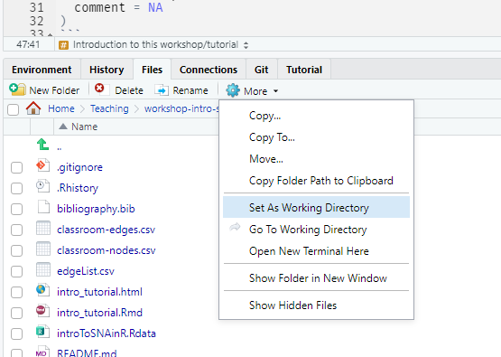

```{r setup, include=FALSE, cache = FALSE}
library(knitr)
requireNamespace("sessioninfo")
requireNamespace("network")
requireNamespace("sna")
requireNamespace("igraph")
requireNamespace("tidygraph")
requireNamespace("ggraph")
requireNamespace("graph")
requireNamespace("htmltools")

# remotes::install_github("mbojan/isnar")
requireNamespace("isnar")


knitr::opts_chunk$set(
  cache = FALSE, 
  comment = NA
)
```


 
# Introduction to this workshop/tutorial

This workshop and tutorial provide an overview of R packages for network analysis. This online tutorial is also designed for self-study, with example code and self-contained data.

- Statnet suite [@statnet] including:
    - **network** [@butts-network;@rpkg-network] -- storage and manipulation of network data
    - **sna** [@rpkg-sna] -- descriptive statistics and graphics for exploratory network analysis`
- **igraph** [@rpkg-igraph]
- **tidygraph** [@rpkg-tidygraph] and **ggraph** [@rpkg-ggraph]
- **graph** [@rpkg-graph] and **Rgraphviz** [@rpkg-rgraphviz]

and other more specialized packages that provide tools for e.g. particular SNA techniques or visualization, but rely on one of the above for network data storage and manipulation.


## Prerequisites

This workshop assumes basic familiarity with **R**, experience with network concepts, terminology and data, and familiarity with the general framework for statistical modeling and inference. While previous experience with ERGMs is not required, some of the topics covered here may be difficult to understand without a strong background in linear and generalized linear models in statistics.


## Software installation

Minimally, you will need to install the latest version of **R** [(available here)](https://cran.r-project.org) and the packages listed below. The workshops are conducted using the free version of **RStudio** [(available here)](https://rstudio.com).

The packages required for the workshop can be installed with the following expression:

```{r install-packages, eval=FALSE}
install.packages(c("network", "sna", "igraph", "tidygraph", "ggraph", 
                   "intergraph", "remotes"))
```

Package **remotes** [@rpkg-remotes] is needed to install the remaining two packages.


```{r install-graph, eval=FALSE}
remotes::install_bioc("graph")
```

For more information about installing other packages from the Statnet suite can be found on [`statnet` workshop wiki](https://github.com/statnet/Workshops/wiki/Software-Installation-Instructions). In particular, you can install (but do not have to for this tutorial) the whole Statnet suite with:

```{r install-statnet, eval=FALSE}
install.packages('statnet')
```


## Necessary data files

```{r data-classroom, include=FALSE}
# Create three CSV data files based on isnar::IBE121 that are used in the
# examples.
dl <- igraph::as_data_frame(isnar::IBE121, what = "both")
write.csv(
  subset(dl$vertices, select = -wraven),
  file="classroom-nodes.csv", row.names=FALSE)
de <- subset(dl$edges, question == "play", select = -question)
set.seed(666)
de$liking <- sample(1:5, nrow(de), replace=TRUE)
write.csv(de, file="classroom-edges.csv", row.names=FALSE)
# Adjacency matrix
write.csv(
  igraph::as_adjacency_matrix(
    igraph::delete_edges(isnar::IBE121, igraph::E(isnar::IBE121)[question != "play"]),
    sparse = FALSE
  ),
  file = "classroom-adjacency.csv"
)
rm(dl, de) # Clean-up
```

- Classroom data is a network within a school class of 26 9-year-olds coming from a larger study of @dolata-2014. The name generator question was "With whom do you like to play with?". The data is available in the following files
    - `classroom-adjacency.csv` with adjacency matrix
    - `classroom-edges.csv` with an edgelist with edge attribute: 
      `liking` -- numeric, on the scale 1-5 the extent to which ego likes the alter. This attribute has been randomly generated for illustrative purposes.
    - `classroom-nodes.csv` with node attributes:
      `female` -- logical, gender (`TRUE` for girls);
      `isei08_m`, `isei08_f` -- numeric, social status score of, respectively, mother and father
- Several other datasets contained in the file `introToSNAinR.Rdata`.

```{r data-make-a-zip, include=FALSE}
# Create a ZIP file with all data files
zip(
  "intro-sna-data",
  c("classroom-edges.csv", "classroom-nodes.csv", "classroom-adjacency.csv",
    "introToSNAinR.Rdata")
)
```

Download all the files as a [ZIP file `intro-sna-data.zip`](intro-sna-data.zip).

The code from this tutorial is available as [a script](intro_tutorial.R) too.


## Working Directory

Before we go further, make sure R's Working Directory (WD) is set to the folder where you extracted the [data files from the ZIP archive](intro-sna-data.zip) for the workshop. If you've not set the working directory, you must do so now by one of:

1. (Recommended) Create an [RStudio Project](https://support.rstudio.com/hc/en-us/articles/200526207-Using-Projects) dedictated to the workshop and unpack the data files there.
2. Use RStudio "Files" tab to navigate to the directory with the workshop files, then click "More" and "Set As Working Directory":

    ```{r, echo=FALSE}
    
    ```

3. You can use `setwd()` to change the working directory as well, like so:

    ```{r, eval=FALSE}
    setwd("path/to/folder/with/workshop/files")
    ```

Verify if the WD is set correctly by

1. Looking at the top of the Console window in RStudio, or
2. Use `getwd()`:
    ```{r}
    getwd() # Check what directory you're in
    list.files() # Check what's in the working directory
    ```


## Mitigating function name conflicts

Some packages we are going to demonstrate provide functions with identical names as in other packages. Examples include a function `get.vertex.attribute()` which is defined in packages **network** and **igraph**. Hence, if we load both packages with `library()` it matters which package is loaded last as its version of the function will be used when we write `get.vertex.attribute`.

In particular, note the following function name clashes:

```{r conflicts, echo = FALSE}
pkgs <- c("network", "sna", "igraph", "tidygraph")
o <- lapply(pkgs, function(p) ls(envir = asNamespace(p)))
names(o) <- pkgs
d <- data.frame(
  name = unique(unlist(o))
)
d$network <- d$name %in% o$network
d$sna <- d$name %in% o$sna
d$igraph <- d$name %in% o$igraph
d$tidygraph <- d$name %in% o$tidygraph
# subset(
#   with(d, as.data.frame(table(network, sna, igraph, tidygraph))),
#   Freq > 0
# )
```

- Between **igraph** and **network**:
    ```{r conflicts-network-igraph, echo=FALSE}
    with(d, name[network & igraph])
    ```

- Between **igraph** and **sna**:
    ```{r conflicts-sna-igraph, echo=FALSE}
    with(d, name[sna & igraph])
    ```

```{r conflicts-cleanup, include=FALSE}
rm(d, o, pkgs)
```


There are the following strategies to make sure possible conflicts are as painless as possible:

1. Load the packages but do not attach them and always use `::`
2. Load and attach the packages and use `::` for disambiguation.
3. Load the packages and selectively attach and detach them in order to always have only one of them attached.

In this tutorial we had to deal with these conflicts as well. We have opted for strategy (3) because:

- Code blocks will illustrate working with a particular package when without worrying about the conflicts.
- The code examples are clean of `::` namespace directives and hence cleaner to read.

The disadvantage is that

- You will see frequent calls to `library()` and `detach()` at the beginning and end of the subsections to make sure only one intended package is attached at a given time.


# Importing Relational Data

Network data is usually stored as

- Adjacency matrices
- Edge lists
- Edge and vertex data frames


## Network

```{r, cache=FALSE}
library(network)
library(sna)
```


Read an adjacency matrix (R stores it as a data frame by default). R also won't permit numbers as column names, although this is fine for rownames.

```{r}
relations <- read.csv("classroom-adjacency.csv",header=T,row.names=1,stringsAsFactors=FALSE)
relations[1:10,1:10] #look at a subgraph using bracket notation
```

We might want to store it as a matrix. Most routines will accept either data format. However, depending on how a function was written, it might require one or the other. The `isSymmetric` function from the `sna` package is one example that requires a matrix rather than a data frame.

```{r}
relations <- as.matrix(relations) # convert to matrix format
isSymmetric(relations)
```

To make the row and column names identical, we can overwrite the rownames:

```{r}
colnames(relations) <- rownames(relations)
```


Read in some vertex attribute data (okay to leave it as a data frame - in fact converting to a matrix would create problems as matrices can only have strings or numbers, but data frames can have vectors of both)

```{r}
nodeInfo <- read.csv("classroom-nodes.csv",header=TRUE,stringsAsFactors=FALSE)
head(nodeInfo)
```

We could also convert it to a network object. This would be useful for (1) storing all data in the same file, (2) a more compact format for large, sparse matrices, or (3) using the data in later analyses where the routines require network objects (e.g. ERGM)

```{r}
nrelations <- network(relations)
summary(nrelations) # Get an overall summary
```

Here the row and column names have been carried through becasue they were attached to the matrix. We can look at them by using the network variable methods and the shorthand %v%:

```{r}
list.vertex.attributes(nrelations)
nrelations%v%"vertex.names"
```

If we wanted to set the names back to the original numbers, we could use these methods as well:

```{r}
nrelations%v%"vertex.names" <- nodeInfo$name
nrelations%v%"vertex.names"
```


### Now with edgelists

Reading in an edgelist and converting it to a network object is also straightforward. Edgelists are useful because they are a smaller, more concise data structure for larger, sparser networks that we typically deal with in social network analysis. 

In the newest release of statnet it will automatically read the weight data and store it as "Weight." If you're using an older version of statnet, you might need to add two more commands to the `network` command: `ignore.eval=FALSE` and `names.eval="Weight"`.


```{r}
edgelist<-read.csv("classroom-edges.csv",header=T,stringsAsFactors = F)
head(edgelist)
edgeNet<-network(edgelist,matrix.type="edgelist")
edgeNet
```

Converting back to an adjacency matrix is simple:

```{r}
edgeNet[,] ##what's missing?
```

In `network` edges and edge weights are considered separate. This is confusing, but done for a number of reasons. (1) you might want multiple types of weights associated with a given edge, or (2) you might want a weight associated where there isn't an edge at all.

To see a particular weight, use the edge attribute shorthand %e% and to get the full network with weights, the command `as.sociomatrix.sna`. Note that the  `network` command just called the weights by the column name from the csv file.

```{r}
list.edge.attributes(edgeNet)
edgeNet %e% "liking"
as.sociomatrix.sna(edgeNet, "liking")
```


```{r, cache=FALSE}
# Detaching the packages
detach(package:sna)
detach(package:network)
```


## Igraph

```{r, cache=FALSE}
library(igraph)
```

Small Igraph objects can be created using `make_graph()`. You can create network from data using one of the functions from the table below. The table point to functions for:

- creating igraph objects from other R objects
- transforming igraph objects into other R objects

| Object              | Object -> Igraph               | Igraph -> Object       |
|---------------------+--------------------------------+------------------------|
| Adjacency matrix    | `graph_from_adjacency_matrix`  | `as_adjacency_matrix`  |
| Edge list           | `graph_from_edgelist`          | `as_edgelist`          |
| Data frames         | `graph_from_data_frame`        | `as_data_frame`        |


### Simple graphs with `make_graph()`

Function `make_graph()` can quickly create small networks. Relational information can be supplied in two ways:

1. As a vector of even number of node IDs. Pairs of adjacent IDs are interpreted as edges:
    ```{r igraph-makegraph1}
    make_graph( c(1,2, 2,3, 3,4), directed=FALSE)
    ```
2. Using symbolic formula in which
    -  `--` undirected tie
    - `--+` directed tie (`+` is arrow's head)
    - `:` refer to node sets (e.g. `A -- B:C` creates ties `A -- B` and `A -- C`)
    - A network is either directed or undirected, it is not possible mix directed and undirected ties.
    - Between given two nodes there can be *many* relations.
    ```{r igraph-makegraph2}
    g1 <- make_graph(~ A - B, B - C:D:E)
    g2 <- make_graph(~ A --+ B, B +-- C, A --+ D:E, B --+ A)
    g2
    ```

The print-out of `g2` exemplifies how **igraph** summarizes igraph objects:

- First line includes
    - Class of the object (`IGRAPH`)
    - An ID of the object, not of particular interest (see also `?igraph::graph_id`)
    - A set of four slots for letter codes indicating, in order:
        - `U` or `D` if the network is `U`ndirected or `D`irected
        - `N` if the nodes have names
        - `W` if the network is weighted
        - `B` if the network is bipartite
    - Number of nodes
    - Number of edges
- Starting with `+ attr:` list of present attributes, each of the form `nameoftheattribute (x/y)` where 
    - `x` informs about the type of an attribute: `v`ertex, `e`dge or `g`raph attribute
    - `y` informs about the mode of an attribute: `n`umeric, `c`haracter, `l`ogical, or e`x`tended (e.g. lists)
- Starting with `+ edges:` a list of (some of) the edges of the network


### Networks from adjacency matrices

Igraph objects can be created from adjacency matrices with `graph_from_adjacency_matrix()`:

```{r igraph-adjacency}
graph_from_adjacency_matrix(relations, mode="directed")
```


Important arguments:

- `mode` -- how to interpret the matrix
    + `"directed"`, `"undirected"`: directed/undirected network
    + `"max"`, `"min"`, `"sum`": determine the number of $i$-$j$ relations that will be created, e.g., `max( m[i,j], m[j,i] )`.
    + `"lower"`, `"upper"`: whether to read only lower/upper triangle of the matrix
- `weighted` -- if `TRUE` non-zero values of the matrix are stored in edge attribute `weight` 


### Networks from edge lists

Function `graph_from_edgelist()` expects a two-column matrix

```{r igraph-edgelist1}
edgelist_matrix <- as.matrix(edgelist[,1:2])
head(edgelist_matrix)
```

Now create the object:

```{r igraph-edgelist2}
graph_from_edgelist(edgelist_matrix, directed=TRUE)
```

Note the number of edges! If edgelist matrix contains integers the function assumes that node IDs start from 1 and thus the result will contain a lot of isolates. In this case we have to convert the matrix to character mode before passing it to `graph_from_edgelist()`:

```{r igraph-edgelist3}
edgelist_matrix_ch <- as.character(edgelist_matrix)
dim(edgelist_matrix_ch) <- dim(edgelist_matrix)
graph_from_edgelist(edgelist_matrix_ch, directed=TRUE)
```

This also shows the disadvantage of solely relying on edgelist representation as we are missing one boy who is an isolate.


### Networks from data frames

Igraph objects can be created from data frames with data on edges and, optionally, on vertices with `graph_from_data_frame`

```{r graph_data_frame}
classroom_kids <- read.csv("classroom-nodes.csv", header=TRUE, colClasses=c(name = "character"))
head(classroom_kids)
classroom_play <- read.csv("classroom-edges.csv", header=TRUE, colClasses = c(from="character", to="character"))
head(classroom_play)

classroom <- graph_from_data_frame(classroom_play, vertices=classroom_kids,
                                   directed=TRUE)
classroom
```

- First two columns of `classroom_play` are vertex IDs, additional columns are interpreted as edge attributes.
- First two column of `classroom_play` is vertex ID, additional columns are interpreted as vertex attributes.
- All vertex IDs present in edge data frame (`classroom_play`) must be present in the node data frame (`classroom_kids`)


```{r, cache=FALSE}
detach(package:igraph)
```


## Tidygraph

Package **tidygraph** uses **igraph** internally to store network data but provides a "tidy" interface for data manipulation -- network data are interfaced as to interconnected data frames (1) nodes and (2) edges. This is very similar to the data structure accepted by `igraph::graph_from_data_frame()` demonstrated above.

```{r, cache=FALSE}
library(tidygraph)
```

Objects can be created with:

1. `tbl_graph()` from two data frames, similarly to `igraph::graph_from_data_frame()`
    ```{r tidygraph-create1}
    tg_classroom <- tbl_graph(nodes = classroom_kids, edges = classroom_play, 
                              directed = TRUE)
    tg_classroom
    ```

2. `as_tbl_graph()` which accepts variety of objects: adjacency matrices, igraph, network, ggraph and some more (c.f. the documentation) 
    ```{r tidygraph-create2}
    # From igraph object created earlier
    tg_classroom2 <- as_tbl_graph(classroom)
    tg_classroom2
    
    # From network object created earlier
    tg_net <- as_tbl_graph(edgeNet)
    tg_net
    ```

### Working with attributes

In **tidygraph** you can use **dplyr** [@rpkg-dplyr] verbs such as `mutate()`, `select()` etc. once you `activate()` either the `nodes` or `edges` data frame. Here are some examples.

Calculate social status of kid's family as a minimal value of social statuses of mother and father:

```{r tidygraph-mutate}
tg_classroom %>%
  activate(nodes) %>%
  mutate(
    status = pmin(isei08_m, isei08_f, na.rm=TRUE)
  )
```

Similarly to **dplyr** you can use the pipe operator `%>%` to chain multiple data transformations. Here add a node attribute first, then edge attribute `like5` second:

```{r tidygraph-pipe}
tg_classroom %>%
  activate(nodes) %>%
  mutate(
    status = pmin(isei08_m, isei08_f, na.rm=TRUE)
  ) %>%
  activate(edges) %>%
  mutate(
    like5 = liking == 5  # TRUE if liking is 5
  )
```

You can refer to node attributes with `.N()` when computing on edges data frame and refer to edge attributes with `.E()` when computing on the nodes. For example, to add an edge attribute which is `TRUE` if gender of ego and alter match and `FALSE` otherwise we can use `.N()` in the following manner. Function `.N()` returns a the node data frame.

```{r}
tg_classroom %>%
  activate(edges) %>%
  mutate(
    # Add edge attribute which is TRUE if gender of ego and alter match
    sex_match = .N()$female[from] == .N()$female[to]
  )
```


Use `filter()` to select subgraphs:

- Select the subgraph of girls and relations between them:
    ```{r tidygraph-filter-nodes}
    tg_classroom %>%
      activate(nodes) %>%
      filter(female)
    ```
- Select a subgraph of relations for which `liking` is at least 3
    ```{r tidygraph-filter-edges}
    tg_classroom %>%
      activate(edges) %>%
      filter(liking >= 3)
    ```


```{r, cache=FALSE}
detach(package:tidygraph)
```


## graph

```{r, cache=FALSE}
library(graph)
```

Package **graph** is implemented using S4 class system (see e.g. the part 
["Object oriented programming"](https://adv-r.hadley.nz/oo.html)
of @adv-r, especially chapter
[15 on the S4 system](https://adv-r.hadley.nz/s4.html)).
The two main classes of objects are:

- `graphAM` -- networks internally stored as adjacency matrices
- `graphNEL` -- networks internally stored as adjacency lists (imprecisely called "edge lists" in the documentation). Adjacency list is a list (class of R object) with an element for every node being a vector of adjacent nodes.

Objects can be created with functions with the above names. From adjacency matrices:

```{r graph-adjacency}
gr1 <- graphAM(relations, edgemode = "directed")
gr1
```

To demonstrate `graphNEL` we have to create an adjacency list first. We can create it from adjacency matrix `relations` like so:

```{r graph-create-adjlist}
adjlist <- apply(relations, 1, function(r) rownames(relations)[which(r == 1)])
head(adjlist) # initial elements of the adj. list
```

... and now the object:

```{r graph-edgelist}
gr2 <- graphNEL(
  nodes = classroom_kids$name, # names of the nodes
  edgeL = adjlist, # adjacency list of node names
  edgemode = "directed"
)
gr2
```

Both types of objects `graphAM` and `graphNEL` can store edge and node attributes. There are separate functions `edgeData()` and `nodeData()` for setting and accessing edge/node attributes. For example to add `female` attribute we need to:

```{r graph-vattr}
# Set the default value, say FALSE
nodeDataDefaults(gr2, attr="female") <- FALSE
# Assign the values
nodeData(gr2, n = classroom_kids$name, attr="female") <- classroom_kids$female
```

Working with edge attributes look similar, but uses function `edgeData()` like so:

```{r graph-eattr}
edgeDataDefaults(gr2, attr = "liking") <- as.numeric(NA)
edgeData(gr2, 
         from = classroom_play$from, 
         to = classroom_play$to, 
         attr = "liking") -> classroom_play$liking
```


```{r, cache=FALSE}
detach(package:graph)
```


# Converting objects

Use **intergraph** [@rpkg-intergraph] to convert data objects between **igraph** and **network** representations.

```{r intergraph}
# igraph -> network
classroom_network <- intergraph::asNetwork(classroom)

# network -> igraph
classroom_igraph <- intergraph::asIgraph(classroom_network)

classroom_network
classroom_igraph
```

All the attributes are copied properly.

Use `igraph::as_graphnel()` and `igraph::graph_from_graphnel()` for **igraph** <-> **graph** conversions.


# Capabilities of objects in different packages

```{r, echo=FALSE}
htmltools::includeHTML("captab.html")
```


# Visualization

## Network

```{r, cache=FALSE}
library(network)
library(sna)
```

We can plot matrices using the `gplot` routine from the `sna` package:

```{r}
gplot(relations) # Requires sna
```

Or network objects using the `plot` command. This automatically incorporates the network level attribute data that the network is undirected. `gplot` came first and years later the network package with the more specialized data structures was written, but we preserve gplot for the ability to work directly with matrices.

```{r}
plot(nrelations,displaylabels=T) # Plot with names
plot(nrelations,displaylabels=T,mode="circle") # A less useful layout...
```
More layout options are included in the `sna` package for `gplot`. Here's one that selects a node and tries to arrange the other nodes around it as a bullseye.
```{r}
gplot(relations,mode="target")
```

Let's color the nodes in gender-stereotypic colors, and increase the size of the nodes

```{r}
nodeColors<-ifelse(nodeInfo$female,"hotpink","dodgerblue")
plot(nrelations,displaylabels=T,vertex.col=nodeColors,vertex.cex=3)
```

Same with edgelists, and simple to also display the edge weights

```{r}
plot(edgeNet,displaylabels=T) ##what's missing?
plot(edgeNet,displaylabels=T,edge.lwd=5*edgeNet%e%"question")
```


We can now look at slightly more complicated data in the supplied dataset. Plot the contiguity among nations in 1993 (from the Correlates of War (CoW)1 project)

```{r}
load("introToSNAinR.Rdata")
gplot(contig_1993) # The default visualization
gplot(contig_1993, usearrows=FALSE) # Turn off arrows manually
```

Here's an example of directed data|militarized interstate disputes (MIDs) for 1993, with added labels

```{r}
gplot(mids_1993,label.cex=0.5,label.col="blue",displaylabels=TRUE)
```

All those isolates can get in the way. We can suppress them using `displayisolates`

```{r}
gplot(mids_1993,label.cex=0.5,label.col="blue",displaylabels=TRUE,displayisolates=FALSE)
```

When a layout is generated, the results can be saved for later reuse. Here we use a spring-embedded algorithm on the global contiguity plot to place the nodes and then plot the edges from the militarized interstate dispute network. It's very approximate, but generally shorter edges are attacks between contiguous or neigbouring countries and longer edges are between farther away countries.

```{r}
coords <- gplot(contig_1993,gmode="graph",label=colnames(contig_1993[,]),label.cex=0.5,label.col="blue") # Capture the magic of the moment
head(coords) # Show the vertex coordinates
```

Saved (or a priori) layouts can be used via the coord argument

```{r}
gplot(mids_1993,gmode="graph",label=colnames(contig_1993[,]),label.cex=0.5,label.col="blue",coord=coords)
```

When the default settings are insuficient, interactive mode allows for tweaking. This is a bit clunky and not run here, but can be very useful for getting a specific image exactly correct. We haven't run it here, but you can play around with it later.

```{r,eval=FALSE}
coords <- gplot(contig_1993, interactive=TRUE) # Modify and save
gplot(contig_1993,coord=coords,displaylabels=TRUE,gmode="graph",label.cex=0.5,label.col="blue") # Should reproduce the modified layout
```


```{r, cache=FALSE}
# Detaching the packages
detach(package:sna)
detach(package:network)
```


## Igraph

```{r, cache=FALSE}
library("igraph")
```

Network visualization is performed using `plot` function.

With default settings it looks like

```{r, echo=2:3}
layout(matrix(1:2, 1, 2))
plot(g1)
plot(g2)
layout(1)
```

Example plots using the `classroom` data:

```{r igraph-plot1}
plot(
  classroom, 
  layout=layout_with_fr,
  vertex.color="white",
  vertex.size=15,
  edge.arrow.size=0.5,
  vertex.label.color="black",
  vertex.label.family="sans",
  vertex.label=ifelse(V(classroom)$female, "F", "M") 
)
```

---

```{r igraph-plot2}
plot(
  classroom, 
  layout=layout_with_fr,
  vertex.label=NA,
  vertex.size=scales::rescale(degree(classroom, mode="in"), c(5, 25)),
  edge.arrow.size=0.5,
  vertex.color=ifelse(V(classroom)$female, "pink", "lightskyblue") 
)
```


```{r, cache=FALSE}
detach(package:igraph)
```


## A note on layouts

Notable layouts in **sna**:

- target

Notable layouts in **igraph**:

- sugiyama

Package **graphlayouts**:

- stress
- focus


# Description


## Network

```{r, cache=FALSE}
library(network)
library(sna)
```

The network package has many routines to describe the data. Dyads give the number of possible edges, so $n*(n-1)$ for a directed graph, and $\frac{n*(n-1)}{2}$ for undirected graphs. The edgecount will give the number of actual edges, and the size the number of nodes.

```{r}
network.dyadcount(nrelations) # How many dyads?
network.edgecount(nrelations) # How many edges are present?
network.size(nrelations) # How large is the network?
```

Going back to the Correlates of War data, we can look at our centrality measures. Freeman degree is also called total degree and is the sum of the indegrees and outdegrees. One degree centrality function is used for all three with a default of Freeman degree. The input for `cmode` determines which kind of degree is calculated.

```{r}
degree(mids_1993) # Default: total degree
ideg <- degree(mids_1993, cmode="indegree") # Indegree for MIDs
odeg <- degree(mids_1993, cmode="outdegree") # Outdegree for MIDs
all(degree(mids_1993) == ideg+odeg) # In + out = total?
```

Once centrality scores are computed, we can handle them using standard R methods. Here, the dashed line indicates where on the plot outgoing attacks would equal incoming attacks (y=x); countries above this line are net agressors, and countries below are net defenders.

```{r}
plot(ideg, 
     odeg, 
     type="n", 
     xlab="Incoming MIDs", 
     ylab="Outgoing MIDs") # Plot ideg by odeg

abline(0, 1, lty=3)

text(jitter(ideg), 
     jitter(odeg), 
     network.vertex.names(contig_1993), 
     cex=0.75, 
     col=2)
```

Plot simple histograms of the degree distributions. These can be quite useful to get a sense of how skewed the network is.

```{r}
hist(ideg, 
     xlab="Indegree",
     main="Indegree Distribution", 
     prob=TRUE)

hist(odeg, 
     xlab="Outdegree", 
     main="Outdegree Distribution", 
     prob=TRUE)
```

Centrality scores can also be used with other sna routines, e.g., gplot(). Here we've used the color functionality in rgb to shade each node by how much of an agressor (red) and defender (blue) compared to the other countries each node is.

```{r}
gplot(mids_1993, 
      vertex.cex=(ideg+odeg)^0.5, 
      vertex.sides=50,
      label.cex=0.4,
      vertex.col=rgb(odeg/max(odeg),0,ideg/max(ideg)),
      displaylabels=TRUE,
      displayisolates=FALSE)
```

Betweenness and closeness are also popular measures

```{r}
bet <- betweenness(contig_1993, 
                   gmode="graph") # Geographic betweenness

bet
```

Closeness can be a bit tricky for disconnected graphs, but there are alternative definitions that fix some problems - see the help file for a discussion.

```{r}
gplot(contig_1993, 
      vertex.cex=sqrt(bet)/25, 
      gmode="graph") # Use w/gplot

clo <- closeness(contig_1993) # Geographic closeness
clo # A large world after all?

closeness(contig_1993,cmode="suminvundir") 
```


From centrality to centralization. Here we nest commands - the `cmode` input is sent to the `degree` function.

```{r}
centralization(mids_1993, degree, cmode="indegree") # Do MIDs concentrate?
centralization(contig_1993, evcent) # Eigenvector centralization
```

Elementary graph-level indices are pretty useful. Density is the number of edges divided by the number of possible edges, or $\frac{E}{n(n-1)}$ for a directed network, and $\frac{E}{2n(n-1)}$ for undirected graphs.

```{r}
gden(mids_1993) # Density
```

The MAN distribution is quite useful; it lists the number of Mutal, Assymetric, and Null ties in a given graph:

```{r}
dyad.census(mids_1993)
dyad.census(contig_1993)
```

Reciprocity is calculated from the numbers in the dyad census. The defaul routine defines reciprocity as $\frac{M+N}{M+A+N}$. This is often not what we first think of as reciprocity, since null ties are included in the definition making the MIDS network seem quite reciprocal. `Edgewise` reciprocity, defined as $\frac{M}{M+A}$ is interpreted as the probability that a tie sent is also recieved. Under this definiton the MIDS network has a very low reciprocity.

```{r}
grecip(mids_1993) # Dyadic reciprocity
grecip(mids_1993, measure="edgewise") # Edgewise reciprocity
```

Transitivity is the proportion of paths i-->j-->k where the i-->k edge is also present.

```{r}
gtrans(mids_1993) # Transitivity
```


```{r, cache=FALSE}
# Detaching the packages
detach(package:sna)
detach(package:network)
```


## Igraph

```{r, cache=FALSE}
library("igraph")
```

```{r igraph-basics}
summary(g1)
ecount(g1)      # number of edges
vcount(g1)      # number of vertices
is.directed(g1) # is the network directed?
```


Graph density and reciprocity

Density = proportion of exisintg edges

```{r igraph-density}
edge_density(classroom)
```

Reciprocity = proportion of mutual connections

```{r igraph-resiprocity, echo=-4}
g <- make_graph(c(1,2, 2,3, 3,2), n = 3)
reciprocity(g)
reciprocity(g, mode="ratio")
plot(g)
```


Vertex degrees

Calculating in-/out-/total degrees

```{r igraph-degree}
degree(classroom)
degree(classroom, mode="in")
degree(classroom, mode="out")
```

Degree distribution

Fraction of nodes with given degree

```{r igraph-degree-distribution}
degree_distribution(classroom)
```

Centrality

```{r igraph-centrality}
betweenness(classroom)
closeness(classroom)
```

See also package **netrankr** [@rpkg-netrankr] and [this blogpost](http://blog.schochastics.net/post/network-centrality-in-r-introduction/) for more centrality indices.


```{r, cache=FALSE}
detach(package:igraph)
```


## graph

Package **graph** is rather thin with respect to analysis. For the most part it relies on a separate package **RBGL** [@rpkg-rbgl] available from Bioconductor repository.


# Practicals

Challenge your self with [the set of practicals](practicals.html) we have prepared. 


# Appendix {-}

<details>
<summary>Session info</summary>
```{r session-info, echo = FALSE}
sessioninfo::session_info()
```
</details>

# References {-}
