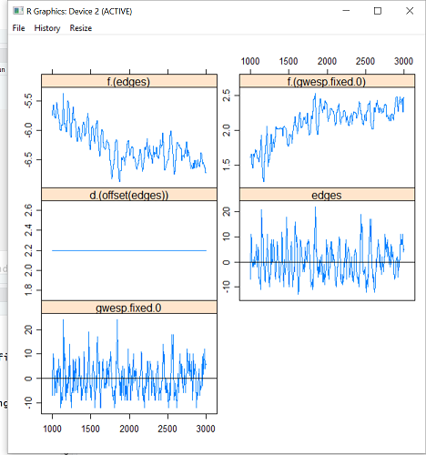
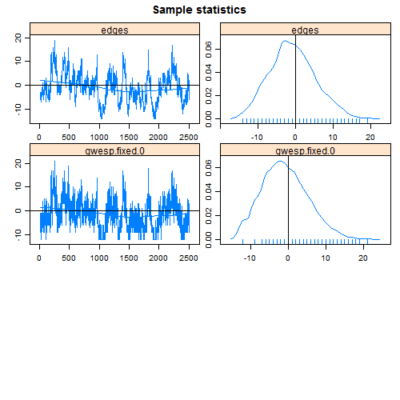

```{r setup, include = FALSE}
library(knitr)
knitr::opts_chunk$set(cache=F, comment=NA, fig.align='center')
```

_Last updated: `r Sys.Date()`_

<div style = "width:60%; height = 60%">

</div>


```{r dev, child = '../statnetDevTeam.Rmd'}
```
   
The temporal modeling software demonstrated in this tutorial is authored by Pavel Krivitsky (`tergm`) and Skye Bender de-Moll (`networkdynamic`, `tsna` and `ndtv`).

---

```{r project, child = '../statnetProject.Rmd'}
```

---

## Introduction to this workshop/tutorial.

This workshop and tutorial provide an overview of 
statistical modeling of temporal network data 
using `statnet` software.  The tutorial is also designed
for self-study, with example code and self-contained data.

The `statnet` packages we will be demonstrating are:

* [`networkDynamic`](https://cran.r-project.org/web/packages/networkDynamic/index.html) -- storage and manipulation of temporal network data
* [`tsna`](https://cran.r-project.org/web/packages/tsna/index.html) -- descriptive statistics and graphics for exploratory network analysis`
* [`ndtv`](https://cran.r-project.org/web/packages/ndtv/index.html) -- utilities for plotting temporal networks (including network movies)
* [`tergm`](https://cran.r-project.org/web/packages/tergm/index.html) -- statistical tools for estimating TERGMs, model assessment, and dynamic network simulation.


### Prerequisites

This workshop assumes basic familiarity with **R**, experience with
network concepts, terminology and data, and experience with 
Exponential family Random Graph Models (ERGMs).  
The `statnet` 
[ERGM workshop](https://statnet.github.io/Workshops/ergm_tutorial.html) 
is ideal preparation.

### Software installation

Minimally, you will need to install the latest version of **R**
[(available here)](https://cran.r-project.org)
and the `statnet` packages above to
run the code presented here.  
The workshops are conducted using the free version of `Rstudio`
[(available here)](https://rstudio.org).

To install the packages for this tutorial, 
open an R session and type: 

```{r,eval = FALSE}
install.packages('statnet')
install.packages('ndtv')
install.packages('htmlwidgets')
install.packages('latticeExtra')
```

The two non-statnet packages here (`htmlwidgets` and `latticeExtra`), provide some nice graphing utilities, and demonstrate one of the many benefits of working in the R software ecosystem---you're not restricted to the features in any one package.  Throughout this tutorial we will be
exploiting this benefit, using functions from base R and other packages seamlessly with our statnet software.


Make sure the packages are attached:

```{r,results = 'hide', message = FALSE, warning = FALSE}
library(statnet)
library(ndtv)
library(htmlwidgets)
library(latticeExtra)
```

Check package versions

```{r, cache = FALSE}
sessionInfo()
```


Set seed for simulations -- this is not necessary, but it ensures that we all get the same results (if we execute the same commands in the same order).
```{r}
set.seed(0)
```

## 1. Temporal network data: Some considerations

Moving from static to dynamic networks leads to 
many different types of potential dynamics:

* Tie dynamics--formation and dissolution (this is the minimum for our purposes)
* Node dynamics--entry and exit (we won't address this here, but can handle them)
* Attribute dynamics--both node and tie attributes can change over time

All of this requires new data storage mechanisms, new methods for descriptive statistics, new tools for visualization, and a new framework for modeling. As a result, there are 4 software packages in statnet that perform these new tasks.  Comparing to the statnet packages used for static network analysis:

Function    |    Static Networks    |    Dynamic Networks
----------- | --------------------- | ---------------------------
Data Storage | network | networkDynamic
Descriptive Stats | sna | tsna
Visualization | plot.network | ndtv
Statistical Modeling | ergm | tergm


### Types of temporal network data

Temporal network information can be collected in different ways, leading
to several different types of data:

* Discrete time network census panel data (with 2 or more panels)
* Cross-sectional network census data with information on tie duration
* Cross-sectional *sampled* network data with tie duration information
* Continuous time network event data

Each type typically requires different methods for analysis.  We will cover the first two types of data in this tutorial (though TERGMs can handle the first three).


### Overview of modeling frameworks for temporal network data

There are three general modeling frameworks for temporal network
data analysis in the social networks field.

* Stochastic Actor Oriented Models (SAOM)--implemented in the `RSiena` package written by Tom A.B. Snijders and colleagues.  SAOMs model the coevolution of nodal attributes and tie dynamics.  They are formulated as continuous time models, but typically are estimated on discrete time data.

* Relational Event Models--implemented in the `statnet` package `relevent`
written by Carter Butts and colleagues.  These are continuous time models
for node and tie dynamics, so they can assume dyad independence, 
and exploit the methodology of logistic regression.

* Temporal Exponential family Random Graph Models (TERGMS)--This is a large family of models that extend ERGMs for dynamic networks, and include the specific subclass of _Separable_ TERGMs that are implemented in the `statnet` software in the `tergm` package.  TERGMs represent tie dynamics only, and are typically formulated in discrete time.

This workshop will focus on TERGMs.  And we'll start with a quick overview of the utilities for data storage, descriptive stats and visualization of temporal network data before moving on to the statistical modeling.

---

All temporal network models can be thought of as a form of "agent-based" model, in that they can be used for stochastic simulation of a population
of "agents" interacting over time.
However, the statistical network modeling frameworks are distinguished by (1) a foundation based
on principled statistical estimation of the model parameters that allows for hypothesis testing and inference at the model building stage; and 
(2) reproduction of the full joint distribution of observed network configurations that are represented by the terms in the model. 

---

## 2. Exploring temporal network data

### networkDynamic:  storing and working with temporal network data

Temporal network data in `statnet` 
are stored as `networkDynamic` class objects--but these also have the class `network`.
They can thus be edited or queried using standard functions from the `network` package, or using additional 
functions tailored specifically to the case of dynamic networks in the package `networkDynamic`.

Let us consider the 3 panels of the Sampson monastery data:

```{r}
data(samplk)
ls()
```

To create a dynamic network object from the panels, we need to combine them into a list:

```{r}
samplist <- list(samplk1,samplk2,samplk3)
sampdyn <- networkDynamic(network.list = samplist)
```
Note that, by default, the starting time is set to 0, so the first network will have this time stamp.  You can change that behavior by specifying
a different value, for example:
`sampdyn <- networkDynamic(network.list = samplist, start=1)`.

The `networkDynamic` function is able to convert a wide array of temporal network data types into the `networkDynamic` objects.  For more information, see `?networkDynamic`.

As with `network` objects you can get a quick summary of a `networkDynamic` object by typing the object name:

```{r}
sampdyn
```
Note that the description indicates 4 timepoints (0 through 3).  This is an artifact of representing discrete time.  If you look at the final network, you'll see it is empty:
```
network.extract(sampdyn, at = 3) # empty
network.extract(sampdyn, at = 0) # the first network, as expected
```
The discrete time representation means that specifying `at=0` is equivalent
to specifying the semi-open interval `[0-1)` 
with `onset = 0, terminus = 1`.

```
# Equivalent statements
#network.extract(sampdyn, at = 0) # first network
#network.extract(sampdyn, onset = 0, terminus=1) # same thing
```

The `networkDynamic` package contains many utilities for modifying, extracting and querying `networkDynamic` objects.  For example, the `network.extract`
function above extracts one or more networks from the series, while the `network.collapse` function extracts one or more networks and collapses them into a single network object.  

You can get a good overview of the wide range of functionality in this package by reading the package vignette:

```{r, eval = F}
vignette("networkDynamic")
```

As one small example, we'll just make a quick plot of the three network panels, using the `network.extract` function (this also extracts one or more networks, but preserves the time info if present) and the network.
```{r}
par(mfrow = c(2,2), oma=c(1,1,1,1), mar=c(4,1,1,1))
plot(network.extract(sampdyn, at = 0), main = "Time 1", 
     displaylabels = T, label.cex = 0.6, vertex.cex = 2, pad = 0.5)
plot(network.extract(sampdyn, at = 1), main = "Time2", 
     displaylabels = T, label.cex = 0.6, vertex.cex = 2, pad = 0.5)
plot(network.extract(sampdyn, at = 2), main = "Time3", 
     displaylabels = T, label.cex = 0.6, vertex.cex = 2, pad = 0.5)
plot(sampdyn, main = "Collapsed", 
     displaylabels = T, label.cex = 0.6, vertex.cex = 2, pad = 0.5)
```

Not the most helpful display if you're seeking some insight into the temporal changes in the friendships among the monks at the Sampson Monastery.  The next packages we'll review
are designed to facilitate that task.

### `tsna`: a package for descriptive temporal network analysis

As the name suggests, this package generalizes the `sna` package functionality for temporal network data.  It provides utilities for calculating:

* Static social network analysis metrics at multiple time points via the `tSnaStats` function

```{r}
tSnaStats(sampdyn,"degree") # Changes in degree centrality
```

* Static ergm term statistics at multiple time points via the `tErgmStats`function

```{r}
tErgmStats(sampdyn, "~ edges+triangle") # Notice the increase in triangles
```

* Temporal paths through networks via the `tPath`, `tReach` and `plotPaths` functions

Temporal paths are unique to dynamic networks.  Similar to a path in a static network, they trace out the sequence and distances of nodes in a `networkDynamic` object reachable from an initial node, following paths constrained by edge timing (and direction, if the network is directed).  A temporal path can only traverse active nodes and edges, so the onset times of successive elements must be greater than or equal than those of the previous.

Below, we compute and plot the forward reachable set (FRS) from node 1 (v1) in the Sampson networks (the vertices that node 1 can reach).
```{r}
# who is v1?
get.vertex.attribute(sampdyn, "vertex.names")[1]

# who is in v1's FRS?
tp <- tPath(sampdyn, v=1, direction = 'fwd')
print(tp)
par(mfrow=c(1,2))
coords <- plot(tp, main="Forward Reachable Set from v1", cex.main=.8)
plotPaths(sampdyn, tp, 
          coord = coords,
          main = "Overlaid on collapsed Network",
          label.cex=.8, cex.main=.8)

```
Because all of the vertices are in one component in the first graph, node 1 (Bosco) is able to reach every other vertex in the first spell; the first network alone determines the temporal path.  
A forward `tpath` traces the earliest arriving path, so
in this case, `tp$tdist = 0` for all vertices, because they can all be reached in the first spell, `tp$gsteps` is simply the geodesic from Bonaventure to each other vertex in the first network, and plotting `tp` shows those geodesics. 

And note that one can also construct a "backwards reachable set" for Bosco -- the set of all vertices that can reach *him*.

Forward and backward reachable sets are key metrics for understanding diffusion processes over networks.  The `tsna` package vignette demonstrates many more interesting features of temporal paths in dynamic networks with multiple components that change over time.  

* Duration summaries for node and tie dynamics

Durations are another feature unique to temporal networks, representing
the lenth of time that vertices and edges are active.  The tsna package currently contains several functions for reporting on active durations. Most of these functions have options for varying the units of aggregation or analysis. For example, the edge measures can be adjusted from focusing on an ‘edge’ (aggregating across all of the activity spells associated with that edge) or a ‘spell’ (a single interval of contiguous time during which an edge is activated). 

```{r}
table(edgeDuration(sampdyn, mode = 'duration', subject = 'spells')) # Note bimodality
```

 
### `ndtv`: Visualizing dynamic networks


The Network Dynamic Temporal Visualization (`ndtv`) package provides tools
for visualizing changes in network structure and attributes over time. 

`ndtv` has its own workshop and tutorial, with materials online at
[the ndtv GitHub repo](statnet.github.io/ndtv/workshop/ndtv_workshop.html)

The package includes an example network data set named `short.stergm.sim` which is the output of a toy model based on Padgett's Florentine Family Business Ties dataset simulated using the `tergm` package. (We'll use `tergm` package to construct this simulated dynamic network in a later section.)  

```{r}
library(ndtv)
data(short.stergm.sim)
```

#### Network Movies
To get a quick visual summary of how the structure changes over time, we can render the dynamic network as an animation, here we will use an interactive HTML5 animation in a web browser. 
```{r, eval = FALSE, message = FALSE,results = 'hide',cache = FALSE}
render.d3movie(short.stergm.sim, 
               plot.par=list(displaylabels=T))
```

This should bring up a browser window displaying the animation.  In addition to playing and pausing the movie, it is possible to click on vertices and edges to show their ids, double-click to highlight neighbors, and zoom into the network at any point in time.

Finally, we can render the interactive movie from an Rmarkdown document
to an html document like this one.

```{r, message = FALSE,cache = FALSE}
render.d3movie(short.stergm.sim,
               plot.par=list(displaylabels=T),
               output.mode = 'htmlWidget') # using htmlwidgets package here
```
  

#### Proximity Timelines

Another interesting visualization tool is the "proximity timeline".  In this view vertices are positioned vertically by their geodesic distance proximity.  This means that changes in network structure deflect the vertices' lines into new positions, attempting to keep closely-tied vertices as neighbors. The edges are not shown at all in this view. 

```{r,message = FALSE,cache = TRUE}
proximity.timeline(short.stergm.sim,default.dist = 6,
          mode = 'sammon',labels.at = 17,vertex.cex = 4)
```

Notice how the bundles of vertex lines diverge after time 20, reflecting the split of the large component into two smaller components.

Ok, so that's a whirlwind tour through the descriptive tools available in `statnet` for exploring temporal network data.  We strongly encourage exploring your data before you start to model it with `tergm`.


## 3. Modeling temporal network data with STERGMs

Separable Temporal ERGMs (STERGMs) are an extension of ERGMs for modeling dynamic networks in discrete time, introduced in Krivitsky and Handcock (2010).  They are a subset of the TERGM family, and the "Separable" part refers to the way in which formation and dissolution dynamics are represented.

### An Introduction to STERGMs (non-technical)

Where an ERGM provides a single model for the _prevalence_ of ties in a cross-sectional single network,
STERGMs posit two models for the _tie dynamics_ in a network over time: 

* one for tie formation, and 

* one for tie dissolution.  

Both models are ERGMs, and they are "separable" in the sense that they assume formation is independent of dissolution _within time step_, and Markov dependent between steps.  This allows the factors that influence formation to be different than those that influence dissolution, so
specifying a STERGM requires two formulas instead of one.

Allowing the formation model to be different than the dissolution model is useful in many contexts.
Take friendships.  It seems intuitive that the 
factors influencing who becomes friends with whom, out of the set of people who aren't already) are likely to be different than the factors affecting who stops liking whom, out of the set of people currently in relationships).
Any reasonable model of formation would 
need to include a variety of homophily parameters (mixing on age, for example).  Friendship dissolution may or may not.  (Conditional on being
friends, 
does a difference in age affect the probability that your friendship ends?  Perhaps, but probably not as fundametally or as strongly as for formation).

In thinking about how STERGMs work, and the difference between the *prevalence* of ties in the cross section, and the *incidence* of ties in a temporal data set, it can be helpful to think of the approximation commonly used in epidemiology to consider basic disease dynamics:

$$ prevalence = incidence \times duration $$

To translate this to dynamic networks:  the expression above says that the number of ties present in the cross-section (prevalence) is a function of the rate at which they form (incidence) and the rate at which they dissolve (1/duration). The faster ties form, the more ties will be present in the cross-section, and the more slowly they form, the fewer will be present.  The slower ties dissolve, the longer the duration, the more ties will be present in the cross-section, and the reverse (faster/shorter/fewer) again holds.  The cross-sectional prevalence of ties is determined by both processes.

This same concept extends to other network configurations, for example triangles---the faster that triangles are formed and the slower that they're dissolved, the more that will be present in the cross-section.

ERGMs are models for the prevalence of ties; they do not represent the implicit rates of incidence and duration, they simply model the net result.

STERGMs are models that explicitly represent the incidence and duration processes.

The two equations governing a STERGM are commonly called the formation equation and the dissolution (or persistence) equation, respectively:

<center>
$\ln{\frac{P(Y_{ij,t+1} = 1 \mid y^{c}_{ij}, Y_{ij,t} = 0)}{P(Y_{ij,t+1} = 0\mid y^{c}_{ij}, Y_{ij,t} = 0)}} = 
\theta^+ \delta(g^+(y_{ij}))$
</center><br>

<center>
$\ln{\frac{P(Y_{ij,t+1} = 1 \mid y^{c}_{ij}, Y_{ij,t} = 1)}{P(Y_{ij,t+1} = 0\mid y^{c}_{ij}, Y_{ij,t} = 1)}} = 
\theta^- \delta(g^-(y_{ij}))$
</center><br>

These parallel the traditional cross-sectional ERGM.  We have simply:

* added a time index to the tie values
 
* added in a new conditional. In the formation equation, the expression is conditional on the tie _not_ existing at the prior time step, and in the dissolution equation it is conditional on the tie existing; and  

* defined two $\theta$ and $g$ vectors instead of just one.  Now there are $\theta^+$ and $g^+(y)_{ij}$, reflecting the coefficients and statistics in the formation model, and $\theta^-$ and $g^-(y)_{ij}$ reflecting those in the dissolution model.

------

Note that for the dissolution model, the $P(Y_{ij,t+1} = 1)$ is in the numerator and the $P(Y_{ij,t+1} = 0)$ is in the denominator.  This makes the mathematics parallel to that of the formation model; however, it also means the "dissolution" model is actually a "persistence" model.  The probability of dissolution is simply 1 - persistence, so the model can be interpreted in both ways.

------


Finally, remember that the _s_ in _stergm_ stands for separable; this refers to assumption that relational formation and dissolution occur independently of one another within a time step.  We explore how this works and its implications in the examples below.  But effectively, at each timestep, we are sending off all empty dyads to be considered for formation (conditioning on the ties that exist), and sending off all the paired dyads to be considered for dissolution (conditioning on the empty dyads), and these two processes proceed independently.  

### An Introduction to STERGMs (more formal)

To understand STERGMs formally, we first review the ERGM framework for cross-sectional or static networks. Let $\mathbb{Y}\subseteq \{1,\dotsc,n\}^2$ be the set of potential relations (dyads) among $n$ nodes, ordered for directed networks and unordered for undirected. 
We can represent a network $\mathbf{y}$ as a set of ties, with the set of possible sets of ties, $\mathcal{Y}\subseteq 2^\mathbb{Y}$, being the sample space: $\mathbf{y} \in \mathcal{Y}$. Let $\mathbf{y}_{ij}$ be 1 if $(i,j)\in\mathbf{y}$ --- a relation of interest exists from $i$ to $j$ --- and 0 otherwise.

The network also has an associated 
covariate array $\mathbf{X}$ containing attributes of the nodes, the dyads, or both.
An exponential-family random graph model (ERGM) represents the pmf of $\mathbf{Y}$ as a function of a $p$-vector of network statistics $g(\mathbf{Y},\mathbf{X})$, with parameters $\theta \in \mathbb{R}^p$, as follows:

<center>
$\mbox{Pr}\left(\mathbf{Y} = \mathbf{y} \mid \mathbf{X}\right) = 
\frac{\exp\left\{\theta\cdot g(\mathbf{y}, \mathbf{X})\right\} }
{k(\theta, \mathbf{X}, \mathcal{Y})},$
</center><br>

where the normalizing constant 
$k(\theta, \mathbf{X}, \mathcal{Y})  = \sum\limits_{\mathbf{y}' \in \mathcal{Y}}\exp\left\{\theta\cdot g(\mathbf{y}', \mathbf{X})\right\}$
is a summation over the space of possible networks on $n$ nodes, $\mathcal{Y}$.
Where $\mathcal{Y}$ and $\mathbf{X}$ are held constant, as in a typical cross-sectional model, they may be suppressed in the notation.  Here, on the other hand, the dependence on $\mathcal{Y}$ and $\mathbf{X}$ is made explicit.

In modeling the transition from a network $\mathbf{Y}^{t}$ at time $t$ to a network $\mathbf{Y}^{t+1}$ at time $t+1$, the separable temporal ERGM assumes that the formation and dissolution of ties occur independently from each other within each time step, with each half of the process modeled as an ERGM. For two networks (sets of ties) $\mathbf{y},\mathbf{y}'\in \mathcal{Y}$, let $\mathbf{y} \supseteq \mathbf{y}'$ if any tie present in $\mathbf{y}'$ is also present in $\mathbf{y}$. Define $\mathcal{Y}^+(\mathbf{y}) = \{\mathbf{y}'\in\mathcal{Y}:\mathbf{y}'\supseteq\mathbf{y}\}$, the networks that can be constructed by forming ties in $\mathbf{y}$; and $\mathcal{Y}^-(\mathbf{y}) = \{\mathbf{y}'\in\mathcal{Y}:\mathbf{y}'\subseteq\mathbf{y}\}$, the networks that can be constructed dissolving ties in $\mathbf{y}$.

Given $\mathbf{y}^{t}$, a formation network $\mathbf{Y}^+$ is generated from an ERGM controlled by a $p$-vector of formation parameters $\theta^+$ and formation statistics $g^+(\mathbf{y}^+, \mathbf{X})$, conditional on only adding ties:

<center>
$\Pr\left(\mathbf{Y}^+ = \mathbf{y}^+\mid \mathbf{Y}^{t};\theta^+\right) = \frac{\exp\left\{\theta^+\cdot g^+(\mathbf{y}^+, \mathbf{X})\right\} }
{k\left(\theta^+, \mathbf{X}, \mathcal{Y}^+(\mathbf{Y}^{t})\right)}, \quad \mathbf{y}^+ \in \mathcal{Y}^+(\mathbf{y}^{t})$.
</center><br>


 A dissolution network $\mathbf{Y}^-$ is simultaneously generated from an ERGM controlled by a (possibly different) $q$-vector of dissolution parameters $\theta^-$ and corresponding statistics $g^-(\mathbf{y}^-, \mathbf{X})$, conditional on only dissolving ties from $\mathbf{y}^{t}$, as follows:
 
<center>
$\Pr\left(\mathbf{Y}^- = \mathbf{y}^-\mid \mathbf{Y}^{t};\theta^-\right) = \frac{\exp\left\{\theta^-\cdot g^-(\mathbf{y}^-, \mathbf{X})\right\} }
{k\left(\theta^-, \mathbf{X}, \mathcal{Y}^-(\mathbf{Y}^{t})\right)}, \quad
\mathbf{y}^- \in \mathcal{Y}^-(\mathbf{y}^{t}).$
</center><br>

The cross-sectional network at time $t+1$ is then constructed by applying the changes in $\mathbf{Y}^+$ and $\mathbf{Y}^-$ to $\mathbf{y}^{t}$, as follows:
$\mathbf{Y}^{t+1} = \mathbf{Y}^{t}\cup (\mathbf{Y}^+ - \mathbf{Y}^{t}) \, - \, ( \mathbf{Y}^{t} - \mathbf{Y}^-).$
which simplifies to either:
$\mathbf{Y}^{t+1} = \mathbf{Y}^+ - (\mathbf{Y}^{t} - \mathbf{Y}^-)$
$\mathbf{Y}^{t+1} = \mathbf{Y}^-\cup (\mathbf{Y}^+ - \mathbf{Y}^{t})$

Visually, we can sum this up as:


### `stergm` Model specification and syntax


In `statnet`, an ERGM is specified using R's formula notation:

```{r,eval = FALSE}
        ergm(my.network ~ edges + gwesp(0, fixed=T))     #do not run this
           
```

For a call to `stergm`, there is one dynamic network, with two formulas. These are now passed as three separate arguments: 
the network(s) (argument `nw`), 
the formation formula (argument `formation`), 
and the dissolution formula (argument `dissolution`).  
The latter two take the form of a one-sided formula.  E.g.:

```{r,eval = FALSE}
        stergm(my.network,                               #do not run this
            formation =  ~ edges + nodefactor('age'),
            dissolution =  ~ edges + gwesp(0, fixed=T),
            estimate =  `insert method`
        )
```


In addition to the two equations, one more specification is _required_ 
for a `stergm` as shown above:
the argument `estimate`, which controls the estimation method. 
This is because there are different types of temporal network data, and each requires a different type of estimation.

The two options are `CMLE` (conditional maximum likelihood estimation) and `EGMME` (equilibrium generalized method of moments estimation). 
When fitting a model to network panel data, use `estimate = "CMLE"`; 
and when fitting a model to a single cross-sectional network with duration information, use `estimate = "EGMME"`.

There are many other features of a call to `stergm` that will be important; we illustrate them in one or more examples below.


## 4. Example data analyses

We'll work through three examples here, first with network panel data, next with cross-sectional data plus duration information, and finally (briefly)
with an approximation used in the cross sectional case when durations are 
very long.

### CMLE:  Network panel data (Repeated network cross-sections over time)

The canonical form of data for modeling dynamic network processes consists of observations of a complete network at two or more points in time on the same node set.  Many classic temporal network studies were of this type, and this remains a gold standard for temporal network data collection.

Let us return to the Sampson monastery data, and consider models for the formation and dissolution of ties across the 3 observed time points.

This is a directed network, so it would be natural to consider mutuality as a predictor of a directed tie.  From the descriptive statistics we saw that the number of triangles increased over time.  Given directedness, it would be natural to examine the role of cyclical (non-hierarchical) vs. transitive (hierarchical) triangles in the network. The robust way to model this in ERGMs is with the terms `transitiveties` and `cyclicalties` (the number of ties $i{\rightarrow}j$ that have at least one two-path from $i{\rightarrow}j$ and from $j{\rightarrow}i$, respectively).

In this case, we will specify the same terms in both the formation and dissolution model.  That is not necessary in `stergms`, we could just as well specify a simple homogenous Bernoulli model for dissolution (all ties are equally likely to dissolve at each time step).  Having the same terms also does not mean we have the "same model" for formation and dissolution. We might see different terms are signficant in the formation model than in the dissolution model; or that the coefficient estimates differ in sign or magnitude.

In the following code, we pass five arguments: the network list that we want to model (`samplist`), the formation formula, the dissolution formula, the fitting algorithm (CMLE since we have a network panel), and the list of time slices we wish to model:

```{r,results = "hide", message = FALSE}
samp.fit <- stergm(samplist,
	formation =  ~edges+mutual+cyclicalties+transitiveties,
	dissolution = ~edges+mutual+cyclicalties+transitiveties,
	estimate = "CMLE",
	times = c(1:3)
	)
```

```
Fitting formation:  

Starting maximum likelihood estimation via MCMLE:
Iteration 1 of at most 20:  

 = = = = = = Lots of output snipped = = = = = = 

This model was fit using MCMC.  To examine model diagnostics and check for degeneracy, use the mcmc.diagnostics() function.
```

And the results:
```{r}
summary(samp.fit)
```

So, all else equal, a relationship is much more likely to *form* if it will close a mutual pair; the conditional log-odds are increased by 
`r round(samp.fit$formation.fit$coef[[2]],2)`
which translates to an increase in the conditional odds of 
`r round(exp(samp.fit$formation.fit$coef[[2]]),2)`
(note that the change statistic can equal only $0$ or $1$ in this case).  

The reciprocity effect on persistence is also positive, but less strong and not statistically signifiant; the point estimate is an increase of 
`r round(samp.fit$dissolution.fit$coef[[2]],2)`
in the conditional log-odds of persistence, a bit more than double the conditional odds.

The coefficients for transitive triads (hierarchical) are positive and borderline significant for both formation and persistence.  The coefficients for cyclical triads (egalitarian) are negative for both models, but not significant.
Keep in mind that 
this is a small sparse network, so the amount of information available for testing these effects is minimal (especially for the dissolution model). Overall, the results suggest that hierarchy plays a role in tie formation and persistence in this monastery, and there is a weak but consistent anti-egalitarianism dynamic.

To include only a subset of the panels from a network series, you can alter the `times` argument:

```{r,results = "hide", message = FALSE}
samp.fit.2 <- stergm(samplist,
  formation =  ~edges+mutual+cyclicalties+transitiveties,
	dissolution = ~edges+mutual+cyclicalties+transitiveties,
	estimate = "CMLE",
  times = 1:2
	)
```

```
 = = = = = = Lots of output snipped again = = = = = = 
```

```{r}
summary(samp.fit.2)
```

How do these coefficients compare? How about the standard errors?


### EGMME:  Cross sectional network data with tie duration information


Now, imagine a different scenario in which we have observed a single cross-sectional network, with retrospective information collected on
the duration of ties. 
This kind of data can be collected in a simple one-time survey, so it
is much easier to obtain, and in many contexts it will the only feasible type of network data that can be collected.  

How can we estimate the formation and dissolution models with a single cross-sectional network?  By making an equilibrium assumption.

If we assume that the process is in equilibrim, then we can rely on the
fact that, at equilibrium, $prevalence = incidence \times duration$.  
Our cross-sectional network allows us to observe the $prevalence$ of ties, and the retrospective information
collected allow us to estimate the $duration$, so we can use `stergm` to solve for the $incidence$ in the formation model that would be consistent with
this prevalence and duration.

The duration information required here is obtained by asking respondents
to report the duration of relationships.  In the simple case of a time-constant dissolution hazard, the mean duration is the
estimate we need to calculate the dissolution edge coefficient.
This estimate can come from the same cross-sectional study, 
or, if necessary, from a completely different data source.

We will demonstrate the latter by creating a toy dataset, based on 
Padgett's cross-sectional `flobusiness` network, using a fictional mean tie
duration estimate of 10 time steps, and assuming
a homogeneous dissolution process 
(that is, every existing tie has the same probability of dissolving, 
at each step). With real data we could model heterogeneous durations as we did above,
but in this simple case will suffice to demonstrate the basic modeling
tasks.


* __First__, we specify the formation and dissolution models.

We begin with a model that sets the density (`edges`) and includes a term to test for possible triad formation bias (`gwesp`):

`formation = ~ edges + gwesp(alpha=0,fixed = T)`

Note that with the decay parameter `alpha` set to $0$ the `gwesp` term only counts the first triad closed by a tie so the coefficient will
represent the log-odds of forming a tie given that it creates at least one "shared-parter" triad.

For our dissolution model, we will assume a simple homogenous process,
which corresponds to a model with only an `edges` term in it.  The coefficient on this term represents the conditional log-odds of tie persistence at each step, and the inverse is the mean log duration.

In this case, however, we already _know_ the mean duration, which means
we know the rate of persistence/dissolution, 
so we don't need to estimate it.

In STERGM notation we specify this as:

`dissolution = ~offset(edges)`

****

A term with a known coefficient in statistical modeling is called an "offset".  The coefficient on the dissolution edges term will be derived below.

****

* __Second__, we calculate the offset coefficient: `theta.diss`.

Our dissolution model is applied to the set of ties that exist at 
each step, as reflected in the conditional present in both the
numerator and denominator:


$$ \ln{\frac{P(Y_{ij,t+1} = 1 \mid Y_{ij,t} = 1)}{P(Y_{ij,t+1} = 0\mid Y_{ij,t} = 1)}} = \theta'\delta(g(y))_{ij} $$

The numerator represents the case when a tie persists to the next step, and the denominator represents the case when it dissolves.  

The one term in our $\delta(g(y))_{ij}$ vector is the change statistic for 
the network edge count, which equals one for all $i,j$.

Let the probability of persistence from one time step to the next for actor pair $i,j$ be $p_{ij}$, 
and the probability of dissolution be $q_{ij} = 1-p_{ij}$.
Our dissolution model is homogenous, so we further define $p_{ij} = p$ for all $i,j$. Then:

<center>
$\ln{(\frac{p_{ij}}{1-p_{ij}})} = \theta ' \delta(g(y))_{ij}$

$\ln{(\frac{p}{1-p})} = \theta$

$\ln{(\frac{1-q}{q})} = \theta$

$\ln{(\frac{1}{q}-1)} = \theta$
</center><br>

This is a discrete memoryless process, so the durations have a 
geometric distribution; and for the geometric distribution, 
the mean duration is equal to the reciprocal of the dissolution probability. Symbolizing mean relational duration as $d$, we have $d = \frac{1}{q}$, and thus:

<center>
$\theta = \ln{(d-1)}$
</center><br>


So, for our dissolution model, theta.diss = $\ln{(10-1)}$ = $\ln{9}$ 
($\approx 2.2$):
```{r}
theta.diss <- log(9)
```

In short, we can calculate the dissolution coefficient using a (rather simple) closed form solution in this case.  And in general, we can do this for all dyadic-dependent terms in a dissolution model.


* __Third__, we specify our equilibrium target statistics  

This is the second difference in the EGMME specification.

We specify this with a one-sided formula 
listing the statistics that will be used as equilbrium targets.  

The targets can be one of three things:  the statistics in the formation model, the statistics in the dissolution model, or a different set of statistics altogether.  If the formula is identical to either the formation or dissolution model, the user can simply pass the string `"formation"` or `"dissolution"`, respectively. 

****

Note:  If one is specifying `targets = "formation"`, then the dissolution coefficient(s) should be specified with an offset, and vice versa.

****

Typically, the target statistic values are drawn from the observed 
cross-sectional network that is the focus of analysis.  In this case, they are
the values of the terms returned by a call to the `summary` function.  

For `stergms`, as for `ergms`, however, the target values do not have to come from 
a specific observed network -- they can be derived as counterfactuals, or from
multiple data sets, as long as they are internally consistent (for example,
the number of ties for a nodefactor level cannot exceed the total number of
ties in the network).  In this case, we would pass the _values_ of the target
statistics to the model with the argument `target.stats`.  If that argument
appears in the model specification, it overrides the values in the observed
network data.

Here, we will use the formation model to define the statistics, and take the values from our observed cross-sectional network.

`targets = "formation"`

* __Finally__, we estimate the formation model, conditional on the dissolution model.

We put this all together in the call to `stergm`, adding in one additional control argument to monitor model convergence: 
plotting the progress of the coefficient estimates and the simulated sufficient statistics in real time. When one is using a GUI tool like RStudio, it helps to output this plotting to a separate window, which we do below with the function `X11` (and then turn off that window again with `dev.off()`):

```{r,results = 'hide',message = FALSE,warning = FALSE}
data(florentine)
X11()
stergm.fit.1 <- stergm(flobusiness,
	formation =  ~edges+gwesp(0,fixed = T),
	dissolution = ~offset(edges),
	targets = "formation",
	offset.coef.diss = theta.diss,
	estimate = "EGMME",
	control = control.stergm(SA.plot.progress = TRUE)
	)
dev.off()
```

```
Iteration 1 of at most 20:  

 = = = = = = Lots of output snipped = = = = = = 

 = = Phase 3: Simulate from the fit and estimate standard errors. =  = 
```
In the X11 window, you should see the MCMC traceplots showing the progress of the coefficient estimates (the f. plots) and the corresponding values of the target statistics.



The real-time feedback suggests that the fitting went well, but let's double-check:
```{r,eval = FALSE}
mcmc.diagnostics(stergm.fit.1)
```

```
 = = = = = = = = = = = = = = = = = = = = = = = = =  = 
EGMME diagnostics
 = = = = = = = = = = = = = = = = = = = = = = = = =  = 
 = = = = = = Lots of output snipped = = = = = = 
```


These look pretty good.  The serial correlation evident in the traceplots 
could be reduced by modifying some of `stergm`'s control parameters.  You can
experiment with increasing the `mcmc.interval` to see how that works.  But
the level of serial correlation here is not enough to cause concern.

So, we'll move on to explore the fit object to see what we have:

```{r}
stergm.fit.1
names(stergm.fit.1)
summary(stergm.fit.1)
```

We have now obtained estimates for the coefficients of a formation model 
that, conditional on the given dissolution model (and it's offsets), yields simulated targets over time that match (in expectation) those observed in the 
cross-sectional flobusiness network.

From this fitted model we can now simulate new dynamic networks 
(that is, entire network panels over time) that have the 
desired cross-sectional structure and mean relational duration.  This
is a very useful tool -- essentially an agent-based simulation that
is guaranteed to reproduce, on average, the full joint distribution of the cross-sectional network statistics and partnership durations in the model
that we observed in our data.  

```{r}
stergm.sim.1 <- simulate(stergm.fit.1, nsim = 1, 
    time.slices = 1000)
```

We can use `ndtv` to visualize the simulated network time series (we'll
just look at the 1st 25 steps):
  
```{r, message = FALSE, cache = FALSE}
wealthsize <- log(get.vertex.attribute(flobusiness, "wealth")) * 2/3
slice.par = list(start = 0, 
               end = 25, 
               interval = 1, 
               aggregate.dur = 1, 
               rule = "any")
compute.animation(stergm.sim.1, slice.par = slice.par)
render.par = list(tween.frames = 5,
                show.time = T,
                show.stats = "~edges+gwesp(0,fixed = T)")
plot.par = list(edge.col = "darkgray",
              displaylabels = T,
              label.cex = .8,
              label.col = "blue",
              vertex.cex = wealthsize)
render.d3movie(stergm.sim.1,
               render.par = render.par,
               plot.par = plot.par,
               output.mode = 'htmlWidget')
```


How well do the cross-sectional networks within our simulated dynamic network fit the probability distribution implied by our model?  We can check by comparing the summary statistics for our observed network to those for our cross-sectional networks. This is easy, since by default, the simulate command for a stergm object not only simulates a dynamic network, but calculates the statistics from the model for each time point. These are stored in `attribute(simulated.networkDynamic)$stats`.


```{r}
cbind(model = summary(flobusiness~edges+gwesp(0,fixed = T)),
      obs = colMeans(attributes(stergm.sim.1)$stats))
```

And we can also easily look at a time series and histogram for each statistic:
  
```{r}
plot(attributes(stergm.sim.1)$stats)
```

Or a scatter plot of the two network statistics for each simulated network cross-section, to see how these co-vary for this model:
  
```{r}
plot(as.matrix(attributes(stergm.sim.1)$stats))
```

We should also check to make sure that our mean duration is what we 
specified (10 time steps). 


This time we'll use a different approach, using `as.data.frame`, 
which, when applied to an object of class `networkDynamic`, 
generates a timed edgelist.  From this we can directly calculate the mean. 
We'll show that this produces the same result as the edgeDuration function.

```{r}
# create dataFrame for direct estimation
stergm.sim.1.df <- as.data.frame(stergm.sim.1)
names(stergm.sim.1.df)
stergm.sim.1.df[1,]

cbind(directEst = mean(stergm.sim.1.df$duration),
      ndEst = mean(edgeDuration(stergm.sim.1, 
                  mode = 'duration', 
                  subject = 'spells')))
```

Although right-censoring is present for some edges in our simulation, with a mean duration of 10 time steps and a simulation 1000 time steps long, the effect of censoring on our observed mean duration should be small, and we see above that it is.  

### EGMME Approximation with long durations

When the dissolution model offsets are a subset of terms 
from the formation model -- as was the case in the example above -- it 
has been shown that a good set of 
starting values for the estimation of the formation model are as follows: 

(1) Fit the terms in the formation model using a *static* ERGM on the cross-sectional network; then 

(2) Subtract the values of the dissolution offsets from the estimated coefficients for the corresponding terms in the cross-sectional ERGM. 

The result is a vector of parameter values that are a reasonable place to start 
the MCMC chain for the estimation of the formation model.  
This is in fact what the `stergm` estimation code does by default for this type of model.

In fact ... when mean relational duration is *very* long, this approximation is so good that it may not be necessary to run a STERGM estimation at all. 

This turns out to be quite useful, since models with long mean duration are precisely the ones that 
are the slowest and most difficult to fit using EGMME.  That's because, with long durations, very few ties dissolve at each MCMC step (toggle), so the fitting algorithm gets very little information to update the estimates, and needs many (*many*) more steps to accumulate that information.  

Again, the equation from epidemiology sheds light on why this works :

$$ incidence \approx  prevalence \div duration $$

The edge offset for the dissolution/persistence model gives us log-odds that map onto duration. Fitting the cross-sectional ergm gives us log-odds for prevalence.  To estimate incidence, we subtract the duration from prevalence, rather than divide, since we are working on a log scale.

It bears repeating that the terms in your dissolution model must be a subset of the terms in your formation model for you to be able to take advantage of this approximation. 

To illustrate, let us reconsider Example 2, with a mean relational duration of 100 time steps.

```{r}
theta.diss.100 <- log(99)
```

First, we treat the formation process as if it were a stand-alone cross-sectional model, and estimate it using a standard cross-sectional ERGM. 
(We fit this same formation model in an earlier call to `stergm`, so
will snip the output here):

```{r, results = "hide", message = FALSE}
ergm.fit1 <- ergm(flobusiness ~ edges + gwesp(0, fixed = T))
```

```{r}
summary(ergm.fit1)
theta.form <- ergm.fit1$coef 
theta.form
```

Next, we subtract the values of the dissolution $\theta$ from each of the corresponding values in the formation model. 

In this example, the dissolution model contains only an edges term, so this coefficient should be subtracted from the starting value for the edges term in the formation model. 

```{r}
theta.form[1] <- theta.form[1] - theta.diss.100
```

How well does this approximation do in capturing our desired dynamic network properties? First, we can simulate from it:

```{r}
stergm.sim.2 <- simulate(flobusiness, 
                         formation = ~edges+gwesp(0,fixed = T),
                         dissolution = ~edges, 
                         monitor = "all",
                         coef.form = theta.form, 
                         coef.diss = theta.diss.100,
                         time.slices = 50000)
```

Then check the results in terms of cross-sectional network structure and mean relational duration.

```{r}
# first, recovery of the cross sectional statistics in the formation model
cbind(observed = summary(flobusiness~edges+gwesp(0,fixed = T)),
      simulated = colMeans(attributes(stergm.sim.2)$stats))

plot(attributes(stergm.sim.2)$stats)

# second, recovery of the tie duration
stergm.sim.dm.2 <- as.data.frame(stergm.sim.2)
mean(stergm.sim.dm.2$duration)
```


## 5. Notes on independence within, not between time steps


STERGMs assume that the formation and dissolution processes are independent of each other _within the same time step_.

This does not mean that they will be independent across time; and in fact, for any dyadic dependent model, they will not be. To see this point, consider a romantic relationship example with:

```
     formation = ~edges+degree(2:10)
     dissolution = ~edges
```

with increasingly negative parameters on the degree terms.  

The negative parameters on higher order degree terms means
that there is some underlying tendency for relational formation to occur, 
governed by the coefficient on the `edges` term, but it is 
reduced with each pre-existing tie that the two actors 
involved already have.
In other words, there is a norm against being in multiple simultaneous romantic relationships. 
However, dissolution in this model is homogeneous---all existing relationships have the same underlying dissolution probability 
at every time step.
(The latter assumption is probably unrealistic; in practice, if someone just acquired a second partner, their first is likely to be at increased risk of dissoving their relation.
We ignore this now for simplicity).

While formation and dissolution are indepentdent within a time step, there is dependence between time steps.

Imagine that Chris and Pat are in a relationship at time `t`, and each
of them has only this one partner. 
During the time between `t` and `t+1`, 
whether they break up does not depend on when either of 
them acquires a new partner, and vice versa. 

* If they do _not_ break up during this time, then during the next time period between `t+1` and `t+2`, 
the probability that either one
forms a new partnership will be lower, because it is
influenced by their existing partnership.

* If they do break up during this time, then during the 
next time period between `t+1` and `t+2`, the probability that
either forms a new partnership will be higher, as neither is
currently involved in a partnership.

If we had modeled dissolution as a function of degree, then a similar
logic would induce dependence in the hazard of dissolution, 
as a function of partnerships formed in the prior step.

The simple implication is that formation and dissolution can be dependent
in this framework, but that dependence occurs across time steps, not within. 

Note that the length of the time step here is abritrary, and left to the user to define.  
At the limit, a STERGM can approximate a continuous-time model by letting the time interval become very small---the only issue is computational limitations.
The choice of interval length will therefore depend on context, and 
on whether the assumption of within-step independence makes 
sense in that
context.  In general, a larger time interval increases the
impact of this assumption, while a smaller interval reduces the
impact and makes the assumption easier to justify. 
With a time step of 1 month, 
if I start a second relationship today, the earliest I can break up with my first partner as a direct result of my new partnership is one month later. 
Shortening the time step to a day means I can break up a day later, 
rather than a month later, which is probably more reasonable. The tradeoff is that a shorter time interval means longer computation time for both model estimation and simulation.  


## 6. Additional functionality

One of the most important extensions to `stergm` functionality is the ability
to estimate models based on egocentrically sampled network data.  This
makes it possible to start with data on a single, cross-sectional,
egocentrically sampled network, plus tie duration, estimate a
`stergm`, and use the fitted model to simulate complete dynamic networks
over time.  For more information, see: 

* The `ergm.ego` [package](https://cran.r-project.org/web/packages/ergm.ego/index.html) and [workshop materials](https://github.com/statnet/Workshops/wiki) on the `statnet` Workshops wiki.  We teach this workshop at most of the INSNA annual meetings (Sunbelt, EUSN, NASN).

* The `EpiModel` [package](https://cran.r-project.org/web/packages/EpiModel/index.html), which uses this functionality to model diffusion on dynamic networks.  See the [EpiModel website](https://www.epimodel.org) and the [weeklong intensive workshop](statnet.github.io/nme)).


All of the packages reviewed in this tutorial have additional functionality, 
which you can learn about and explore through the use of R's many help features. 

If you begin to use them in depth, you will likely have further questions.  If so, we encourage you to join the statnet users' group 
(http://csde.washington.edu/statnet/statnet_users_group.shtml), where you can then post your questions (and possibly answer others).  You may also encounter bugs; please use the same place to report them. 

****

## References


Krivitsky, P.N., Handcock, M.S,(2014).
A separable model for dynamic networks
*JRSS Series B-Statistical Methodology*, 76 (1):29-46; 
10.1111/rssb.12014 JAN 2014
  
Krivitsky, P. N., Handcock, M. S., & Morris, M. (2011). 
Adjusting for network size and composition effects in exponential-family random graph models. 
*Statistical Methodology*, 8(4), 319-339. 
doi:10.1016/j.stamet.2011.01.005

Snijders, T. A. B., van de Bunt, G. G., & Steglich, C. E. G. (2010). Introduction to stochastic actor-based models for network dynamics. 
*Social Networks*, 32(1), 44-60. doi:http://dx.doi.org/10.1016/j.socnet.2009.02.004

Butts, C. T. (2008). 
A relational event framework for social action. 
*Sociological Methodology*, 38(1), 155-200. doi:10.1111/j.1467-9531.2008.00203.
 
Hanneke, Steve; Fu, Wenjie; Xing, Eric P. (2010)
Discrete temporal models of social networks. 
*Electron. J. Statist.* 4 , 585--605. http://projecteuclid.org/euclid.ejs/1276694116.

Almquist, Z. W., & Butts, C. T. (2014). 
Logistic Network Regression for Scalable Analysis of Networks with Joint Edge/Vertex Dynamics. 
*Sociological Methodology*, 44(1), 273-321. 
doi:doi:10.1177/0081175013520159


Krivitsky, P. N., & Morris, M. (2017). 
Inference for social network models from egocentrically sampled data, with application to understanding persistent racial disparities in HIV prevalence in the US. 
*Annals of Applied Statistics*, 11(1), 427-455. doi:10.1214/16-aoas1010

